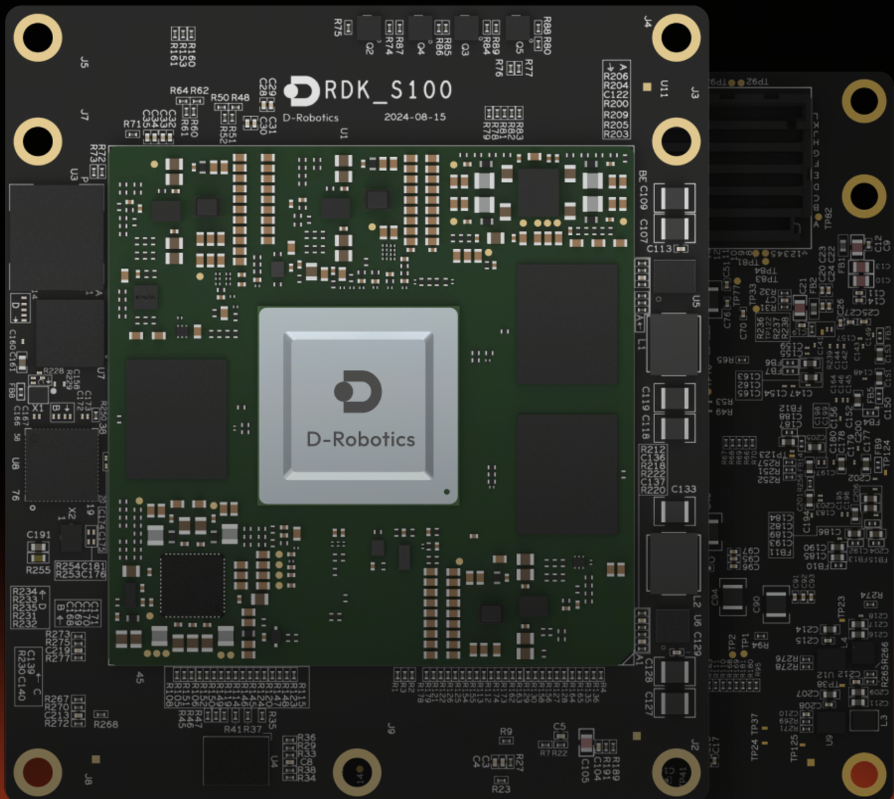
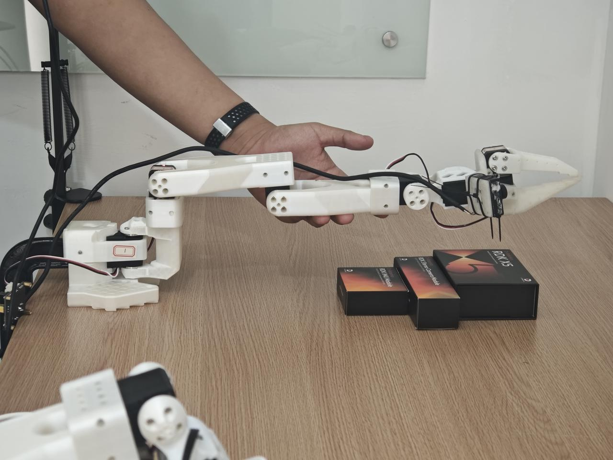
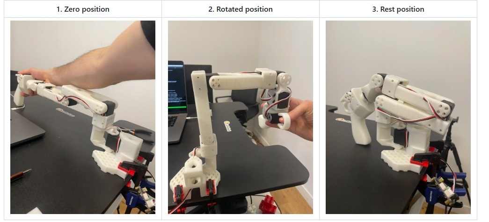
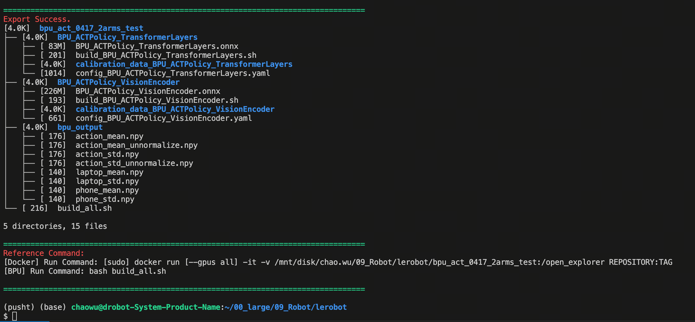
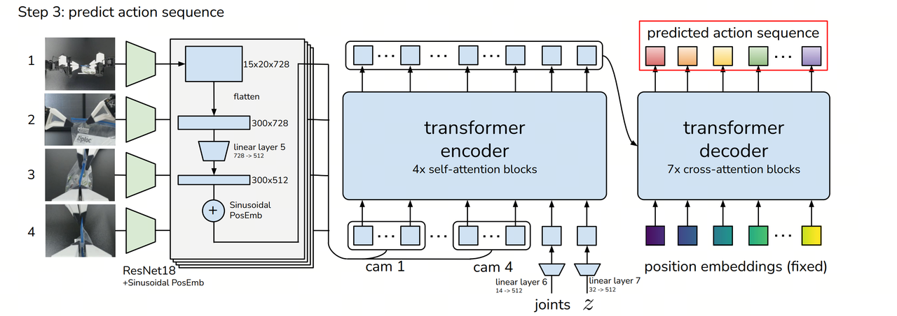
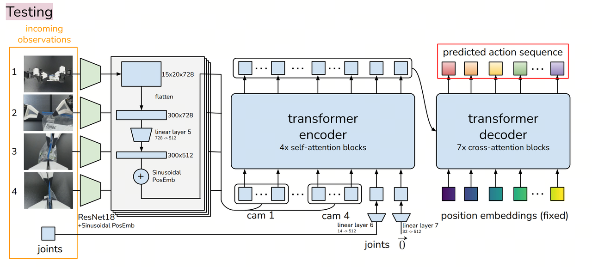
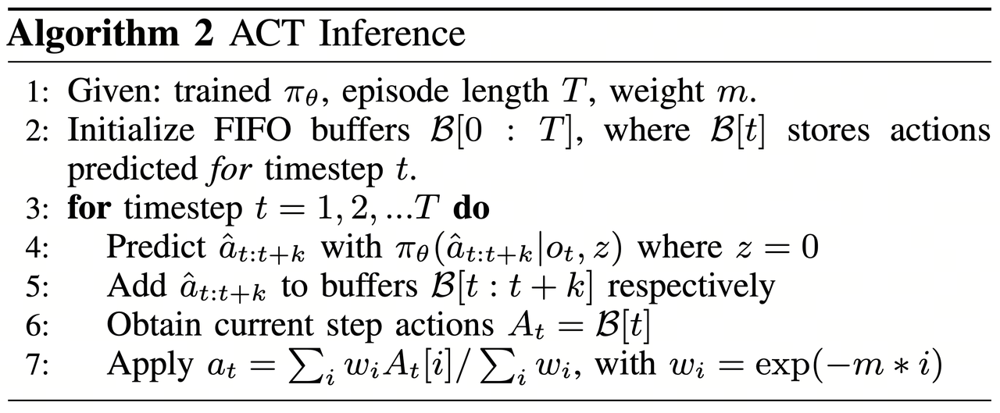

English | [简体中文](./README_cn.md)

# RDK LeRobot Tools

Feishu Document: https://horizonrobotics.feishu.cn/docx/HSr8dBdZ0oQ5OwxPQvBcsuyZnWe

Github README & README_cn: https://github.com/D-Robotics/rdk_LeRobot_tools

D-Robotics Developer Community Chinese Blog: https://developer.d-robotics.cc/forumDetail/289424806557116771

D-Robotics Developer Community English Blog: https://developer.d-robotics.cc/en/forumDetail/287581909104596495


- [RDK LeRobot Tools](#rdk-lerobot-tools)
  - [Abstract](#abstract)
    - [Highlights](#highlights)
    - [Single Arm SO100 Performance Comparison](#single-arm-so100-performance-comparison)
    - [Dual Arm SO100 Performance Comparison](#dual-arm-so100-performance-comparison)
  - [Overview of the Entire Process](#overview-of-the-entire-process)
  - [1. Tooling Setup](#1-tooling-setup)
    - [Material Preparation](#material-preparation)
    - [Software Environment Installation and Setup](#software-environment-installation-and-setup)
      - [Development Machine Software Environment](#development-machine-software-environment)
      - [RDK Board Software Environment](#rdk-board-software-environment)
    - [Modifications Based on the Public Version of LeRobot](#modifications-based-on-the-public-version-of-lerobot)
    - [Assembling the Robotic Arm \& Servo Motor Labeling](#assembling-the-robotic-arm--servo-motor-labeling)
      - [Servo Motor Labeling](#servo-motor-labeling)
      - [Assembling the Robotic Arm](#assembling-the-robotic-arm)
  - [2. Calibration (Calibrate Robot)](#2-calibration-calibrate-robot)
  - [3. Teleoperation](#3-teleoperation)
  - [4. Record a Dataset](#4-record-a-dataset)
  - [5. Train a Policy](#5-train-a-policy)
    - [Transfer Dataset to Development Machine](#transfer-dataset-to-development-machine)
    - [Monitor Training Progress](#monitor-training-progress)
    - [Analyze Training Results](#analyze-training-results)
  - [6. Run on CPU](#6-run-on-cpu)
  - [7. Model Export (ONNX Export)](#7-model-export-onnx-export)
  - [8. Model Quantization and Compilation](#8-model-quantization-and-compilation)
  - [9. Model Deployment on BPU (Run on BPU)](#9-model-deployment-on-bpu-run-on-bpu)
  - [Cloth Folding Case Study](#cloth-folding-case-study)
    - [Dual-Arm Setup](#dual-arm-setup)
    - [Data Collection and Training Deployment](#data-collection-and-training-deployment)
  - [Appendix 1: Algorithm Analysis](#appendix-1-algorithm-analysis)
    - [Dataset Recording (Record a Dataset)](#dataset-recording-record-a-dataset)
    - [Model Training (Train a Policy)](#model-training-train-a-policy)
    - [Model Deployment (Run)](#model-deployment-run)
  - [Appendix 2: BPU Deployment Analysis](#appendix-2-bpu-deployment-analysis)
  - [Appendix 3: Accessories list](#appendix-3-accessories-list)
  - [Appendix 4: Using MiniConda Virtual Environment](#appendix-4-using-miniconda-virtual-environment)
  - [Appendix 5: Troubleshooting](#appendix-5-troubleshooting)
      - [FFmpeg Error Troubleshooting](#ffmpeg-error-troubleshooting)
      - [Robotic Arm Oscillating at One Position](#robotic-arm-oscillating-at-one-position)
      - [Unable to Use Two USB Cameras](#unable-to-use-two-usb-cameras)
  - [Postscript](#postscript)


## Abstract
### Highlights
- End-to-end robotic arm case study on RDK devices, showcasing ACT Policy: an embodied algorithm for attention from visual space to action space.
- Fully utilizes RDK's BPU acceleration capabilities for end-to-end speedup.
- Hugging Face community is active, LeRobot is a popular project with significant influence domestically and internationally, offering a complete workflow from dataset collection, training, toolchain quantization, to BPU deployment.

### Single Arm SO100 Performance Comparison
This guide enables you to implement LeRobot's ACT Policy algorithm on RDK devices and observe how BPU acceleration eliminates action generation latency. The following videos are unedited and without acceleration.

RDK S100: Run on CPU


Video: [https://github.com/D-Robotics/rdk_LeRobot_tools/blob/main/imgs/so100_1arm_RunOnCPU.mp4]


RDK S100: Run on BPU


Video: [https://github.com/D-Robotics/rdk_LeRobot_tools/blob/main/imgs/so100_1arm_RunOnBPU.mp4]


### Dual Arm SO100 Performance Comparison

You can even assemble a dual-arm SO100 setup and use LeRobot on RDK to tackle tasks like folding clothes!

RDK S100: Run on CPU


Video: [https://github.com/D-Robotics/rdk_LeRobot_tools/blob/main/imgs/so100_2arm_RunOnCPU.mp4]

RDK S100: Run on BPU: 


Video: [https://github.com/D-Robotics/rdk_LeRobot_tools/blob/main/imgs/so100_2arm_RunOnBPU.mp4]

We collected 50 sets of dual-arm cloth folding datasets. You can refer to our HuggingFace repository to decide on your dual-arm setup.


Video: [https://github.com/D-Robotics/rdk_LeRobot_tools/blob/main/imgs/dataset_5X6.mp4]

https://huggingface.co/datasets/MaCCChhh/rdk_so100_test/tree/main

https://huggingface.co/spaces/lerobot/visualize_dataset?dataset=MaCCChhh%2Frdk_so100_test


## Overview of the Entire Process


## 1. Tooling Setup  

For tooling setup, refer to the documentation provided by HuggingFace's LeRobot project:
https://github.com/huggingface/lerobot/blob/main/examples/10_use_so100.md

### Material Preparation

Below is the list of materials required for a complete SO100 master-slave arm setup. Refer to the complete documentation provided by SO-ARM100 for material preparation:
https://github.com/TheRobotStudio/SO-ARM100

| D-Robotics | images | links |
|----------|--------|--------|
| RDK S100 |  | [https://developer.d-robotics.cc/rdks100](https://developer.d-robotics.cc/rdks100) |
| RDK X5   |    | [https://developer.d-robotics.cc/rdkx5](https://developer.d-robotics.cc/rdkx5) |


### Software Environment Installation and Setup
If you plan to upload datasets and models to HuggingFace or fetch resources from HuggingFace, configure the terminal proxy accordingly; otherwise, HuggingFace will be inaccessible.

#### Development Machine Software Environment 

1. Prepare a Miniconda environment (optional)

```bash
# Install the corresponding version of Miniconda, then source it
https://www.anaconda.com/docs/getting-started/miniconda/install
# Create a conda environment
conda create -y -n lerobot python=3.10
# Activate the virtual environment
conda activate lerobot
```

2. It is recommended to download the forked LeRobot repository from the D-Robotics organization. In principle, you can download the public version of the LeRobot repository for model training.
     
```bash
git clone https://github.com/D-Robotics/lerobot.git   # Recommend
git clone https://github.com/huggingface/lerobot.git  # or
```

3. After cloning, run the following commands to install the LeRobot repository:

```bash
conda install ffmpeg -c conda-forge # If using a conda environment
cd ~/lerobot && pip install -e ".[feetech]"
```

#### RDK Board Software Environment

1. Miniconda environment installation on RDK boards is detailed in the appendix (optional).
```bash
# Create a conda environment
conda create -y -n lerobot python=3.10
# Activate the virtual environment
conda activate lerobot
```

2. It is recommended to download the forked LeRobot repository from the D-Robotics organization. In principle, you can download the public version of LeRobot. All development is based on the forked public version of the LeRobot repository by D-Robotics. D-Robotics has made minimal changes to the public version of LeRobot, and all BPU-related operations are conducted in the newly added `rdk_LeRobot_tools` subfolder.
     
```bash
git clone https://github.com/D-Robotics/lerobot.git   # Recommend
git clone https://github.com/huggingface/lerobot.git  # or
```

3. Download the `rdk_LeRobot_tools` repository as a subfolder of the LeRobot project.

```bash
cd lerobot
git clone https://github.com/D-Robotics/rdk_LeRobot_tools
```

4. After cloning, run the following commands to install the LeRobot repository. Refer to the official documentation `lerobot/examples/10_use_so100.md` for details.

```bash
conda install ffmpeg -c conda-forge # If using a conda environment
cd lerobot && pip install -e ".[feetech]"
```

### Modifications Based on the Public Version of LeRobot
1. All operations are based on the `lerobot` repository directory, which contains the `lerobot` directory as a package. Most modifications involve adding configuration files rather than altering the source code of LeRobot.
     
2. Added `rdk_LeRobot_tools/cpu_act_control_robot.py` as the entry point for ACT Policy CPU inference.
     
3. Added `rdk_LeRobot_tools/bpu_act_control_robot.py` as the entry point for ACT Policy BPU inference.
     
4. Added `rdk_LeRobot_tools/export_bpu_actpolicy.py` for exporting ACT Policy to ONNX, preparing calibration data, YAML files, and BPU model quantization and compilation scripts.
     
5. Modified the `lerobot/lerobot/common/datasets/video_utils.py` file in the `encode_video_frames` method to adapt to video formats on RDK. Changed `libsvtav1` to `libx264`.
```bash
def encode_video_frames(
        imgs_dir: Path | str,
        video_path: Path | str,
        fps: int,
        vcodec: str = "libx264",  # Change libsvtav1 -> libx264 here
        pix_fmt: str = "yuv420p",
        g: int | None = 2,
        crf: int | None = 30,
        fast_decode: int = 0,
        log_level: str | None = "error",
        overwrite: bool = False,
) -> None:
```

6. Modified the `lerobot/common/robot_devices/cameras/opencv.py` file in the `connect` method to prioritize MJPG format.
     
```bash
# After initializing the object with self.camera = cv2.VideoCapture(camera_idx, backend), add:
# self.camera.set(cv2.CAP_PROP_FOURCC, cv2.VideoWriter_fourcc('M','J','P','G')).
'......'
self.camera = cv2.VideoCapture(camera_idx, backend)
# Add the following:
self.camera.set(cv2.CAP_PROP_FOURCC, cv2.VideoWriter_fourcc('M','J','P','G'))
'......'
```

7. Modified the `lerobot/common/robot_devices/robots/manipulator.py` file in the `set_so100_robot_preset` method to set the D parameter in PID control to 0, effectively reducing robotic arm jitter during teleoperation.

```bash
def set_so100_robot_preset(self):
        for name in self.follower_arms:
                self.follower_arms[name].write("Mode", 0)
                self.follower_arms[name].write("P_Coefficient", 16)
                self.follower_arms[name].write("I_Coefficient", 0)
                self.follower_arms[name].write("D_Coefficient", 0) #<--- Modify here
                self.follower_arms[name].write("Lock", 0)
                self.follower_arms[name].write("Maximum_Acceleration", 254)
                self.follower_arms[name].write("Acceleration", 254)
```

### Assembling the Robotic Arm & Servo Motor Labeling

#### Servo Motor Labeling

1. Connect the power and USB port of a servo motor driver board, then run the following command to find the robotic arm's serial port.

```bash
python lerobot/scripts/find_motors_bus_port.py
```

2. On RDK boards, the serial port typically appears as `/dev/ttyACM0`. Run the following command to grant permissions.

```bash
sudo chmod 666 /dev/ttyACM0
```

3. Insert your first motor and run this script to set its ID to 1. It will also set the current position to 2048, causing the motor to rotate. Repeat this process for the remaining six motors. Each group consists of six motors, with a total of 12 motors to label.
Note: Labeling data is stored in the motor's internal memory.

```bash
python lerobot/scripts/configure_motor.py \
    --port /dev/ttyACM0 \
    --brand feetech \
    --model sts3215 \
    --baudrate 1000000 \
    --ID 1
```

#### Assembling the Robotic Arm

Refer to the official documentation `robot/examples/10_use_so100.md` to complete the robotic arm assembly. The assembled robotic arm should look like the images below.





## 2. Calibration (Calibrate Robot)

1. Ensure that the servo motors are correctly labeled and the robotic arms are assembled in the correct order. Connect the power and USB ports for both robotic arms, then run the following command to identify the device ports:

```bash
python lerobot/scripts/find_motors_bus_port.py
```

2. Update the device ports in the `so100` class within `lerobot/lerobot/common/robot_devices/robots/configs.py`:

```python
@RobotConfig.register_subclass("so100")
@dataclass
class So100RobotConfig(ManipulatorRobotConfig):
    calibration_dir: str = ".cache/calibration/so100"
    max_relative_target: int | None = None
    leader_arms: dict[str, MotorsBusConfig] = field( 
        default_factory=lambda: {
            "main": FeetechMotorsBusConfig(
                port="/dev/ttyACM0", # Update this based on the identified port
                motors={
                    "shoulder_pan": [1, "sts3215"],
                    "shoulder_lift": [2, "sts3215"],
                    "elbow_flex": [3, "sts3215"],
                    "wrist_flex": [4, "sts3215"],
                    "wrist_roll": [5, "sts3215"],
                    "gripper": [6, "sts3215"],
                },
            ),
        }
    )

    follower_arms: dict[str, MotorsBusConfig] = field(
        default_factory=lambda: {
            "main": FeetechMotorsBusConfig(
                port="/dev/ttyACM1", # Update this based on the identified port
                motors={
                    "shoulder_pan": [1, "sts3215"],
                    "shoulder_lift": [2, "sts3215"],
                    "elbow_flex": [3, "sts3215"],
                    "wrist_flex": [4, "sts3215"],
                    "wrist_roll": [5, "sts3215"],
                    "gripper": [6, "sts3215"],
                },
            ),
        }
    )
    cameras: dict[str, CameraConfig] = field(
        default_factory=lambda: {
            "laptop": OpenCVCameraConfig(
                camera_index=2,
                fps=30,
                width=640,
                height=480,
            ),
            "phone": OpenCVCameraConfig(
                camera_index=0,
                fps=30,
                width=640,
                height=480,
            ),
        }
    )
    mock: bool = False
```

3. Ensure both robotic arms are connected, then run the following scripts to start manual calibration:

Calibrate the follower arm:

```bash
python lerobot/scripts/control_robot.py \
  --robot.type=so100 \
  --robot.cameras='{}' \
  --control.type=calibrate \
  --control.arms='["main_follower"]'
```


Calibrate the leader arm:

```bash
python lerobot/scripts/control_robot.py \
  --robot.type=so100 \
  --robot.cameras='{}' \
  --control.type=calibrate \
  --control.arms='["main_leader"]'
```



## 3. Teleoperation

Before starting teleoperation or data collection, run the following command to confirm the robotic arm port numbers:

```bash
python lerobot/scripts/find_motors_bus_port.py
```

If there are any changes, update the corresponding ports in the `so100` class within `lerobot/common/robot_devices/robots/configs.py`:

```python
@RobotConfig.register_subclass("so100")
@dataclass
class So100RobotConfig(ManipulatorRobotConfig):
    calibration_dir: str = ".cache/calibration/so100"
    max_relative_target: int | None = None

    leader_arms: dict[str, MotorsBusConfig] = field(
        default_factory=lambda: {
            "main": FeetechMotorsBusConfig(
                port="/dev/ttyACM0",  #<-------Update this for the leader arm port
                motors={
                    "shoulder_pan": [1, "sts3215"],
                    "shoulder_lift": [2, "sts3215"],
                    "elbow_flex": [3, "sts3215"],
                    "wrist_flex": [4, "sts3215"],
                    "wrist_roll": [5, "sts3215"],
                    "gripper": [6, "sts3215"],
                },
            ),
        }
    )

    follower_arms: dict[str, MotorsBusConfig] = field(
        default_factory=lambda: {
            "main": FeetechMotorsBusConfig(
                port="/dev/ttyACM1",  #<-------Update this for the follower arm port
                motors={
                    "shoulder_pan": [1, "sts3215"],
                    "shoulder_lift": [2, "sts3215"],
                    "elbow_flex": [3, "sts3215"],
                    "wrist_flex": [4, "sts3215"],
                    "wrist_roll": [5, "sts3215"],
                    "gripper": [6, "sts3215"],
                },
            ),
        }
    )

    cameras: dict[str, CameraConfig] = field(
        ......
    )

    mock: bool = False
```

Once the port numbers are correctly configured, run the following command to start teleoperation without cameras:

```bash
python lerobot/scripts/control_robot.py \
  --robot.type=so100 \
  --robot.cameras='{}' \
  --control.type=teleoperate
```


## 4. Record a Dataset

1. Attach two USB cameras to capture the robot arm's perspective and an external fixed perspective. Insert the USB cameras into the RDK and run the following script to check the camera port indices. Ensure that `lerobot/common/robot_devices/cameras/opencv.py` has been modified to prioritize MJPG images.

```bash
python lerobot/common/robot_devices/cameras/opencv.py \
    --images-dir outputs/images_from_opencv_cameras
```

The terminal will display the following information:

```
Linux detected. Finding available camera indices through scanning '/dev/video*' ports
[...]
Camera found at index /dev/video2
Camera found at index /dev/video0
Connecting cameras
OpenCVCamera(2, fps=30, width=640, height=480, color_mode=rgb)
OpenCVCamera(0, fps=30, width=640, height=480, color_mode=rgb
Frame: 0000 Latency (ms): 39.52
[...]
Frame: 0102 Latency (ms): 40.07
Images have been saved to outputs/images_from_opencv_cameras
```

2. Locate the images captured by each camera in the `outputs/images_from_opencv_cameras` directory and confirm the port indices corresponding to each camera's position.

3. Update the camera parameters in the `lerobot/lerobot/common/robot_devices/robots/configs.py` file to align with the identified indices:

```python
@RobotConfig.register_subclass("so100")
@dataclass
class So100RobotConfig(ManipulatorRobotConfig):
    calibration_dir: str = ".cache/calibration/so100"
    max_relative_target: int | None = None

    leader_arms: dict[str, MotorsBusConfig] = field(
        default_factory=lambda: {
            "main": FeetechMotorsBusConfig(
                port="/dev/ttyACM0",
                motors={
                    "shoulder_pan": [1, "sts3215"],
                    "shoulder_lift": [2, "sts3215"],
                    "elbow_flex": [3, "sts3215"],
                    "wrist_flex": [4, "sts3215"],
                    "wrist_roll": [5, "sts3215"],
                    "gripper": [6, "sts3215"],
                },
            ),
        }
    )

    follower_arms: dict[str, MotorsBusConfig] = field(
        default_factory=lambda: {
            "main": FeetechMotorsBusConfig(
                port="/dev/ttyACM1",
                motors={
                    "shoulder_pan": [1, "sts3215"],
                    "shoulder_lift": [2, "sts3215"],
                    "elbow_flex": [3, "sts3215"],
                    "wrist_flex": [4, "sts3215"],
                    "wrist_roll": [5, "sts3215"],
                    "gripper": [6, "sts3215"],
                },
            ),
        }
    )

    cameras: dict[str, CameraConfig] = field(
        default_factory=lambda: {
            "laptop": OpenCVCameraConfig(
                camera_index=0,           # Update this with the robot arm camera ID and parameters
                fps=30,
                width=640,
                height=480,
            ),
            "phone": OpenCVCameraConfig(
                camera_index=2,           # Update this with the external perspective camera ID and parameters
                fps=30,
                width=640,
                height=480,
            ),
        }
    )

    mock: bool = False
```

4. Begin data collection by running the following script:

```bash
python lerobot/scripts/control_robot.py \
  --robot.type=so100 \
  --control.type=record \
  --control.fps=30 \
  --control.single_task="Cloth Fold" \
  --control.tags='["so100","tutorial"]' \
  --control.warmup_time_s=5 \
  --control.episode_time_s=30 \
  --control.reset_time_s=1 \
  --control.num_episodes=50 \
  --control.push_to_hub=false \
  --control.display_data=false \
  --control.repo_id=USER/so100_test \
  --control.root=datasets/so100_test
```

Parameter explanations:
- `warmup-time-s`: Initialization time.
- `episode-time-s`: Duration of each data collection session.
- `reset-time-s`: Preparation time between sessions.
- `num-episodes`: Number of data collection sessions.
- `push-to-hub`: Whether to upload the dataset to HuggingFace Hub.
- `display_data`: Whether to display a graphical interface.
- `root`: Path to save the dataset.

5. Recommendations for dataset recording:

Once you are familiar with recording data, you can create a larger dataset for training. A good starting task is to pick up an object from different locations and place it in a box. We recommend recording at least 50 sessions, with 10 sessions per location. Keep the cameras fixed and maintain consistent grasping behavior throughout the recording process.

In the next steps, you will train your neural network. After achieving reliable grasping performance, you can introduce more variations during data collection, such as additional grasping locations, different grasping techniques, and changing camera positions. Avoid introducing too many variations too quickly, as it may negatively impact your results.

6. To visualize the dataset locally, use the following command:

```bash
python lerobot/scripts/visualize_dataset_html.py \
  --repo-id USER/so100_test \
  --root datasets/so100_test # Specify the dataset path
```

## 5. Train a Policy

### Transfer Dataset to Development Machine

1. If your development machine is configured with a proxy and the dataset has been pushed to HuggingFace, you can load the dataset during training using the `repo_id` parameter. Ensure you are logged into HuggingFace on the development machine.

2. If no proxy is configured and the dataset is stored locally, move the dataset to the development machine under `~/.cache/huggingface/lerobot/USER` or specify the dataset path using the `dataset.root` parameter. The author used a TITAN Xp GPU, and training 50 sessions of 60-second operation data for 50k iterations with a batch size of 8 took approximately 4 hours.

3. Enable `wandb` (optional) and log in to monitor training progress:
```bash
wandb login
```

4. Start training by running the following script. Modify training parameters in the `lerobot/configs/train.py` file as needed:

```bash
python lerobot/scripts/train.py \
  --dataset.repo_id=USER/so100_test \ # Replace with your dataset
  --policy.type=act \
  --output_dir=outputs/train/act_test_1epoch \
  --job_name=act_so100_test \
  --policy.device=cuda \
  --wandb.enable=true \
  --dataset.root=.....
```

Parameter explanations:
- `policy.type`: Type of policy to use.
- `output_dir`: Path to save the trained model.
- `job_name`: Name of the training job.
- `policy.device`: Device to use for training.
- `wandb.enable`: Whether to enable `wandb`.
- `dataset.root`: Path to the dataset.

### Monitor Training Progress

When `--wandb.enable=true` is set, you can view the training curves on the `wandb` dashboard.


### Analyze Training Results

1. `update_s`: The curve fluctuates but remains stable overall. Occasional spikes may indicate anomalies in computation or resource scheduling during training.

2. `steps` & `samples`: Both increase linearly, indicating that training progresses as expected, with a stable number of samples processed per step.

3. `lr`: The learning rate remains constant, allowing the model to converge quickly during the early stages of training.

4. `loss`: The loss decreases rapidly at first and then stabilizes at a low value, indicating effective learning of data features and nearing convergence.

5. `l1_loss`: Gradually decreases with fluctuations, showing that the model is optimizing the absolute error between predictions and ground truth but has not fully stabilized.
## 6. Run on CPU 
1. You can simply use a script to load the model and perform inference:

```bash
# Update the script with the correct model weight directory
python rdk_LeRobot_tools/cpu_control_robot.py
```

2. Alternatively, you can use the `control_robot.py` script with the `record` method to perform inference and simultaneously record evaluation datasets:

```bash
python lerobot/scripts/control_robot.py \
    --robot.type=so100 \
    --control.type=record \
    --control.fps=30 \
    --control.single_task="Cloth Fold" \
    --control.repo_id=MaCCChhh/eval_act_so100_0418_test1 \
    --control.tags='["tutorial"]' \
    --control.warmup_time_s=5 \
    --control.episode_time_s=180 \
    --control.reset_time_s=30 \
    --control.num_episodes=10 \
    --control.push_to_hub=false \
    --control.policy.path=outputs/act_so100_resnet152_0418_test1/pretrained_model
```

You should observe the robotic arm operating as expected. If your training was successful, the robotic arm will mimic the actions recorded earlier. However, it may pause intermittently during operation. Don't worry; we will use the BPU to accelerate policy generation and eliminate these pauses.


## 7. Model Export (ONNX Export) 

Export the LeRobot safetensors model to ONNX and prepare calibration data. After training with LeRobot, you will typically have the following folder structure:

```bash
./pretrained_model/
├── config.json
├── model.safetensors
└── train_config.json
```

Use the `rdk_LeRobot_tools/export_bpu_actpolicy.py` script to prepare calibration data. Update the script with the path to the floating-point weights and other parameters, starting around line 51:

```python
parser = argparse.ArgumentParser()
parser.add_argument('--act-path', type=str, default='lerobot_training_weights/act_0417_2arms-', help='Path to LeRobot ACT Policy model.')
""" 
# example: --act-path pretrained_model
./pretrained_model/
├── config.json
├── model.safetensors
└── train_config.json
"""
parser.add_argument('--export-path', type=str, default='bpu_act_0417_2arms', help='Path to save LeRobot ACT Policy model.') 
parser.add_argument('--cal-num', type=int, default=200, help='Num of images to generate')
parser.add_argument('--onnx-sim', type=bool, default=True, help='Simplify onnx or not.') 
parser.add_argument('--type', type=str, default="nash-e", help='Optional: nash-e, nash-m, nash-p, bayes, bayes-e') 
parser.add_argument('--combine-jobs', type=int, default=6, help='combie jobs for OpenExplore.')
opt = parser.parse_args([])
```

Ensure the parameters match those used during training. Typically, you need to update the `--dataset.repo_id` parameter to specify the dataset used. This export script, based on the training script, will export the model to ONNX and prepare calibration data.

```bash
python rdk_LeRobot_tools/export_bpu_actpolicy.py \
    --dataset.repo_id=MaCCChhh/so100_0417_test1 \
    --policy.type=act \
    --policy.device=cpu \
    --wandb.enable=false 
```

If successful, you will see the following log:


## 8. Model Quantization and Compilation 

After exporting the model, you will have a BPU compilation workspace with the following structure. The ACT Policy's vision encoder and 4+1 Transformer layers are exported separately. Calibration data is saved based on the training dataset, and scripts and YAML files for compilation are generated. Pre- and post-processing parameters for image and action inputs are saved as `.npy` files in the final BPU release folder.

```bash
.
├── BPU_ACTPolicy_TransformerLayers
│   ├── BPU_ACTPolicy_TransformerLayers.onnx
│   ├── build_BPU_ACTPolicy_TransformerLayers.sh
│   ├── calibration_data_BPU_ACTPolicy_TransformerLayers
│   ├── config_BPU_ACTPolicy_TransformerLayers.yaml
├── BPU_ACTPolicy_VisionEncoder
│   ├── BPU_ACTPolicy_VisionEncoder.onnx
│   ├── build_BPU_ACTPolicy_VisionEncoder.sh
│   ├── calibration_data_BPU_ACTPolicy_VisionEncoder
│   ├── config_BPU_ACTPolicy_VisionEncoder.yaml
├── bpu_output_act_0417_2arms
│   ├── action_mean.npy
│   ├── action_mean_unnormalize.npy
│   ├── action_std.npy
│   ├── action_std_unnormalize.npy
│   ├── laptop_mean.npy
│   ├── laptop_std.npy
│   ├── phone_mean.npy
│   └── phone_std.npy
└── build_all.sh
```

Use the standard Docker environment provided by the algorithm toolchain to complete BPU model quantization and compilation. Use the following command to mount the Docker container:

```bash
[sudo] docker run [--gpus all] -it -v <BPU_Work_Space>:/open_explorer REPOSITORY:TAG
```

Where:
- `sudo` is optional, depending on your Docker installation.
- `--gpus all` is required for GPU Docker. For CPU Docker, omit this parameter. In the X5 PTQ scheme, use CPU Docker unless using QAT. For S100 PTQ, GPU Docker accelerates calibration but is optional.
- `<BPU_Work_Space>` should be replaced with the absolute path to your BPU workspace.
- `REPOSITORY:TAG` refers to the Docker container name and version. Use `docker images` to confirm.

Note:
This is a reference mounting method. You can use any preferred method to run Docker. For further details, refer to the Docker documentation.
## 9. Model Deployment on BPU (Run on BPU)

After completing model quantization and compilation, you will obtain a `bpu_output` folder containing the following files:

```bash
$ tree bpu_output_act_0417_2arms
.
├── BPU_ACTPolicy_TransformerLayers.hbm
├── BPU_ACTPolicy_VisionEncoder.hbm
├── action_mean.npy
├── action_mean_unnormalize.npy
├── action_std.npy
├── action_std_unnormalize.npy
├── laptop_mean.npy
├── laptop_std.npy
├── phone_mean.npy
└── phone_std.npy
```

Copy the BPU ACT Policy model to the RDK board and update the path to your `bpu_output` folder. Note that the model path provided to the `BPU_ACTPolicy` class should be the folder path. Run the following script to use the BPU for ACT Policy model inference. During each inference, the BPU operates at 100% utilization for 50 milliseconds to generate 50 robotic arm actions. While the actions are being executed, the BPU utilization drops to 0%. Once the 50 actions are completed, the BPU starts the next round of inference.

```bash
python rdk_LeRobot_tools/bpu_act_control_robot.py 
```

Compared to pure CPU inference, the powerful burst inference capability of the BPU eliminates the latency between actions.

## Cloth Folding Case Study

Reference dataset repository ID: https://huggingface.co/datasets/MaCCChhh/rdk_so100_test/tree/main

Online visualization of the reference dataset: https://huggingface.co/spaces/lerobot/visualize_dataset?dataset=MaCCChhh%2Frdk_so100_test

### Dual-Arm Setup

1. **Material Preparation**: Prepare two complete sets of SO100 materials: 2 leader arms, 2 follower arms, and 4 servo motor control boards. Ensure you have enough USB ports; if not, prepare a USB hub.

2. **Reassemble SO100**: Ensure the servo motors are labeled (servo labels are stored in the internal memory of the motors).

3. **Connect Servo Boards**: Connect the four servo motor control boards to the RDK and confirm the device ports (servo serial port numbers).

4. **Update Configuration**: Modify the `so100` class in `lerobot/lerobot/common/robot_devices/robots/configs.py` as follows:

```python
@RobotConfig.register_subclass("so100")
@dataclass
class So100RobotConfig(ManipulatorRobotConfig):
    calibration_dir: str = ".cache/calibration/so100"  # Optional: Modify the calibration folder
    max_relative_target: int | None = None
    leader_arms: dict[str, MotorsBusConfig] = field(  # Update "main" to "left" and "right"
        default_factory=lambda: {
            "left": FeetechMotorsBusConfig(
                port="/dev/ttyACM0",  # Update based on device confirmation
                motors={
                    "shoulder_pan": [1, "sts3215"],
                    "shoulder_lift": [2, "sts3215"],
                    "elbow_flex": [3, "sts3215"],
                    "wrist_flex": [4, "sts3215"],
                    "wrist_roll": [5, "sts3215"],
                    "gripper": [6, "sts3215"],
                },
            ),
            "right": FeetechMotorsBusConfig(
                port="/dev/ttyACM3",
                motors={
                    "shoulder_pan": [1, "sts3215"],
                    "shoulder_lift": [2, "sts3215"],
                    "elbow_flex": [3, "sts3215"],
                    "wrist_flex": [4, "sts3215"],
                    "wrist_roll": [5, "sts3215"],
                    "gripper": [6, "sts3215"],
                },
            ),
        }
    )

    follower_arms: dict[str, MotorsBusConfig] = field(  # Update "main" to "left" and "right"
        default_factory=lambda: {
            "left": FeetechMotorsBusConfig(
                port="/dev/ttyACM2",
                motors={
                    "shoulder_pan": [1, "sts3215"],
                    "shoulder_lift": [2, "sts3215"],
                    "elbow_flex": [3, "sts3215"],
                    "wrist_flex": [4, "sts3215"],
                    "wrist_roll": [5, "sts3215"],
                    "gripper": [6, "sts3215"],
                },
            ),
            "right": FeetechMotorsBusConfig(
                port="/dev/ttyACM4",
                motors={
                    "shoulder_pan": [1, "sts3215"],
                    "shoulder_lift": [2, "sts3215"],
                    "elbow_flex": [3, "sts3215"],
                    "wrist_flex": [4, "sts3215"],
                    "wrist_roll": [5, "sts3215"],
                    "gripper": [6, "sts3215"],
                },
            ),
        }
    )
    cameras: dict[str, CameraConfig] = field(
        default_factory=lambda: {
            "laptop": OpenCVCameraConfig(
                camera_index=5,
                fps=30,
                width=640,
                height=480,
            ),
            "phone": OpenCVCameraConfig(
                camera_index=1,
                fps=30,
                width=640,
                height=480,
            ),
        }
    )
    mock: bool = False
```

5. **Calibrate Dual Arms**: If all four arms have already been calibrated in a single-arm setup, you can skip calibration by renaming the calibration files. Calibration files are stored in `.cache/calibration/so100`.

```bash
python lerobot/scripts/control_robot.py \
  --robot.type=so100 \
  --robot.cameras='{}' \
  --control.type=calibrate \
  --control.arms='["left_follower"]'
  #  --control.arms='["right_follower"]'
  #  --control.arms='["left_leader"]'
  #  --control.arms='["right_leader"]'
```

After calibration, you can find the files in the `.cache/calibration/so100` directory:

```bash
`-- calibration
    `-- so100
        |-- left_follower.json
        |-- left_leader.json
        |-- right_follower.json
        `-- right_leader.json
```

6. **Test Teleoperation Without Cameras**: Run the following script to test dual-arm teleoperation:

```bash
python lerobot/scripts/control_robot.py \
  --robot.type=so100 \
  --robot.cameras='{}' \
  --control.type=teleoperate
```

### Data Collection and Training Deployment

Now that you have completed the dual-arm teleoperation setup, the subsequent steps are the same as for a single-arm setup.

For dataset collection, refer to: https://huggingface.co/spaces/lerobot/visualize_dataset?dataset=MaCCChhh%2Frdk_so100_test


## Appendix 1: Algorithm Analysis

Reference Paper: https://arxiv.org/abs/2304.13705

### Dataset Recording (Record a Dataset)
Collect RGB images from multiple cameras, current joint positions of the robot, and human operation data (demonstration trajectories collected via teleoperation).


### Model Training (Train a Policy)





The training objective is to enable the model to predict future k-step action sequences from observation data (images + joint positions) rather than single-step predictions. The core components are as follows:

**Encoder (CVAE Encoder):**
- Uses a Transformer Encoder to process past actions and state information.
- Generates a latent variable z (style variable) to capture styles and variations in human demonstrations.

**Decoder (CVAE Decoder / Transformer Policy):**
- Input: Current observation data (images + joint positions) + latent variable z.
- Output: Future k-step action sequences (target joint positions).

**Training Loss Functions:**
- Reconstruction Loss: Ensures the predicted action sequences are close to the real demonstration data.
- KL Divergence Loss: Forces the latent variable z to follow a standard normal distribution, enhancing generalization.

**Training Outcome:** A Transformer-based model capable of predicting future k-step actions given current observations.

### Model Deployment (Run)




**Inputs:**
1. `robot_state_feature` (optional): Batch of robot states with shape (B, state_dim), where B is the batch size and state_dim is the dimension of the robot state.
2. `image_features`: Batch of images with shape (B, n_cameras, C, H, W), where B is the batch size, n_cameras is the number of cameras, C is the number of channels (usually 3 for RGB), H is the image height, and W is the image width.
3. `env_state_feature`: Batch of environment states with shape (B, env_dim), where B is the batch size and env_dim is the dimension of the environment state.
4. `action_feature` (optional, only used during VAE training): Batch of actions with shape (B, chunk_size, action_dim), where B is the batch size, chunk_size is the length of the action sequence, and action_dim is the dimension of each action.

**Outputs:**
1. Action sequence batch with shape (B, chunk_size, action_dim).
2. A tuple containing latent probability density function (PDF) parameters `(mean, log(σ²))`, where both `mean` and `log(σ²)` are tensors of shape (B, L), and L is the latent dimension.

For example, if B = 32, chunk_size = 10, action_dim = 6, and L = 64, the output action sequence batch will have shape (32, 10, 6), and the latent PDF parameters will have shape (32, 64). During execution, ACT uses inference strategies to smooth predictions and reduce error accumulation.

**Action Chunking:**
- Instead of predicting single actions step-by-step, the robot predicts k-step action sequences at a time.
- This reduces compounding errors and improves action coherence.

**Temporal Ensembling:**
- Since multiple k-step predictions may overlap, at a given time step t, there may be multiple predictions.
- Exponential Moving Average (EMA) is used to fuse multiple predictions, improving stability and ensuring smooth robot motion.

**Execution Phase:**
- The action sequence `a_t`, processed by Temporal Ensembling, is sent to the robot for execution.
- The robot controller uses PID control to gradually follow the target action sequence.

---

## Appendix 2: BPU Deployment Analysis

During CPU deployment, Python debugging tools are used to step through the ACT Policy algorithm implemented in Hugging Face's LeRobot project.

Since the vision encoder is invoked multiple times (once per camera), it is exported separately under the name `BPU_ACTPolicy_VisionEncoder`. Subsequently, image tokens and action tokens are fed into the encoder and decoder layers, which are exported as `BPU_ACTPolicy_TransformerLayers`.


---

## Appendix 3: Accessories list

|Material Name|Reference Image|Quantity|Remarks|
|----|----|----|----|
|3D Printed Parts||1 set|STL file location: [GITHUB](https://github.com/TheRobotStudio/SO-ARM100/tree/main/stl_files_for_3dprinting), can be 3D printed via Taobao shops|
|Feetech STS3215 Servo Motor||12|Reference link: [Official Website](https://www.feetechrc.com/74v-19-kgcm-plastic-case-metal-tooth-magnetic-code-double-axis-ttl-series-steering-gear.html)|
|Waveshare Servo Motor Driver Board||2|Reference link: [Official Website](https://www.waveshare.net/shop/Bus-Servo-Adapter-A.htm)|
|12V 2A Power Adapter||2|Reference link: [Official Website](https://www.lulian.cn/product/232-cn.html)|
|Desktop Carpenter Clamp||4|Reference link: [Taobao](https://detail.tmall.com/item.htm?id=801399113134&skuId=5633627126649), choose size based on desktop thickness|
|Type-C Data Cable||2|Reference link: [Taobao](https://detail.tmall.com/item.htm?id=44425281296)|
|Screwdriver Set||1|Reference link: [Taobao](https://detail.tmall.com/item.htm?id=675684600845&skuId=4856851392176), purchase as needed|
|USB Camera||2|Reference link: [JD.com](https://item.jd.com/100017777326.html), purchase as needed|
|RDK S100||Recommended|[https://developer.d-robotics.cc/rdks100](https://developer.d-robotics.cc/rdks100)|
|RDK X5||Optional|[https://developer.d-robotics.cc/rdkx5](https://developer.d-robotics.cc/rdkx5)| 


## Appendix 4: Using MiniConda Virtual Environment

Install MiniConda on RDK X5 / S100 and configure it to use the Tsinghua mirror.

Reference: https://mirrors.tuna.tsinghua.edu.cn/help/anaconda/

Download the MiniConda installation script from the Tsinghua mirror. Choose the py310 version to align with the global interpreter version of Ubuntu 22.04.

```bash
wget https://mirrors.tuna.tsinghua.edu.cn/anaconda/miniconda/Miniconda3-py310_25.1.1-2-Linux-aarch64.sh
```

Run the installation script:

```bash
sh Miniconda3-py310_25.1.1-2-Linux-aarch64.sh

Welcome to Miniconda3 py310_25.1.1-2

In order to continue the installation process, please review the license
agreement.
Please, press ENTER to continue
>>>
```

At this time, press Enter to proceed to the next step. After this, a long string of license will appear. Keep pressing Enter until the following prompt appears.

```bash
Do you accept the license terms? [yes|no]
>>>
```

此时输入 yes 后回车，出现以下提示 

```bash
Miniconda3 will now be installed into this location:
/root/miniconda3

  - Press ENTER to confirm the location
  - Press CTRL-C to abort the installation
  - Or specify a different location below

[/root/miniconda3] >>>
```

Press Enter or fill in the path you want to install (it is not recommended to modify), and start installation until:

```bash
Preparing transaction: done
Executing transaction: done
installation finished.
Do you wish to update your shell profile to automatically initialize conda?
This will activate conda on startup and change the command prompt when activated.
If you'd prefer that conda's base environment not be activated on startup,
   run the following command when conda is activated:

conda config --set auto_activate_base false

You can undo this by running `conda init --reverse $SHELL`? [yes|no]
[no] >>> 
```

ress Enter or fill in the path you want to install (it is not recommended to modify), and start installation until:

```bash
no change     /root/miniconda3/condabin/conda
no change     /root/miniconda3/bin/conda
no change     /root/miniconda3/bin/conda-env
no change     /root/miniconda3/bin/activate
no change     /root/miniconda3/bin/deactivate
no change     /root/miniconda3/etc/profile.d/conda.sh
no change     /root/miniconda3/etc/fish/conf.d/conda.fish
no change     /root/miniconda3/shell/condabin/Conda.psm1
no change     /root/miniconda3/shell/condabin/conda-hook.ps1
modified      /root/miniconda3/lib/pythonNone/site-packages/xontrib/conda.xsh
no change     /root/miniconda3/etc/profile.d/conda.csh
modified      /root/.bashrc

==> For changes to take effect, close and re-open your current shell. <==

Thank you for installing Miniconda3!
```

then input

```bash
source ~/.bashrc
```

If the terminal prompt shows `(base)` at the beginning, the installation was successful:

```bash
(base) root@ubuntu:~#
```

## Appendix 5: Troubleshooting

#### FFmpeg Error Troubleshooting
If you encounter an issue where FFmpeg cannot find the `libx264` encoder, it is likely that the precompiled FFmpeg binary you are using was built without GPL components. To resolve this, uninstall the current FFmpeg and install a version that includes GPL support.

```bash
# Locate the FFmpeg being used in the current environment
which ffmpeg
# If it is the system FFmpeg [e.g., /usr/bin/ffmpeg]
sudo apt remove ffmpeg
# If it is the FFmpeg from a Conda environment [e.g., /home/user/miniconda3/bin/ffmpeg]
conda remove ffmpeg
```

#### Robotic Arm Oscillating at One Position
If the robotic arm oscillates repeatedly at a single position, first verify that the correct model weights are being used. For example, if the model weights are from the early stages of training, the model may not have converged yet. Additionally, if you are using more than two cameras, check whether the camera indices are correct. You can confirm this by reviewing the camera names in the dataset.

#### Unable to Use Two USB Cameras
Since the RDK X5 chip has only one USB 3.1 port, you need to limit the bandwidth usage of each USB camera for UVC devices. Otherwise, the first camera may consume all the available bandwidth.

```bash
rmmod uvcvideo
modprobe uvcvideo quirks=128
```

If the issue persists, you can try using the following driver patch:

```bash
sudo rmmod uvcvideo
sudo insmod uvcvideo.ko
```

## Postscript
Due to the challenges of migrating the solution, some hard-coded configurations were inevitably used, such as the names of the two cameras (`phone` and `laptop`) and the fixed input image size of 640x480. It is recommended to first reproduce the setup as described in this document. If you wish to make modifications, such as adding more cameras, changing the camera resolution, or increasing the number of robotic arms, the source code of our solution is fully open. You can customize your deployment plan based on the source code.

