[English](./README.md) | 简体中文

# RDK LeRobot Tools


- 飞书文档 Feishu Document: https://horizonrobotics.feishu.cn/docx/HSr8dBdZ0oQ5OwxPQvBcsuyZnWe

- Github README & README_cn: https://github.com/D-Robotics/rdk_LeRobot_tools

- 地瓜开发者社区中文博客: https://developer.d-robotics.cc/forumDetail/289424806557116771

- D-Robotics Developer Community English Blog: developer.d-robotics.cc/en/forumDetail/287581909104596495

## 目录

- [RDK LeRobot Tools](#rdk-lerobot-tools)
  - [目录](#目录)
  - [摘要](#摘要)
    - [亮点](#亮点)
    - [单臂SO100的效果对比](#单臂so100的效果对比)
    - [双臂SO100的效果对比](#双臂so100的效果对比)
  - [全流程概览](#全流程概览)
  - [一、工装搭建 (Tooling Setup)](#一工装搭建-tooling-setup)
    - [物料准备](#物料准备)
    - [软件环境安装和准备](#软件环境安装和准备)
      - [开发机软件环境](#开发机软件环境)
      - [RDK板卡的软件环境](#rdk板卡的软件环境)
    - [基于公开版本的LeRobot修改说明](#基于公开版本的lerobot修改说明)
    - [组装机械臂 \& 舵机标注](#组装机械臂--舵机标注)
      - [舵机标注](#舵机标注)
      - [组装机械臂](#组装机械臂)
  - [二、标定 (Calibrate Robot)](#二标定-calibrate-robot)
  - [三、遥操 (Teleoperation)](#三遥操-teleoperation)
  - [四、数采 (Record a Dataset)](#四数采-record-a-dataset)
  - [五、模型训练 (Train a Policy)](#五模型训练-train-a-policy)
    - [移动数据集到开发机上](#移动数据集到开发机上)
    - [查看训练过程](#查看训练过程)
    - [训练结果分析](#训练结果分析)
  - [六、模型CPU部署 (Run on CPU)](#六模型cpu部署-run-on-cpu)
  - [七、模型导出 (ONNX Export)](#七模型导出-onnx-export)
  - [八、模型量化与编译 (Model Quantized and Compilation)@吴超](#八模型量化与编译-model-quantized-and-compilation吴超)
  - [九、模型BPU部署 (Run on BPU)](#九模型bpu部署-run-on-bpu)
  - [叠衣服案例](#叠衣服案例)
    - [双臂环境准备](#双臂环境准备)
    - [数据采集以及训练部署](#数据采集以及训练部署)
  - [附录一、算法原理分析](#附录一算法原理分析)
    - [数采 (Record a Dataset)](#数采-record-a-dataset)
    - [模型训练 (Train a Policy)](#模型训练-train-a-policy)
    - [模型部署 (Run)](#模型部署-run)
  - [附录二、BPU部署原理分析](#附录二bpu部署原理分析)
  - [附录三、使用MiniConda虚拟环境](#附录三使用miniconda虚拟环境)
  - [附录四、常见问题排查](#附录四常见问题排查)
      - [ffmpeg错误排查](#ffmpeg错误排查)
      - [机械臂在一个位置反复震荡](#机械臂在一个位置反复震荡)
      - [无法使用两个USB摄像头](#无法使用两个usb摄像头)
  - [后记](#后记)


## 摘要
### 亮点
- RDK设备上的e2e的机械臂案例，体验ACT Policy: 视觉空间到动作空间Attention的具身算法。
- 完全可以调用上RDK的BPU的加速能力去端到端加速。
- Hugging Face社区活跃，LeRobot项目热门，在国内外有一定影响力，并且像YOLO一样可以从数采、训练、工具链量化、BPU部署全流程交付。

### 单臂SO100的效果对比
通过本文，您可以在RDK设备上实现LeRobot的ACT Policy算法，同时可以观察到在BPU加速算法后，每次生成动作的卡顿完全消失。以下视频无加速，无剪辑。

RDK S100: Run on CPU


RDK S100: Run on BPU


### 双臂SO100的效果对比

甚至我们还可以组装一个双臂的SO100工装，在RDK上使用LeRobot来挑战叠衣服！

RDK S100: Run on CPU


RDK S100: Run on BPU: 


我们采集了50组双臂叠衣服的数据集，您可以参考我们的HuggingFace仓库的数据集来决定您的双臂工装


参考数据集仓库ID：https://huggingface.co/datasets/MaCCChhh/rdk_so100_test/tree/main

在线可视化参考数据集：https://huggingface.co/spaces/lerobot/visualize_dataset?dataset=MaCCChhh%2Frdk_so100_test

## 全流程概览


## 一、工装搭建 (Tooling Setup)  

工装搭建请优先参考HuggingFace的LeRobot项目提供的文档。
https://github.com/huggingface/lerobot/blob/main/examples/10_use_so100.md

### 物料准备

以下是组成一套完整的SO100主从臂所需要的物料，物料准备过程请优先参考SO-ARM100提供的完整资料：
https://github.com/TheRobotStudio/SO-ARM100

| D-Robotics | images | links |
|----------|--------|--------|
| RDK S100 | 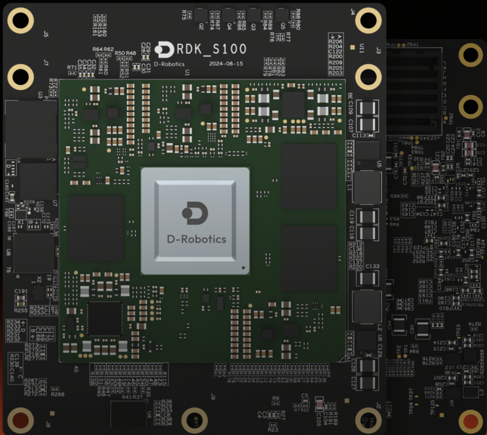 | [https://developer.d-robotics.cc/rdks100](https://developer.d-robotics.cc/rdks100) |
| RDK X5   | 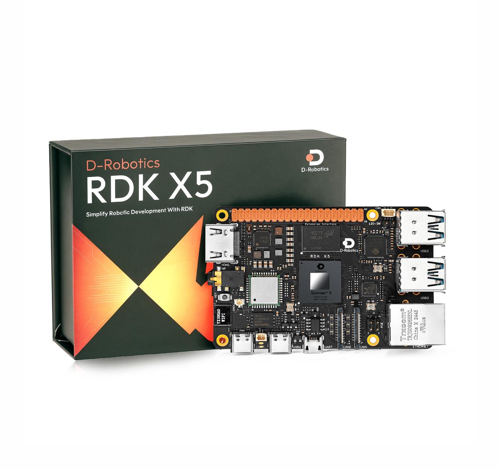   | [https://developer.d-robotics.cc/rdkx5](https://developer.d-robotics.cc/rdkx5) |


### 软件环境安装和准备
若选择将数据集以及模型上传至huggingface或从huggingface获取资源，请配置对应环境终端代理，否则无法访问huggingface

#### 开发机软件环境 

1. 准备miniconda环境（可选）

```bash
# 安装对应版本的Miniconda ，安装后source
https://www.anaconda.com/docs/getting-started/miniconda/install
# 创建conda环境
conda create -y -n lerobot python=3.10
# 激活虚拟环境
conda activate lerobot
```

2. 推荐从D-Robotics组织下载Fork的LeRobot仓库，原则上可以下载公版的LeRobot仓库进行模型的训练。
   
```bash
git clone https://github.com/D-Robotics/lerobot.git   # Recommend
git clone https://github.com/huggingface/lerobot.git  # or
```

3. Git后按步运行以下命令安装LeRobot仓库

```bash
conda install ffmpeg -c conda-forge #若使用conda环境
cd ~/lerobot && pip install -e ".[feetech]"
```

#### RDK板卡的软件环境

1. RDK板卡Miniconda环境安装详见附录（可选）
```bash
# 创建conda环境
conda create -y -n lerobot python=3.10
# 激活虚拟环境
conda activate lerobot
```

2. 推荐从D-Robotics组织下载Fork的LeRobot仓库，原则上可以下载公版的LeRobot，这里的开发都是基于D-Robotics组织Fork公版的LeRobot仓库。D-Robotics对公版的LeRobot仓库几乎没有作任何修改，所有关于BPU的操作都是基于新增的rdk_LeRobot_tools子文件夹而进行。
   
```bash
git clone https://github.com/D-Robotics/lerobot.git   # Recommend
git clone https://github.com/huggingface/lerobot.git  # or
```

3. 下载rdk_LeRobot_tools仓库，作为LeRobot项目的子文件夹。

```bash
cd lerobot
git clone https://github.com/D-Robotics/rdk_LeRobot_tools
```

4. Git后按步运行以下命令安装LeRobot仓库，具体可参考`lerobot/examples/10_use_so100.md`官方文档

```bash
conda install ffmpeg -c conda-forge #若使用conda环境
cd lerobot && pip install -e ".[feetech]"
```

### 基于公开版本的LeRobot修改说明
1. 所有的操作基于lerobot 仓库目录，目录下有lerobot目录，作为lerobot的package。所有的修改都以新增配置文件为主，不会特别的去修改LeRobot的源代码文件。
   
2. 新增 `rdk_lerobot_tools/cpu_act_control_robot.py` 文件，作为ACT Policy CPU推理启动的入口。
   
3. 新增 `rdk_lerobot_tools/bpu_act_control_robot.py` 文件，作为ACT Policy BPU推理启动的入口。
   
4. 新增 `rdk_lerobot_tools/export_bpu_actpolicy.py` 文件，导出ACT Policy为ONNX，准备校准数据，yaml文件和BPU模型量化编译脚本。
   
5. 修改 `lerobot/lerobot/common/datasets/video_utils.py` 文件中`encode_video_frames`方法以适配RDK上的视频格式，把libsvtav1改成libx264.
```bash
def encode_video_frames(
    imgs_dir: Path | str,
    video_path: Path | str,
    fps: int,
    vcodec: str = "libx264",  #在此处修改 libsvtav1 -> libx264
    pix_fmt: str = "yuv420p",
    g: int | None = 2,
    crf: int | None = 30,
    fast_decode: int = 0,
    log_level: str | None = "error",
    overwrite: bool = False,
) -> None:
```

6. 修改 lerobot/common/robot_devices/cameras/opencv.py 文件中 connect方法，优先取用MJPG格式.
   
```bash
# 在 self.camera = cv2.VideoCapture(camera_idx, backend) 初始化对象后，添加
# self.camera.set(cv2.CAP_PROP_FOURCC, cv2.VideoWriter_fourcc('M','J','P','G')).
'......'
self.camera = cv2.VideoCapture(camera_idx, backend)
# 在以下添加
self.camera.set(cv2.CAP_PROP_FOURCC, cv2.VideoWriter_fourcc('M','J','P','G'))
'......'
```

7. 修改 `lerobot/common/robot_devices/robots/manipulator.py` 中set_so100_robot_preset 方法，将PID控制中的D参数改为0，可有效减少遥操机械臂抖动。

```bash
def set_so100_robot_preset(self):
    for name in self.follower_arms:
        self.follower_arms[name].write("Mode", 0)
        self.follower_arms[name].write("P_Coefficient", 16)
        self.follower_arms[name].write("I_Coefficient", 0)
        self.follower_arms[name].write("D_Coefficient", 0) #<---此处修改
        self.follower_arms[name].write("Lock", 0)
        self.follower_arms[name].write("Maximum_Acceleration", 254)
        self.follower_arms[name].write("Acceleration", 254)
```

### 组装机械臂 & 舵机标注

#### 舵机标注

1. 接上一块舵机驱动板的电源和usb口，运行以下命令以找到机械臂串口

```bash
python lerobot/scripts/find_motors_bus_port.py
```

2. 在RDK板卡中常以/dev/ttyACM0形式出现，运行以下代码获取权限

```bash
sudo chmod 666 /dev/ttyACM0
```

3. 插入你的第一个电机并运行此脚本将其 ID 设置为 1。它还会将当前位置设置为 2048，你的电机会旋转，同理设置剩下6个电机。6个为一组，共计完成12个电机标注
注：标注数据保存在电机内部储存器中

```bash
python lerobot/scripts/configure_motor.py \
  --port /dev/ttyACM0 \
  --brand feetech \
  --model sts3215 \
  --baudrate 1000000 \
  --ID 1
```

#### 组装机械臂

参考`robot/examples/10_use_so100.md`官方文档完成机械臂组装，组装完成后的参考效果如下图所示。

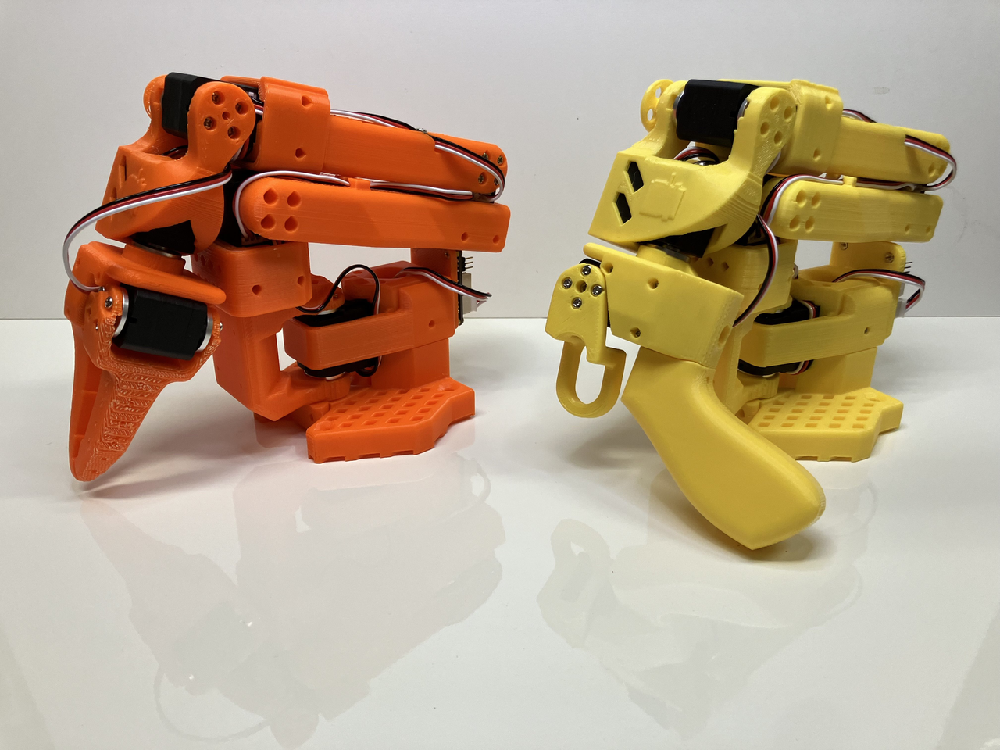
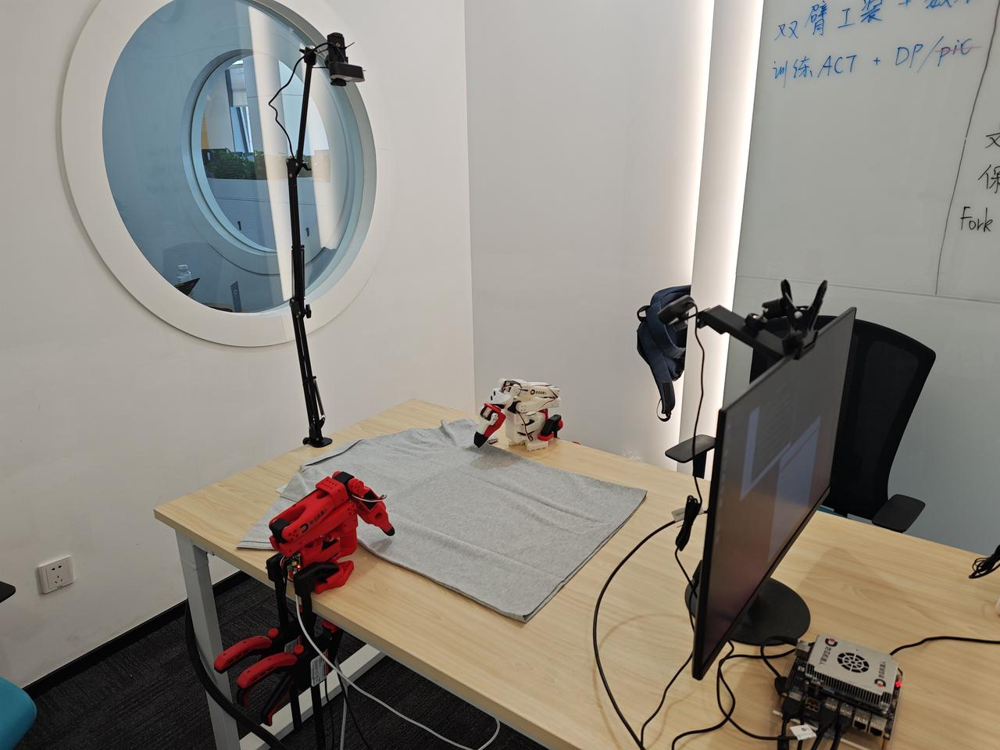
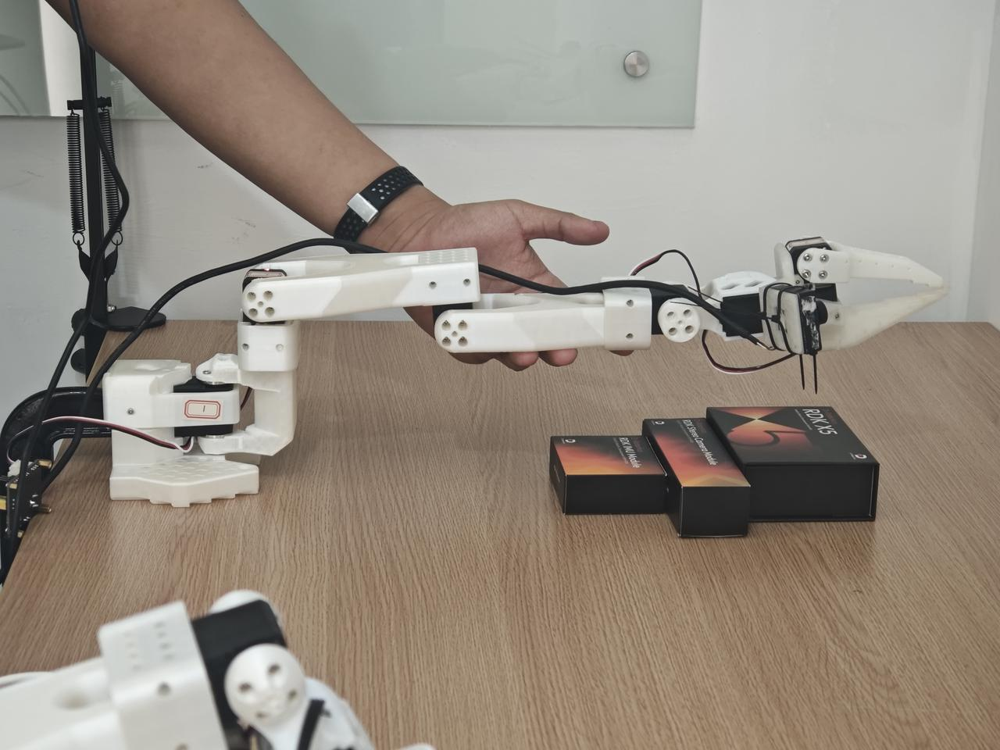


## 二、标定 (Calibrate Robot)  
1. 确保正确标注舵机以及按序正确组装机械臂后，接上两个机械臂的电源和usb口，运行以下代码以进行设备号确认

```bash
python lerobot/scripts/find_motors_bus_port.py
```

2. 修改lerobot/lerobot/common/robot_devices/robots/configs.py中‘so100’类对应设备串口
   
```python
@RobotConfig.register_subclass("so100")
@dataclass
class So100RobotConfig(ManipulatorRobotConfig):
    calibration_dir: str = ".cache/calibration/so100"
    max_relative_target: int | None = None
    leader_arms: dict[str, MotorsBusConfig] = field( 
        default_factory=lambda: {
            "main": FeetechMotorsBusConfig(
                port="/dev/ttyACM0", #根据设备确认填写
                motors={
                    "shoulder_pan": [1, "sts3215"],
                    "shoulder_lift": [2, "sts3215"],
                    "elbow_flex": [3, "sts3215"],
                    "wrist_flex": [4, "sts3215"],
                    "wrist_roll": [5, "sts3215"],
                    "gripper": [6, "sts3215"],
                },
            ),
        }
    )

    follower_arms: dict[str, MotorsBusConfig] = field(
        default_factory=lambda: {
            "main": FeetechMotorsBusConfig(
                port="/dev/ttyACM1", #根据设备确认填写
                motors={
                    "shoulder_pan": [1, "sts3215"],
                    "shoulder_lift": [2, "sts3215"],
                    "elbow_flex": [3, "sts3215"],
                    "wrist_flex": [4, "sts3215"],
                    "wrist_roll": [5, "sts3215"],
                    "gripper": [6, "sts3215"],
                },
            ),
        }
    )
    cameras: dict[str, CameraConfig] = field(
        default_factory=lambda: {
            "laptop": OpenCVCameraConfig(
                camera_index=2,
                fps=30,
                width=640,
                height=480,
            ),
            "phone": OpenCVCameraConfig(
                camera_index=0,
                fps=30,
                width=640,
                height=480,
            ),
        }
    )
    mock: bool = False
```


3. 确保两个机械臂都已连接，然后运行以下脚本启动手动校准：

校准follow臂

```bash
python lerobot/scripts/control_robot.py \
  --robot.type=so100 \
  --robot.cameras='{}' \
  --control.type=calibrate \
  --control.arms='["main_follower"]'
```

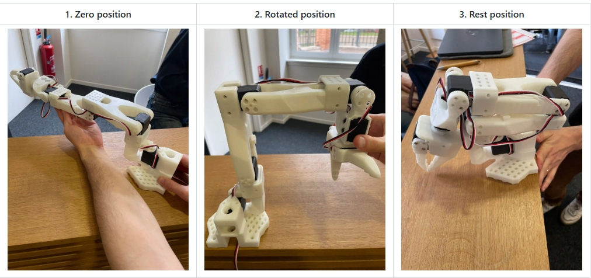

校准leader臂

```bash
python lerobot/scripts/control_robot.py \
  --robot.type=so100 \
  --robot.cameras='{}' \
  --control.type=calibrate \
  --control.arms='["main_leader"]'
```

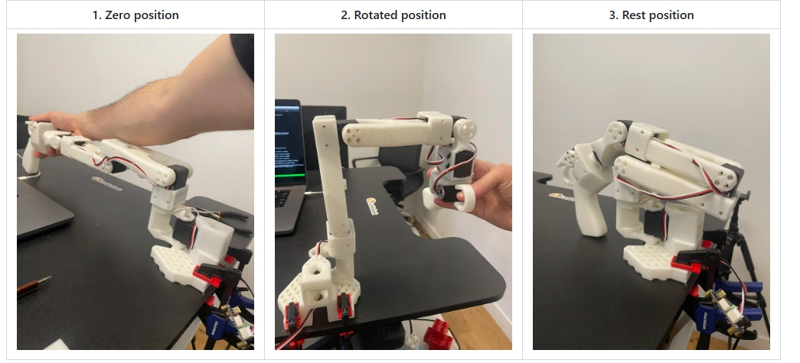


## 三、遥操 (Teleoperation) 

开始遥操作或数据采集之前运行以下命令以确认机械臂串口号

```bash
python lerobot/scripts/find_motors_bus_port.py
```

确认后若有所变化，请修改 `lerobot/common/robot_devices/robots/configs.py`中 'so100'类对应串口

```python
@RobotConfig.register_subclass("so100")
@dataclass
class So100RobotConfig(ManipulatorRobotConfig):
    calibration_dir: str = ".cache/calibration/so100"
    max_relative_target: int | None = None

    leader_arms: dict[str, MotorsBusConfig] = field(
        default_factory=lambda: {
            "main": FeetechMotorsBusConfig(
                port="/dev/ttyACM0",  #<-------修改此处主臂串口
                motors={
                    "shoulder_pan": [1, "sts3215"],
                    "shoulder_lift": [2, "sts3215"],
                    "elbow_flex": [3, "sts3215"],
                    "wrist_flex": [4, "sts3215"],
                    "wrist_roll": [5, "sts3215"],
                    "gripper": [6, "sts3215"],
                },
            ),
        }
    )

    follower_arms: dict[str, MotorsBusConfig] = field(
        default_factory=lambda: {
            "main": FeetechMotorsBusConfig(
                port="/dev/ttyACM1",  #<-------修改此处从臂串口
                motors={
                    "shoulder_pan": [1, "sts3215"],
                    "shoulder_lift": [2, "sts3215"],
                    "elbow_flex": [3, "sts3215"],
                    "wrist_flex": [4, "sts3215"],
                    "wrist_roll": [5, "sts3215"],
                    "gripper": [6, "sts3215"],
                },
            ),
        }
    )

    cameras: dict[str, CameraConfig] = field(
        ......
    )

    mock: bool = False
```

确定串口号正确配置后，运行以下命令进行无相机遥操作

```bash
python lerobot/scripts/control_robot.py \
  --robot.type=so100 \
  --robot.cameras='{}' \
  --control.type=teleoperate
```


## 四、数采 (Record a Dataset)


1. 固定两个USB摄像头至机械臂视角和外部固定视角，插入两个 USB 摄像头至 RDK后，运行以下脚本以检查摄像头的端口号，确保已修改 lerobot/common/robot_devices/cameras/opencv.py 优先读取MJPG图像。

```bash
python lerobot/common/robot_devices/cameras/opencv.py \
    --images-dir outputs/images_from_opencv_cameras
```

终端将打印出以下信息：

```
Linux detected. Finding available camera indices through scanning '/dev/video*' ports
[...]
Camera found at index /dev/video2
Camera found at index /dev/video0
Connecting cameras
OpenCVCamera(2, fps=30, width=640, height=480, color_mode=rgb)
OpenCVCamera(0, fps=30, width=640, height=480, color_mode=rgb
Frame: 0000 Latency (ms): 39.52
[...]
Frame: 0102 Latency (ms): 40.07
Images have been saved to outputs/images_from_opencv_cameras
```

2. 在 outputs/images_from_opencv_cameras 目录中找到每个摄像头拍摄的图片，并确认不同位置摄像头对应的端口索引信息。

3. 然后，完成 lerobot/lerobot/common/robot_devices/robots/configs.py 文件中摄像头参数的对齐：
   
```bash
@RobotConfig.register_subclass("so100")
@dataclass
class So100RobotConfig(ManipulatorRobotConfig):
    calibration_dir: str = ".cache/calibration/so100"
    max_relative_target limits the magnitude of the relative positional target vector for safety purposes.
    Set this to a positive scalar to have the same value for all motors, or a list that is the same length as
    the number of motors in your follower arms.
    max_relative_target: int | None = None

    leader_arms: dict[str, MotorsBusConfig] = field(
        default_factory=lambda: {
            "main": FeetechMotorsBusConfig(
                port="/dev/ttyACM0",
                motors={
                    name: (index, model)
                    "shoulder_pan": [1, "sts3215"],
                    "shoulder_lift": [2, "sts3215"],
                    "elbow_flex": [3, "sts3215"],
                    "wrist_flex": [4, "sts3215"],
                    "wrist_roll": [5, "sts3215"],
                    "gripper": [6, "sts3215"],
                },
            ),
        }
    )

    follower_arms: dict[str, MotorsBusConfig] = field(
        default_factory=lambda: {
            "main": FeetechMotorsBusConfig(
                port="/dev/ttyttyACM1",
                motors={
                    name: (index, model)
                    "shoulder_pan": [1, "sts3215"],
                    "shoulder_lift": [2, "sts3215"],
                    "elbow_flex": [3, "sts3215"],
                    "wrist_flex": [4, "sts3215"],
                    "wrist_roll": [5, "sts3215"],
                    "gripper": [6, "sts3215"],
                },
            ),
        }
    )

    cameras: dict[str, CameraConfig] = field(
        default_factory=lambda: {
            "laptop": OpenCVCameraConfig(
                camera_index=0,           #  ！在这里更新你的机械臂摄像头ID和其他参数
                fps=30,
                width=640,
                height=480,
            ),
            "phone": OpenCVCameraConfig(
                camera_index=2,           #  ！在这里更新你的另一个外部视角ID和其他参数
                fps=30,
                width=640,
                height=480,
            ),
        }
    )

    mock: bool = False
```

4. 接下来开始进行数据采集


接下运行以下代码开始数据采集：

```bash
python lerobot/scripts/control_robot.py \
  --robot.type=so100 \
  --control.type=record \
  --control.fps=30 \
  --control.single_task="Cloth Fold" \
  --control.tags='["so100","tutorial"]' \
  --control.warmup_time_s=5 \
  --control.episode_time_s=30 \
  --control.reset_time_s=1 \
  --control.num_episodes=50 \
  --control.push_to_hub=false \
  --control.display_data=false \
  --control.repo_id=USER/so100_test \
  --control.root=datasets/so100_test
```

参数说明
- warmup-time-s: 指初始化时间。
- episode-time-s: 表示每次收集数据的时间。
- reset-time-s: 是每次数据收集之间的准备时间。
- num-episodes: 表示预期收集多少组数据。
- push-to-hub: 决定是否将数据上传到 HuggingFace Hub。
- display_data：决定是否显示图形化界面
- root: 指定数据集保存路径


5. 记录数据集的建议

一旦您熟悉了数据记录，就可以创建一个更大的数据集进行训练了。一个好的开始任务是在不同的位置抓住一个物体并把它放在一个箱子里。我们建议至少录制50次，每种地点10次。保持摄像机固定，并在整个录制过程中保持一致的抓取行为。
在下面的部分中，您将训练您的神经网络。在获得可靠的抓取性能之后，您可以开始在数据收集过程中引入更多的变化，例如额外的抓取位置，不同的抓取技术以及改变相机位置。
避免太快地添加太多的变化，因为它可能会影响你的结果。

6. 若数据集保存在本地，可以使用以下命令在本地进行可视化：

```bash
python lerobot/scripts/visualize_dataset_html.py \
  --repo-id USER/so100_test \
  --root datasets/so100_test #指定数据集路径
```

## 五、模型训练 (Train a Policy) 

### 移动数据集到开发机上

1. 若开发机正确配置代理，且已将数据集push至huggingface，可选择在训练时通过repo_id方式加载数据集，需要在开发机终端登录huggingface。

2. 若未配置代理，且数据集保存在本地，请将数据集移动至开发机~/.cache/huggingface/lerobot/USER目录下或通过指定dataset.root参数读取数据集. 作者使用的卡是TITAN Xp，50组60秒的操作数据，训练50k轮，batch size为8，大约需要4小时。
   
3. 启动wandb（可选），运行以下代码登录wandb方便观察训练曲线
wandb login

4. 运行以下代码开始训练，可通过lerobot/configs/train.py文件修改训练参数

```bash
python lerobot/scripts/train.py \
  --dataset.repo_id=USER/so100_test \ #修改成自己的数据集
  --policy.type=act \
  --output_dir=outputs/train/act_test_1epoch \
  --job_name=act_so100_test \
  --policy.device=cuda \
  --wandb.enable=true \
  --dataset.root=.....
```

部分参数解读：
参数说明
- policy.type: 使用的策略类型。
- output_dir: 训练模型保存的路径。
- job_name:任务名称 。
- policy.device: 训练设备。
- wandb.enable：是否选择启动wandb
- dataset.root: 指定数据集路径

### 查看训练过程

当设置参数--wandb.enable=true时可在wandb网页中查看训练曲线

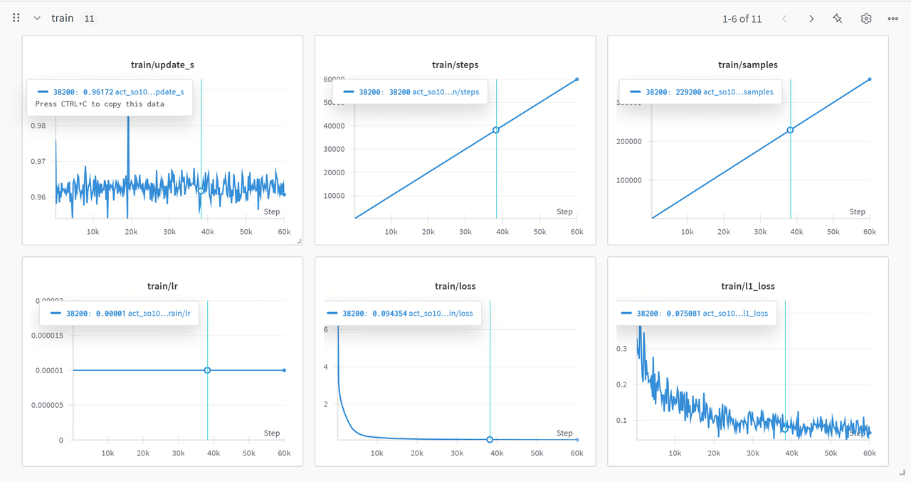

### 训练结果分析
1. update_s
曲线波动但整体稳定在一定范围，个别尖峰可能是训练中某些步骤的计算或资源调度耗时异常。

2. steps&&samples
二者均线性增长，训练按预期迭代推进，每步处理样本数稳定，训练流程正常。

3. lr
学习率保持固定值，在训练前期能让模型快速收敛。

4. loss
初期快速下降后趋于平稳且数值较低，表明模型前期能有效学习数据特征，后期接近收敛。

5. l1_loss
从较高值逐渐下降并波动，说明模型在优化预测值和真实值的绝对误差，但尚未完全稳定。

## 六、模型CPU部署 (Run on CPU) 
1. 可以简单使用只调取模型进行推理的脚本

```bash
# 需要修改脚本中对应模型权重目录
python rdk_lerobot_tools/cpu_control_robot.py
```

2. 也可以使用control_robot.py脚本record方法使推理和记录评估数据集同步进行

```bash
python lerobot/scripts/control_robot.py \
  --robot.type=so100 \
  --control.type=record \
  --control.fps=30 \
  --control.single_task="Cloth Fold" \
  --control.repo_id=MaCCChhh/eval_act_so100_0418_test1 \
  --control.tags='["tutorial"]' \
  --control.warmup_time_s=5 \
  --control.episode_time_s=180 \
  --control.reset_time_s=30 \
  --control.num_episodes=10 \
  --control.push_to_hub=false \
  --control.policy.path=outputs/act_so100_resnet152_0418_test1/pretrained_model
```

我们可以观察到机械臂按照我们所想的那样运行起来了，如果您的训练效果良好的话，那么这个机械臂会模仿我们之前所录制的动作。但是，他可能会运动一会卡一会，不要担心，我们即将使用BPU去加速这个策略的生成时间，避免动作之间的卡顿。


## 七、模型导出 (ONNX Export) 

导出LeRobot的safetensors模型到onnx，同时准备校准数据。准备浮点权重，一般在LeRobot训练后，会获得如下的文件夹

```bash
./pretrained_model/
├── config.json
├── model.safetensors
└── train_config.json
```

使用rdk_lerobot_tools/export_bpu_actpolicy.py准备校准数据。我们需要在文件中修改浮点权重的路径，和一些其他的参数，大约在第51行。

```python
parser = argparse.ArgumentParser()
parser.add_argument('--act-path', type=str, default='lerobot_training_weights/act_0417_2arms-', help='Path to LeRobot ACT Policy model.')
""" 
# example: --act-path pretrained_model
./pretrained_model/
├── config.json
├── model.safetensors
└── train_config.json
"""
parser.add_argument('--export-path', type=str, default='bpu_act_0417_2arms', help='Path to save LeRobot ACT Policy model.') 
parser.add_argument('--cal-num', type=int, default=200, help='Num of images to generate')
parser.add_argument('--onnx-sim', type=bool, default=True, help='Simplify onnx or not.') 
parser.add_argument('--type', type=str, default="nash-e", help='Optional: nash-e, nash-m, nash-p, bayes, bayes-e') 
parser.add_argument('--combine-jobs', type=int, default=6, help='combie jobs for OpenExplore.')
opt = parser.parse_args([])
```

这里的参数和您训练时是一致的，一般需要修改的参数是--dataset.repo_id来指定您所使用的数据集。事实上，这个导出脚本是基于训练脚本编写，会帮您导出模型到ONNX，同时准备好校准数据。

```bash
python rdk_lerobot_tools/export_bpu_actpolicy.py \
  --dataset.repo_id=MaCCChhh/so100_0417_test1 \
  --policy.type=act \
  --policy.device=cpu \
  --wandb.enable=false 
```

出现以下日志则运行成功：
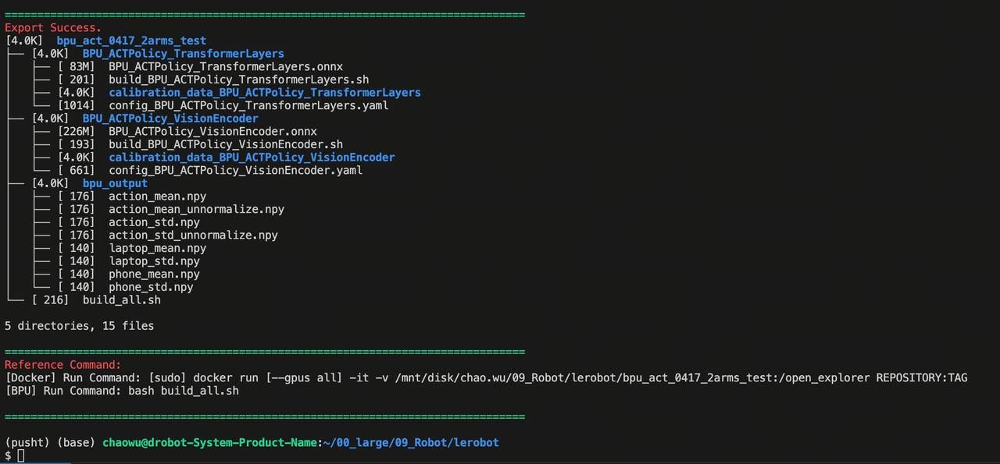

## 八、模型量化与编译 (Model Quantized and Compilation)@吴超 
经过模型导出的步骤，我们获得了BPU编译的工作目录，结构如下所示。这里面将ACT Policy的视觉编码器部分和4+1层的Transformers层分别导出，同时基于训练时的数据集取了200组校准数据进行保存，生成了编译的脚本和编译的yaml文件夹，还将图像和action输入的前后处理参数保存为了npy文件，放在最终bpu的发布文件夹中。

```bash
.
├── BPU_ACTPolicy_TransformerLayers
│   ├── BPU_ACTPolicy_TransformerLayers.onnx
│   ├── build_BPU_ACTPolicy_TransformerLayers.sh
│   ├── calibration_data_BPU_ACTPolicy_TransformerLayers
│   ├── config_BPU_ACTPolicy_TransformerLayers.yaml
├── BPU_ACTPolicy_VisionEncoder
│   ├── BPU_ACTPolicy_VisionEncoder.onnx
│   ├── build_BPU_ACTPolicy_VisionEncoder.sh
│   ├── calibration_data_BPU_ACTPolicy_VisionEncoder
│   ├── config_BPU_ACTPolicy_VisionEncoder.yaml
├── bpu_output_act_0417_2arms
│   ├── action_mean.npy
│   ├── action_mean_unnormalize.npy
│   ├── action_std.npy
│   ├── action_std_unnormalize.npy
│   ├── laptop_mean.npy
│   ├── laptop_std.npy
│   ├── phone_mean.npy
│   └── phone_std.npy
└── build_all.sh
```

在这里，我们使用算法工具链标准交付的docker环境，来完成BPU模型的量化和编译，docker的挂载命令参考以下代码块。

```bash
[sudo] docker run [--gpus all] -it -v <BPU_Work_Space>:/open_explorer REPOSITORY:TAG
```

其中：
- sudo可选，有时候我们的docker安装选项不同，所以需要根据自己的实际情况来选择是否sudo.
- --gpus all是挂载 GPU Docker 所需要的参数，如果是 CPU Docker，则不需要此参数。在X5的PTQ方案中，使用CPU Docker即可，仅仅QAT方案会使用到GPU Docker。在S100的PTQ方案中，GPU Docker会使用CUDA去加速前向传播calibrate阶段，不过，CPU Docker也是完全可以使用PTQ方案的。
- <BPU_Work_Space>需要替换为您想挂载进Docker的路径，这里为您导出的BPU工作目录的路径，注意，需要使用绝对路径。
- REPOSITORY:TAG需要根据您下载的Docker容器名称和版本号，可以使用docker的images命令来确认。
注：
这里只是提供参考的挂载方式，实际上您可以使用任何您喜欢的方式来使用Docker软件，如果您有其他疑问，请参考Docker的官方文档。

## 九、模型BPU部署 (Run on BPU)
经过模型量化与编译的步骤，我们会得到bpu_output文件夹，这个文件夹里面会有这些内容.

```bash
$ tree bpu_output_act_0417_2arms
.
├── BPU_ACTPolicy_TransformerLayers.hbm
├── BPU_ACTPolicy_VisionEncoder.hbm
├── action_mean.npy
├── action_mean_unnormalize.npy
├── action_std.npy
├── action_std_unnormalize.npy
├── laptop_mean.npy
├── laptop_std.npy
├── phone_mean.npy
└── phone_std.npy
```

将BPU ACT Policy模型拷贝至RDK板端，修改您的bpu_output文件路径，注意，给BPU_ACTPolicy类初始化的模型路径是一个文件夹的路径。
运行以下脚本即可使用BPU推理ACT Policy模型。每次ACT算法推理时，BPU以100%的占用爆发推理50毫秒，生成50组机械臂动作，动作执行时BPU占用静息到0%，50组机械臂动作执行完后，BPU开启下一轮算法推理。

```bash
python rdk_lerobot_tools/bpu_act_control_robot.py 
```

与纯CPU推理相比，由于BPU的强大爆发的推理算力，已经没有了动作和动作间的卡顿。


## 叠衣服案例
参考数据集仓库ID：https://huggingface.co/datasets/MaCCChhh/rdk_so100_test/tree/main

在线可视化参考数据集：https://huggingface.co/spaces/lerobot/visualize_dataset?dataset=MaCCChhh%2Frdk_so100_test

### 双臂环境准备

1. 物料准备：两套完备的 so100 物料：2 - 主臂，2 - 从臂，4 - 舵机控制板，确保有足够的USB接口，若没有请准备好USB拓展坞。
   
2. 重新组装一套so100,确保已经完成舵机标号（舵机标签保存在舵机内部存储中）。
   
3. 将四块舵机驱动板连接至RDK，进行 设备确认（舵机串口号确认）

4. 修改`lerobot/lerobot/common/robot_devices/robots/configs.py`中‘so100’类为以下代码
   
```python
@RobotConfig.register_subclass("so100")
@dataclass
class So100RobotConfig(ManipulatorRobotConfig):
    calibration_dir: str = ".cache/calibration/so100" #此处可选择修改机械臂标定文件夹
    max_relative_target: int | None = None
    leader_arms: dict[str, MotorsBusConfig] = field( #此处修改main为left和right
        default_factory=lambda: {
            "left": FeetechMotorsBusConfig(
                port="/dev/ttyACM0", #根据设备确认填写
                motors={
                    "shoulder_pan": [1, "sts3215"],
                    "shoulder_lift": [2, "sts3215"],
                    "elbow_flex": [3, "sts3215"],
                    "wrist_flex": [4, "sts3215"],
                    "wrist_roll": [5, "sts3215"],
                    "gripper": [6, "sts3215"],
                },
            ),
            "right": FeetechMotorsBusConfig(
                port="/dev/ttyACM3",
                motors={
                    "shoulder_pan": [1, "sts3215"],
                    "shoulder_lift": [2, "sts3215"],
                    "elbow_flex": [3, "sts3215"],
                    "wrist_flex": [4, "sts3215"],
                    "wrist_roll": [5, "sts3215"],
                    "gripper": [6, "sts3215"],
                },
            ),
        }
    )

    follower_arms: dict[str, MotorsBusConfig] = field( #此处修改main为left和right
        default_factory=lambda: {
            "left": FeetechMotorsBusConfig(
                port="/dev/ttyACM2",
                motors={
                    "shoulder_pan": [1, "sts3215"],
                    "shoulder_lift": [2, "sts3215"],
                    "elbow_flex": [3, "sts3215"],
                    "wrist_flex": [4, "sts3215"],
                    "wrist_roll": [5, "sts3215"],
                    "gripper": [6, "sts3215"],
                },
            ),
            "right": FeetechMotorsBusConfig(
                port="/dev/ttyACM4",
                motors={
                    "shoulder_pan": [1, "sts3215"],
                    "shoulder_lift": [2, "sts3215"],
                    "elbow_flex": [3, "sts3215"],
                    "wrist_flex": [4, "sts3215"],
                    "wrist_roll": [5, "sts3215"],
                    "gripper": [6, "sts3215"],
                },
            ),
        }
    )
    cameras: dict[str, CameraConfig] = field(
        default_factory=lambda: {
            "laptop": OpenCVCameraConfig(
                camera_index=5,
                fps=30,
                width=640,
                height=480,
            ),
            "phone": OpenCVCameraConfig(
                camera_index=1,
                fps=30,
                width=640,
                height=480,
            ),
        }
    )
    mock: bool = False
```

5. 进行双臂舵机标定
若是四臂都已通过单臂环境标定好，可通过修改标定文件名称 以 跳过对应机械臂标定
标定文件保存在 `.cache/calibration/so100`
```bash
python lerobot/scripts/control_robot.py \
  --robot.type=so100 \
  --robot.cameras='{}' \
  --control.type=calibrate \
  --control.arms='["left_follower"]'
  #  --control.arms='["right_follower"]'
  #  --control.arms='["left_leader"]'
  #  --control.arms='["right_leader"]'
```

标定完成后可在‘.cache/calibration/so100’目录下查看

```bash
`-- calibration
    `-- so100
        |-- left_follower.json
        |-- left_leader.json
        |-- right_follower.json
        `-- right_leader.json
```

6. 运行以下代码进行无相机遥操测试

```bash
python lerobot/scripts/control_robot.py \
  --robot.type=so100 \
  --robot.cameras='{}' \
  --control.type=teleoperate
```

### 数据采集以及训练部署

现在你已经完成了双臂遥操作的环境准备，后续步骤与单臂一致

数据集采集参考：https://huggingface.co/spaces/lerobot/visualize_dataset?dataset=MaCCChhh%2Frdk_so100_test


## 附录一、算法原理分析

参考论文：https://arxiv.org/abs/2304.13705

### 数采 (Record a Dataset)
多个摄像头的 RGB 图像、机器人当前关节角度(joint positions)和人类操作数据(通过 teleoperation 采集示范轨迹).

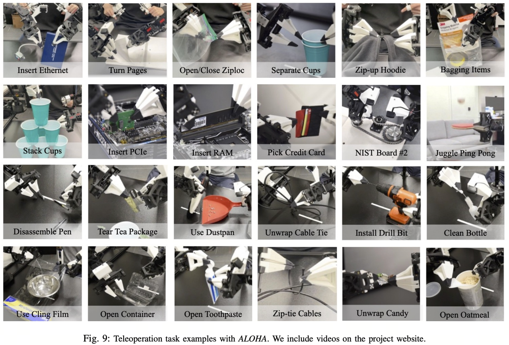
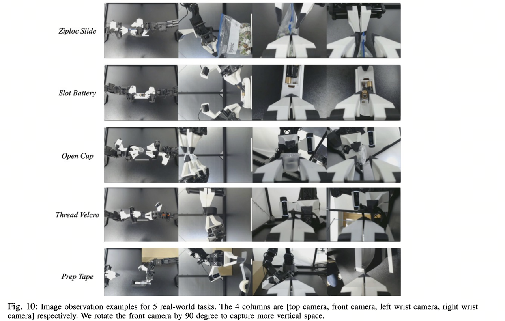

### 模型训练 (Train a Policy)

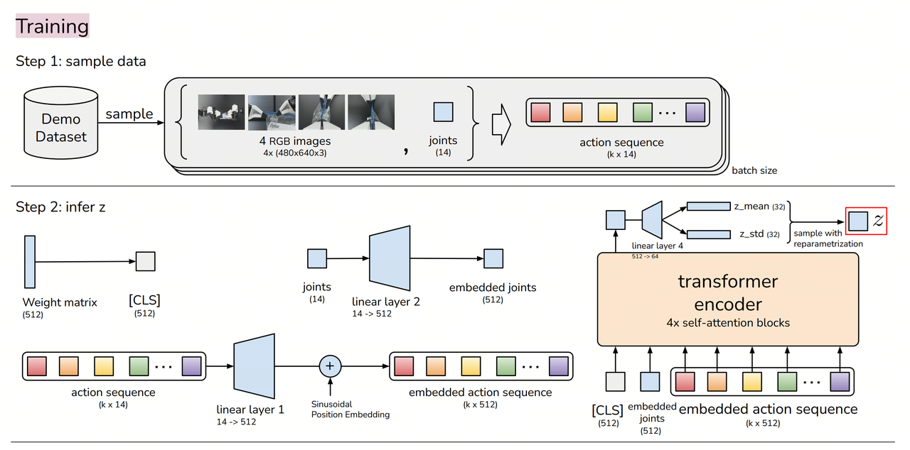
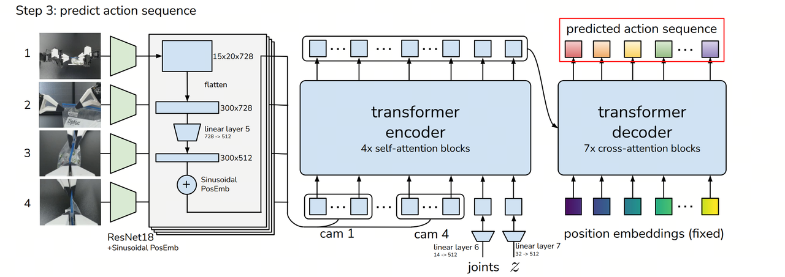
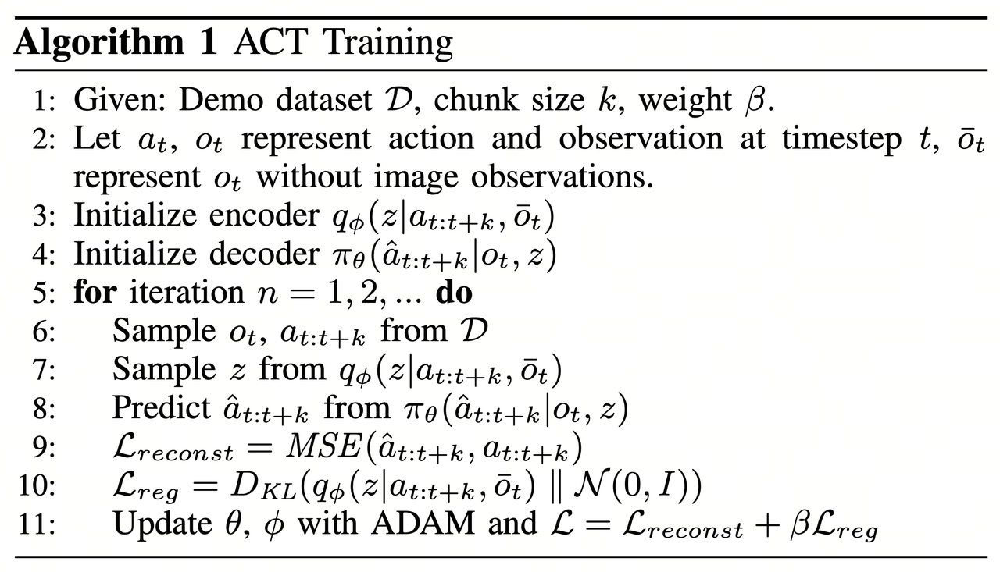

训练的目标 是让模型学会从观测数据（图像 + 关节角度）预测 未来 k 步的动作序列，而不是单步预测。核心组件如下：
Encoder (CVAE 编码器): 
- 采用 Transformer Encoder 处理 过去的动作和状态信息。
- 生成一个隐变量 z（style variable），捕捉人类演示中的风格和变化。
Decoder (CVAE 解码器 / Transformer Policy): 
- 输入：当前观察信息（图像 + 关节角度）+ 隐变量 z。
- 输出：未来 k 个时间步的动作序列（目标关节位置）。
训练损失函数
- 重建损失（Reconstruction Loss）：确保预测的动作序列接近真实示范数据。
- KL 散度（Kullback-Leibler Divergence Loss）：使隐变量 z 服从标准正态分布，以增强泛化能力。
训练结果：一个 Transformer-based 模型，可以在给定当前观察的情况下，预测未来 k 个时间步的动作。

### 模型部署 (Run)

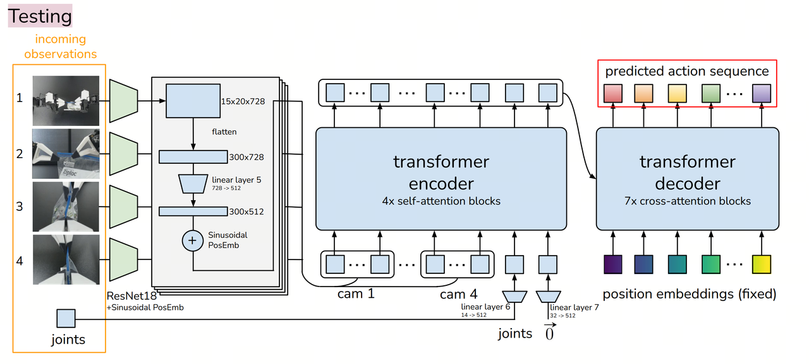
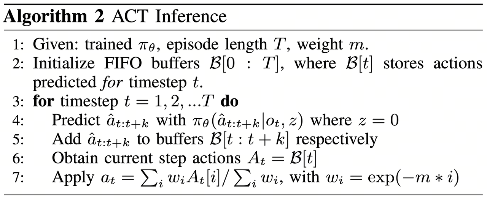

输入：
1. robot_state_feature (可选)：形状为 (B, state_dim) 的机器人状态批次，B 是批次大小（batch size），state_dim 是机器人状态的维度。
2. image_features：形状为 (B, n_cameras, C, H, W) 的图像批次，B 是批次大小（batch size），n_cameras 是摄像头数量，C 是通道数（通常为 3，表示 RGB 图像），H 是图像高度，W 是图像宽度。
3. env_state_feature：形状为 (B, env_dim) 的环境状态批次，B 是批次大小（batch size），env_dim 是环境状态的维度。
4. action_feature (可选，仅在使用 VAE 训练时)：形状为 (B, chunk_size, action_dim) 的动作批次，B 是批次大小（batch size），chunk_size 是动作序列的长度，action_dim 是每个动作的维度。
输出：
1. (B, chunk_size, action_dim) 形状的动作序列批次。
2. 一个包含潜在概率密度函数（PDF）参数的元组 (mean, log(σ²))，其中 mean 和 log(σ²) 都是形状为 (B, L) 的张量，L 是潜在维度。假设 B = 32，chunk_size = 10，action_dim = 6，L = 64，则输出的动作序列批次的形状为 (32, 10, 6)，潜在概率密度函数（PDF）参数的形状为 (32, 64)。在实际执行过程中，ACT 使用推理策略来平滑预测并减少误差累积。
Action Chunking（动作分块）
- 机器人不会逐步预测单个动作，而是每次预测 k 个时间步的动作序列。
- 这样可以减少 compounding error（误差累积），提高动作连贯性。
Temporal Ensembling（时间集成）
- 由于多个 k 步预测可能存在重叠部分，在某个时间步 t，可能会有多个预测值。
- 指数加权平均（Exponential Moving Average, EMA） 用于融合多个预测，提高稳定性,这样可以保证机器人运动平滑

机器人执行阶段（Execution Phase）
- 经过 Temporal Ensembling 处理后的动作序列 a_t，被发送到机器人执行。
- 机器人控制器 采用 PID 控制，使关节角度逐步跟随目标动作序列。


## 附录二、BPU部署原理分析

我们在CPU部署的过程中，使用Python的Debug工具，可以逐行运行Hugging Face的LeRobot项目中实现的ACT Policy算法。

由于视觉编码器的部分会调用多次，具体来说是有几个摄像头就会调用几次，所以这部分我们单独导出，在导出项目中，视觉编码器的名称为: BPU_ACTPolicy_VisionEncoder。

随后就是图像的token和动作的token一起送入编码层和解码层，在导出项目中，这部分的名称为: BPU_ACTPolicy_TransformerLayers.

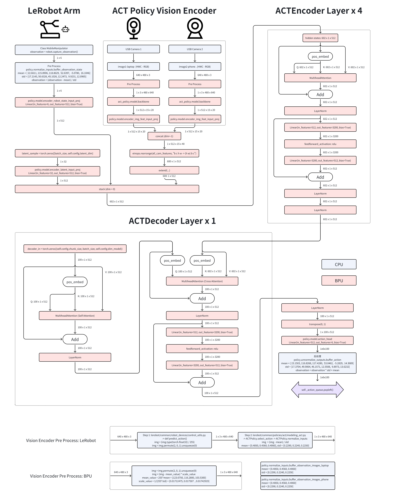


## 附录三、使用MiniConda虚拟环境

在RDK X5 / S100 上安装MiniConda，并配置为清华源  

参考：https://mirrors.tuna.tsinghua.edu.cn/help/anaconda/

从清华源拉取miniconda安装脚本，这里选择py310的版本，与Ubuntu22.04的全局解释器版本对齐.

```bash
wget https://mirrors.tuna.tsinghua.edu.cn/anaconda/miniconda/Miniconda3-py310_25.1.1-2-Linux-aarch64.sh
```

```bash
$ sh Miniconda3-py310_25.1.1-2-Linux-aarch64.sh

Welcome to Miniconda3 py310_25.1.1-2

In order to continue the installation process, please review the license
agreement.
Please, press ENTER to continue
>>>
```

此时按下回车，进行下一步
此后开始出现长串的 license 一直回车，直到出现以下提示 

```bash
Do you accept the license terms? [yes|no]
>>>
```

此时输入 yes 后回车，出现以下提示 

```bash
Miniconda3 will now be installed into this location:
/root/miniconda3

  - Press ENTER to confirm the location
  - Press CTRL-C to abort the installation
  - Or specify a different location below

[/root/miniconda3] >>>
```

按下回车 或填入你想安装的路径（不推荐修改），开始安装，直到出现：

```bash
Preparing transaction: done
Executing transaction: done
installation finished.
Do you wish to update your shell profile to automatically initialize conda?
This will activate conda on startup and change the command prompt when activated.
If you'd prefer that conda's base environment not be activated on startup,
   run the following command when conda is activated:

conda config --set auto_activate_base false

You can undo this by running `conda init --reverse $SHELL`? [yes|no]
[no] >>> 
```

输入 yes 后回车，出现以下提示表示安装成功

```bash
no change     /root/miniconda3/condabin/conda
no change     /root/miniconda3/bin/conda
no change     /root/miniconda3/bin/conda-env
no change     /root/miniconda3/bin/activate
no change     /root/miniconda3/bin/deactivate
no change     /root/miniconda3/etc/profile.d/conda.sh
no change     /root/miniconda3/etc/fish/conf.d/conda.fish
no change     /root/miniconda3/shell/condabin/Conda.psm1
no change     /root/miniconda3/shell/condabin/conda-hook.ps1
modified      /root/miniconda3/lib/pythonNone/site-packages/xontrib/conda.xsh
no change     /root/miniconda3/etc/profile.d/conda.csh
modified      /root/.bashrc

==> For changes to take effect, close and re-open your current shell. <==

Thank you for installing Miniconda3!
```


然后输入

```bash
source ~/.bashrc
```

终端前出现（base）字样表示成功

```bash
(base) root@ubuntu:~# 
```

## 附录四、常见问题排查

#### ffmpeg错误排查
如果出现ffmpeg找不到libx264编码器的问题，可能是预编译二进制包的ffmpeg在编译时屏蔽了GPL的部分，解决方法是卸载对应的ffmpeg，同时安装支持GPL部分的ffmpeg.

```bash
# 寻找当前环境使用的是哪里的ffmpeg
which ffmpeg
# 如果是系统的ffmpeg [例如: /usr/bin/ffmpeg]
sudo apt remove ffmpeg
# 如果是conda环境的ffmpeg [例如: /home/user/miniconda3/bin/ffmpeg]
conda remove ffmpeg
```


#### 机械臂在一个位置反复震荡
这种情况下请先检查所使用的模型是否有误，例如使用的是刚开始训练的模型权重，此时的模型并未收敛。另外两个以上的摄像头的时候，请检查摄像头的索引号是否有误，可以通过数据集的摄像头名称来确认。


#### 无法使用两个USB摄像头
由于RDK X5芯片只有一个USB3.1，所以需要限制每个USB相机对UVC设备带宽的占用，否则带宽会被第一个相机占满。
```bash
rmmod uvcvideo
modprobe uvcvideo quirks=128
```

如果仍然不稳定，则可以尝试使用以下的驱动补丁。

```bash
sudo rmmod uvcvideo
sudo insmod uvcvideo.ko
```

## 后记
由于方案迁移有很多挑战，在一些难以顾及的地方不可避免的使用了硬编码，例如phone和laptop两个摄像头的名称，输入的图像大小固定在了640x480，所以推荐您先按照本文推荐的配置进行复现，当您想做一些修改时，例如添加摄像头的数量，修改摄像头的分辨率，添加臂的数量，我们的方案源代码都是公开的，可以根据源代码来定制您自己的部署方案。

