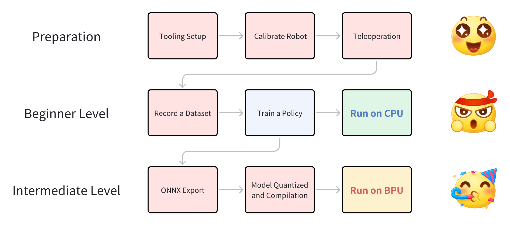

# RDK LeRobot Tools

Github README & README_cn: https://github.com/D-Robotics/rdk_LeRobot_tools
地瓜开发者社区中文博客: 
D-Robotics Developer English Blog: 

## 摘要
### 亮点
- RDK设备上的e2e的机械臂案例，体验ACT Policy: 视觉空间到动作空间Attention的具身算法。
- 完全可以调用上BPU的加速能力去加速。
- Hugging Face社区活跃，LeRobot项目热门，在国内外有一定影响力，并且像YOLO一样可以从数采、训练、工具链量化、BPU部署全流程交付。

### 单臂SO100的效果对比
通过本文，您可以在RDK设备上实现LeRobot的ACT Policy算法，同时可以观察到在BPU加速算法后，每次生成动作的卡顿完全消失。以下视频无加速，无剪辑。

- RDK S100: Run on CPU

[imgs/so100_1arm_RunOnCPU.mp4]

- RDK S100: Run on BPU

[imgs/so100_1arm_RunOnBPU.mp4]

### 双臂SO100的效果对比
甚至我们还可以组装一个双臂的SO100工装，在RDK上使用LeRobot来挑战叠衣服！
RDK S100: Run on CPU
RDK S100: Run on BPU

我们采集了50组双臂叠衣服的数据集，您可以参考我们的HuggingFace仓库的数据集来决定您的双臂工装：@马超 

## 全流程概览

## 一、工装搭建 (Tooling Setup) @马超 
工装搭建请优先参考HuggingFace的LeRobot项目提供的文档。
https://github.com/huggingface/lerobot/blob/main/examples/10_use_so100.md
物料准备
以下是组成一套完整的SO100主从臂所需要的物料
物料准备过程请优先参考SO-ARM100提供的完整资料：
https://github.com/TheRobotStudio/SO-ARM100
物料名称
外观照片参考
数量
备注
3D 打印部件
[图片]
1套

STl文件地址：GITHUB
可选择淘宝店铺进行3D打印
飞特 STS3215 舵机

[图片]
12
参考链接：官网
微雪舵机驱动板
[图片]
2
参考链接：官网
电源适配器12V 2A
[图片]
2

参考链接：官网
桌面木工夹

[图片]
4
参考链接：淘宝
根据桌面厚度选择尺寸
Type-c数据线
[图片]
2
参考链接：淘宝
螺丝刀套装
[图片]
1
参考链接：淘宝
按需购买
USB摄像头

2
参考链接：
按需购买
RDK S100

RDK X5

软件环境安装和准备
若选择将数据集以及模型上传至huggingface或从huggingface获取资源，请配置对应环境终端代理，否则无法访问huggingface
开发机软件环境@马超 
1. 准备miniconda环境（可选）
# 安装对应版本的Miniconda ，安装后source
https://www.anaconda.com/docs/getting-started/miniconda/install
# 创建conda环境
conda create -y -n lerobot python=3.10
# 激活虚拟环境
conda activate lerobot
1. 推荐从D-Robotics组织下载Fork的LeRobot仓库，原则上可以下载公版的LeRobot仓库进行模型的训练。
git clone https://github.com/D-Robotics/lerobot.git   # Recommend
git clone https://github.com/huggingface/lerobot.git  # or
1. Git后按步运行以下命令安装LeRobot仓库
conda install ffmpeg -c conda-forge #若使用conda环境
cd ~/lerobot && pip install -e ".[feetech]"
RDK板卡的软件环境
1. RDK板卡Miniconda环境安装详见附录（可选）
# 创建conda环境
conda create -y -n lerobot python=3.10
# 激活虚拟环境
conda activate lerobot
1. 推荐从D-Robotics组织下载Fork的LeRobot仓库，原则上可以下载公版的LeRobot，这里的开发都是基于D-Robotics组织Fork公版的LeRobot仓库。D-Robotics对公版的LeRobot仓库几乎没有作任何修改，所有关于BPU的操作都是基于新增的rdk_LeRobot_tools子文件夹而进行。
git clone https://github.com/D-Robotics/lerobot.git   # Recommend
git clone https://github.com/huggingface/lerobot.git  # or
1. 下载rdk_LeRobot_tools仓库，作为LeRobot项目的子文件夹。
cd lerobot
git clone https://github.com/D-Robotics/rdk_LeRobot_tools
1. Git后按步运行以下命令安装LeRobot仓库，具体可参考lerobot/examples/10_use_so100.md官方文档
conda install ffmpeg -c conda-forge #若使用conda环境
cd lerobot && pip install -e ".[feetech]"
基于公开版本的LeRobot修改说明
1. 所有的操作基于lerobot 仓库目录，目录下有lerobot目录，作为lerobot的package。所有的修改都以新增配置文件为主，不会特别的去修改LeRobot的源代码文件。
2. 新增 rdk_lerobot_tools/cpu_act_control_robot.py 文件，作为ACT Policy CPU推理启动的入口。
3. 新增 rdk_lerobot_tools/bpu_act_control_robot.py 文件，作为ACT Policy BPU推理启动的入口。
4. 新增 rdk_lerobot_tools/export_bpu_actpolicy.py 文件，导出ACT Policy为ONNX，准备校准数据，yaml文件和BPU模型量化编译脚本。
5. 修改 lerobot/lerobot/common/datasets/video_utils.py文件中encode_video_frames方法以适配RDK X5 / S100上的视频格式，把libsvtav1改成libx264.
def encode_video_frames(
    imgs_dir: Path | str,
    video_path: Path | str,
    fps: int,
    vcodec: str = "libx264",  #在此处修改 libsvtav1 -> libx264
    pix_fmt: str = "yuv420p",
    g: int | None = 2,
    crf: int | None = 30,
    fast_decode: int = 0,
    log_level: str | None = "error",
    overwrite: bool = False,
) -> None:
1. 修改 lerobot/common/robot_devices/cameras/opencv.py 文件中 connect方法，优先取用MJPG格式，
# 在 self.camera = cv2.VideoCapture(camera_idx, backend) 初始化对象后，添加
# self.camera.set(cv2.CAP_PROP_FOURCC, cv2.VideoWriter_fourcc('M','J','P','G')).
'......'
self.camera = cv2.VideoCapture(camera_idx, backend)
# 在以下添加
self.camera.set(cv2.CAP_PROP_FOURCC, cv2.VideoWriter_fourcc('M','J','P','G'))
'......'
1. 修改 lerobot/common/robot_devices/robots/manipulator.py 中set_so100_robot_preset 方法，将PID控制中的D参数改为0，可有效减少遥操机械臂抖动。
def set_so100_robot_preset(self):
    for name in self.follower_arms:
        self.follower_arms[name].write("Mode", 0)
        self.follower_arms[name].write("P_Coefficient", 16)
        self.follower_arms[name].write("I_Coefficient", 0)
        self.follower_arms[name].write("D_Coefficient", 0) #<---此处修改
        self.follower_arms[name].write("Lock", 0)
        self.follower_arms[name].write("Maximum_Acceleration", 254)
        self.follower_arms[name].write("Acceleration", 254)

舵机标注
1. 接上一块舵机驱动板的电源和usb口，运行以下命令以找到机械臂串口
python lerobot/scripts/find_motors_bus_port.py
2. 在RDK板卡中常以/dev/ttyACM0形式出现，运行以下代码获取权限
sudo chmod 666 /dev/ttyACM0
3. 插入你的第一个电机并运行此脚本将其 ID 设置为 1。它还会将当前位置设置为 2048，你的电机会旋转，同理设置剩下6个电机。6个为一组，共计完成12个电机标注
注：标注数据保存在电机内部储存器中
python lerobot/scripts/configure_motor.py \
  --port /dev/ttyACM0 \
  --brand feetech \
  --model sts3215 \
  --baudrate 1000000 \
  --ID 1
组装机械臂
参考lerobot/examples/10_use_so100.md官方文档完成机械臂组装
[图片]
二、标定 (Calibrate Robot) @马超 
1. 确保正确标注舵机以及按序正确组装机械臂后，接上两个机械臂的电源和usb口，运行以下代码以进行设备号确认
python lerobot/scripts/find_motors_bus_port.py
2. 修改lerobot/lerobot/common/robot_devices/robots/configs.py中‘so100’类对应设备串口
@RobotConfig.register_subclass("so100")
@dataclass
class So100RobotConfig(ManipulatorRobotConfig):
    calibration_dir: str = ".cache/calibration/so100"
    max_relative_target: int | None = None
    leader_arms: dict[str, MotorsBusConfig] = field( 
        default_factory=lambda: {
            "main": FeetechMotorsBusConfig(
                port="/dev/ttyACM0", #根据设备确认填写
                motors={
                    "shoulder_pan": [1, "sts3215"],
                    "shoulder_lift": [2, "sts3215"],
                    "elbow_flex": [3, "sts3215"],
                    "wrist_flex": [4, "sts3215"],
                    "wrist_roll": [5, "sts3215"],
                    "gripper": [6, "sts3215"],
                },
            ),
        }
    )

    follower_arms: dict[str, MotorsBusConfig] = field(
        default_factory=lambda: {
            "main": FeetechMotorsBusConfig(
                port="/dev/ttyACM1", #根据设备确认填写
                motors={
                    "shoulder_pan": [1, "sts3215"],
                    "shoulder_lift": [2, "sts3215"],
                    "elbow_flex": [3, "sts3215"],
                    "wrist_flex": [4, "sts3215"],
                    "wrist_roll": [5, "sts3215"],
                    "gripper": [6, "sts3215"],
                },
            ),
        }
    )
    cameras: dict[str, CameraConfig] = field(
        default_factory=lambda: {
            "laptop": OpenCVCameraConfig(
                camera_index=2,
                fps=30,
                width=640,
                height=480,
            ),
            "phone": OpenCVCameraConfig(
                camera_index=0,
                fps=30,
                width=640,
                height=480,
            ),
        }
    )
    mock: bool = False
3. 确保两个机械臂都已连接，然后运行以下脚本启动手动校准：
校准follow臂
python lerobot/scripts/control_robot.py \
  --robot.type=so100 \
  --robot.cameras='{}' \
  --control.type=calibrate \
  --control.arms='["main_follower"]'
[图片]
校准leader臂
python lerobot/scripts/control_robot.py \
  --robot.type=so100 \
  --robot.cameras='{}' \
  --control.type=calibrate \
  --control.arms='["main_leader"]'
[图片]
三、遥操 (Teleoperation) @马超 @黄树坤 
设备确认
开始遥操作或数据采集之前运行以下命令以确认机械臂串口号
python lerobot/scripts/find_motors_bus_port.py
确认后若有所变化，请修改 lerobot/common/robot_devices/robots/configs.py中 'so100'类对应串口
@RobotConfig.register_subclass("so100")
@dataclass
class So100RobotConfig(ManipulatorRobotConfig):
    calibration_dir: str = ".cache/calibration/so100"
    max_relative_target: int | None = None

    leader_arms: dict[str, MotorsBusConfig] = field(
        default_factory=lambda: {
            "main": FeetechMotorsBusConfig(
                port="/dev/ttyACM0",  #<-------修改此处主臂串口
                motors={
                    "shoulder_pan": [1, "sts3215"],
                    "shoulder_lift": [2, "sts3215"],
                    "elbow_flex": [3, "sts3215"],
                    "wrist_flex": [4, "sts3215"],
                    "wrist_roll": [5, "sts3215"],
                    "gripper": [6, "sts3215"],
                },
            ),
        }
    )

    follower_arms: dict[str, MotorsBusConfig] = field(
        default_factory=lambda: {
            "main": FeetechMotorsBusConfig(
                port="/dev/ttyACM1",  #<-------修改此处从臂串口
                motors={
                    "shoulder_pan": [1, "sts3215"],
                    "shoulder_lift": [2, "sts3215"],
                    "elbow_flex": [3, "sts3215"],
                    "wrist_flex": [4, "sts3215"],
                    "wrist_roll": [5, "sts3215"],
                    "gripper": [6, "sts3215"],
                },
            ),
        }
    )

    cameras: dict[str, CameraConfig] = field(
        ......
    )

    mock: bool = False
确定串口号正确配置后，运行以下命令进行无相机遥操作
python lerobot/scripts/control_robot.py \
  --robot.type=so100 \
  --robot.cameras='{}' \
  --control.type=teleoperate
四、数采 (Record a Dataset)@马超 @黄树坤 
1. 固定两个USB摄像头至机械臂视角和外部固定视角，插入两个 USB 摄像头至 RDK后，运行以下脚本以检查摄像头的端口号，确保已修改 lerobot/common/robot_devices/cameras/opencv.py 优先读取MJPG图像。
python lerobot/common/robot_devices/cameras/opencv.py \
    --images-dir outputs/images_from_opencv_cameras
终端将打印出以下信息：
Mac or Windows detected. Finding available camera indices through scanning all indices from 0 to 60
[...]
Camera found at index 0
Camera found at index 2
[...]
Connecting cameras
OpenCVCamera(2, fps=30.0, width=640, height=480, color_mode=rgb)
OpenCVCamera(4, fps=30.0, width=640, height=480, color_mode=rgb)
Saving images to outputs/images_from_opencv_cameras
Frame: 0000 Latency (ms): 39.52
[...]
Frame: 0046 Latency (ms): 40.07
 6
2. 在 outputs/images_from_opencv_cameras 目录中找到每个摄像头拍摄的图片，并确认不同位置摄像头对应的端口索引信息。
3. 然后，完成 lerobot/lerobot/common/robot_devices/robots/configs.py 文件中摄像头参数的对齐：
@RobotConfig.register_subclass("so100")
@dataclass
class So100RobotConfig(ManipulatorRobotConfig):
    calibration_dir: str = ".cache/calibration/so100"
    max_relative_target limits the magnitude of the relative positional target vector for safety purposes.
    Set this to a positive scalar to have the same value for all motors, or a list that is the same length as
    the number of motors in your follower arms.
    max_relative_target: int | None = None

    leader_arms: dict[str, MotorsBusConfig] = field(
        default_factory=lambda: {
            "main": FeetechMotorsBusConfig(
                port="/dev/ttyACM0",
                motors={
                    name: (index, model)
                    "shoulder_pan": [1, "sts3215"],
                    "shoulder_lift": [2, "sts3215"],
                    "elbow_flex": [3, "sts3215"],
                    "wrist_flex": [4, "sts3215"],
                    "wrist_roll": [5, "sts3215"],
                    "gripper": [6, "sts3215"],
                },
            ),
        }
    )

    follower_arms: dict[str, MotorsBusConfig] = field(
        default_factory=lambda: {
            "main": FeetechMotorsBusConfig(
                port="/dev/ttyttyACM1",
                motors={
                    name: (index, model)
                    "shoulder_pan": [1, "sts3215"],
                    "shoulder_lift": [2, "sts3215"],
                    "elbow_flex": [3, "sts3215"],
                    "wrist_flex": [4, "sts3215"],
                    "wrist_roll": [5, "sts3215"],
                    "gripper": [6, "sts3215"],
                },
            ),
        }
    )

    cameras: dict[str, CameraConfig] = field(
        default_factory=lambda: {
            "laptop": OpenCVCameraConfig(
                camera_index=0,           #  ！在这里更新你的机械臂摄像头ID和其他参数
                fps=30,
                width=640,
                height=480,
            ),
            "phone": OpenCVCameraConfig(
                camera_index=2,           #  ！在这里更新你的另一个外部视角ID和其他参数
                fps=30,
                width=640,
                height=480,
            ),
        }
    )

    mock: bool = False
4. 然后，运行下面代码就能够在遥操作时在计算机上显示摄像头（X5 由于性能不足会卡顿）：
python lerobot/scripts/control_robot.py \
  --robot.type=so100 \
  --control.type=teleoperate \
  --control.display_data=true
接下来开始进行数据采集，可选择是否上传至huggingface。
若选择上传至huggingface需要先在终端配置代理，否则无法正常访问 huggingface
正常配置终端代理后运行以下代码登录 huggingface ：
huggingface-cli login --token ${HUGGINGFACE_TOKEN} --add-to-git-credential
将 Hugging Face 仓库名称存储在一个变量中，运行以下命令：
HF_USER=$(huggingface-cli whoami | head -n 1)
echo $HF_USER
接下运行以下代码开始数据采集：
python lerobot/scripts/control_robot.py \
  --robot.type=so100 \
  --control.type=record \
  --control.fps=30 \
  --control.single_task="Cloth Fold" \
  --control.tags='["so100","tutorial"]' \
  --control.warmup_time_s=5 \
  --control.episode_time_s=30 \
  --control.reset_time_s=1 \
  --control.num_episodes=50 \
  --control.push_to_hub=false \ #根据需要修改
  --control.display_data=false \
  --control.repo_id=MaCCChhh/so100_0415_test1
记录数据集的建议
一旦您熟悉了数据记录，就可以创建一个更大的数据集进行训练了。一个好的开始任务是在不同的位置抓住一个物体并把它放在一个箱子里。我们建议至少录制50次，每种地点10次。保持摄像机固定，并在整个录制过程中保持一致的抓取行为。
在下面的部分中，您将训练您的神经网络。在获得可靠的抓取性能之后，您可以开始在数据收集过程中引入更多的变化，例如额外的抓取位置，不同的抓取技术以及改变相机位置。
避免太快地添加太多的变化，因为它可能会影响你的结果。

五、模型训练 (Train a Policy)@马超 
移动数据集到开发机上
【要点：SCP软件，什么路径，移动到什么地方】

作者使用的卡是TITAN Xp，50组60秒的操作数据，训练50k轮，batch size为8，大约需要4小时。

开始训练
python lerobot/scripts/train.py \
  --dataset.repo_id=MaCCChhh/so_test9 \
  --policy.type=act \
  --output_dir=outputs/train/act_test_1epoch \
  --job_name=act_test_1epoch \
  --policy.device=cuda \
  --wandb.enable=true
部分参数解读：

查看训练过程
当设置参数--wandb.enable=true时可在wandb网页中查看训练曲线
[图片]

训练结果分析

自定义train_config.json训练 [参考]
主要的修改点在于：修改了视觉backbone为ResNet50
{
    "dataset": {
        "repo_id": "MaCCChhh/so_test9",
        "root": null,
        "episodes": null,
        "image_transforms": {
            "enable": false,
            "max_num_transforms": 3,
            "random_order": false,
            "tfs": {
                "brightness": {
                    "weight": 1.0,
                    "type": "ColorJitter",
                    "kwargs": {
                        "brightness": [
                            0.8,
                            1.2
                        ]
                    }
                },
                "contrast": {
                    "weight": 1.0,
                    "type": "ColorJitter",
                    "kwargs": {
                        "contrast": [
                            0.8,
                            1.2
                        ]
                    }
                },
                "saturation": {
                    "weight": 1.0,
                    "type": "ColorJitter",
                    "kwargs": {
                        "saturation": [
                            0.5,
                            1.5
                        ]
                    }
                },
                "hue": {
                    "weight": 1.0,
                    "type": "ColorJitter",
                    "kwargs": {
                        "hue": [
                            -0.05,
                            0.05
                        ]
                    }
                },
                "sharpness": {
                    "weight": 1.0,
                    "type": "SharpnessJitter",
                    "kwargs": {
                        "sharpness": [
                            0.5,
                            1.5
                        ]
                    }
                }
            }
        },
        "revision": null,
        "use_imagenet_stats": true,
        "video_backend": "torchcodec"
    },
    "env": null,
    "policy": {
        "type": "act",
        "n_obs_steps": 1,
        "normalization_mapping": {
            "VISUAL": "MEAN_STD",
            "STATE": "MEAN_STD",
            "ACTION": "MEAN_STD"
        },
        "input_features": {
            "observation.state": {
                "type": "STATE",
                "shape": [
                    6
                ]
            },
            "observation.images.laptop": {
                "type": "VISUAL",
                "shape": [
                    3,
                    480,
                    640
                ]
            },
            "observation.images.phone": {
                "type": "VISUAL",
                "shape": [
                    3,
                    480,
                    640
                ]
            }
        },
        "output_features": {
            "action": {
                "type": "ACTION",
                "shape": [
                    6
                ]
            }
        },
        "device": "cuda",
        "use_amp": false,
        "chunk_size": 50,
        "n_action_steps": 50,
        "vision_backbone": "resnet50",
        "pretrained_backbone_weights": "ResNet50_Weights.IMAGENET1K_V1",
        "replace_final_stride_with_dilation": false,
        "pre_norm": false,
        "dim_model": 1024,
        "n_heads": 16,
        "dim_feedforward": 6400,
        "feedforward_activation": "relu",
        "n_encoder_layers": 8,
        "n_decoder_layers": 2,
        "use_vae": true,
        "latent_dim": 32,
        "n_vae_encoder_layers": 8,
        "temporal_ensemble_coeff": null,
        "dropout": 0.1,
        "kl_weight": 10.0,
        "optimizer_lr": 1e-05,
        "optimizer_weight_decay": 0.0001,
        "optimizer_lr_backbone": 1e-05
    },
    "output_dir": "outputs/train/act_test_1epoch",
    "job_name": "act_test_1epoch",
    "resume": false,
    "seed": 1000,
    "num_workers": 4,
    "batch_size": 8,
    "steps": 1,
    "eval_freq": 1,
    "log_freq": 1,
    "save_checkpoint": true,
    "save_freq": 1,
    "use_policy_training_preset": true,
    "optimizer": {
        "type": "adamw",
        "lr": 1e-05,
        "weight_decay": 0.0001,
        "grad_clip_norm": 10.0,
        "betas": [
            0.9,
            0.999
        ],
        "eps": 1e-08
    },
    "scheduler": null,
    "eval": {
        "n_episodes": 50,
        "batch_size": 50,
        "use_async_envs": false
    },
    "wandb": {
        "enable": true,
        "disable_artifact": false,
        "project": "lerobot",
        "entity": null,
        "notes": null,
        "run_id": null
    }
}
python3 lerobot/scripts/train.py \
    --config_path=train_config_0409_ResNet50.json \
    --output_dir=outputs/train_config_0409_ResNet50_0001

六、模型CPU部署 (Run on CPU)@马超 
1. 可以简单使用只调取模型进行推理的脚本
# 需要修改脚本中对应模型权重目录
python rdk_lerobot_tools/cpu_control_robot.py
可以使用control_robot.py脚本record方法使推理和记录评估数据集同步进行
python lerobot/scripts/control_robot.py \
  --robot.type=so100 \
  --control.type=record \
  --control.fps=30 \
  --control.single_task="Cloth Fold" \
  --control.repo_id=MaCCChhh/eval_act_so100_0418_test1 \
  --control.tags='["tutorial"]' \
  --control.warmup_time_s=5 \
  --control.episode_time_s=180 \
  --control.reset_time_s=30 \
  --control.num_episodes=10 \
  --control.push_to_hub=false \
  --control.policy.path=outputs/act_so100_resnet152_0418_test1/pretrained_model

暂时无法在飞书文档外展示此内容

七、模型导出 (ONNX Export) @吴超 
导出LeRobot的safetensors模型到onnx，同时准备校准数据
准备浮点权重，一般在LeRobot训练后，会获得如下的文件夹
./pretrained_model/
├── config.json
├── model.safetensors
└── train_config.json
使用rdk_lerobot_tools/export_bpu_actpolicy.py准备校准数据。我们需要在文件中修改浮点权重的路径，和一些其他的参数，大约在第51行。
parser = argparse.ArgumentParser()
parser.add_argument('--act-path', type=str, default='lerobot_training_weights/act_0417_2arms-', help='Path to LeRobot ACT Policy model.')
""" 
# example: --act-path pretrained_model
./pretrained_model/
├── config.json
├── model.safetensors
└── train_config.json
"""
parser.add_argument('--export-path', type=str, default='bpu_act_0417_2arms', help='Path to save LeRobot ACT Policy model.') 
parser.add_argument('--cal-num', type=int, default=200, help='Num of images to generate')
parser.add_argument('--onnx-sim', type=bool, default=True, help='Simplify onnx or not.') 
parser.add_argument('--type', type=str, default="nash-e", help='Optional: nash-e, nash-m, nash-p, bayes, bayes-e') 
parser.add_argument('--combine-jobs', type=int, default=6, help='combie jobs for OpenExplore.')
opt = parser.parse_args([])
#!/user/bin/env python

# Copyright (c) 2025，WuChao D-Robotics.
#
# Licensed under the Apache License, Version 2.0 (the "License");
# you may not use this file except in compliance with the License.
# You may obtain a copy of the License at
#
#     http://www.apache.org/licenses/LICENSE-2.0
#
# Unless required by applicable law or agreed to in writing, software
# distributed under the License is distributed on an "AS IS" BASIS,
# WITHOUT WARRANTIES OR CONDITIONS OF ANY KIND, either express or implied.
# See the License for the specific language governing permissions and
# limitations under the License.

# 注意: 此程序在开发机的训练环境中运行
# Attention: This program runs on developer machine training environment.

import logging
import os
import shutil
import cv2
import numpy as np
import torch
import argparse
import logging
import onnx
import torch
from copy import deepcopy
from termcolor import colored
from onnxsim import simplify
from termcolor import colored
from pprint import pformat

from lerobot.common.policies.act.modeling_act import *
from lerobot.common.datasets.factory import make_dataset
from lerobot.common.utils.utils import get_safe_torch_device, init_logging
from lerobot.configs import parser
from lerobot.configs.train import TrainPipelineConfig

BPU_VisionEncoder = "BPU_ACTPolicy_VisionEncoder"
BPU_TransformerLayers = "BPU_ACTPolicy_TransformerLayers"

REPOSITORY = "REPOSITORY"
TAG = "TAG"

# REPOSITORY = "openexplorer/ai_toolchain_ubuntu_20_x5_gpu"
# TAG = "v1.2.8-py310"

@parser.wrap()
def main(cfg: TrainPipelineConfig):
    # LeRobot的参数列表
    cfg.validate()
    logging.info(pformat(cfg.to_dict()))
    # 这里只是为了美观, 不支持从外传参, 需要在文件内修改
    parser = argparse.ArgumentParser()
    parser.add_argument('--act-path', type=str, default='lerobot_training_weights/act_0417_2arms-', help='Path to LeRobot ACT Policy model.')
    """ 
    # example: --act-path pretrained_model
    ./pretrained_model/
    ├── config.json
    ├── model.safetensors
    └── train_config.json
    """
    parser.add_argument('--export-path', type=str, default='bpu_act_0417_2arms', help='Path to save LeRobot ACT Policy model.') 
    parser.add_argument('--cal-num', type=int, default=200, help='Num of images to generate')
    parser.add_argument('--onnx-sim', type=bool, default=True, help='Simplify onnx or not.') 
    parser.add_argument('--type', type=str, default="nash-e", help='Optional: nash-e, nash-m, nash-p, bayes, bayes-e') 
    parser.add_argument('--combine-jobs', type=int, default=6, help='combie jobs for OpenExplore.')

    opt = parser.parse_args([])
    logging.info(f"opt: {opt}")
    # 所有的导出会基于opt.export_path这个文件夹
    ## 如果存在这个文件夹则删除
    if os.path.exists(opt.export_path): 
        shutil.rmtree(opt.export_path)
    visionEncoder_ws = os.path.join(opt.export_path, BPU_VisionEncoder)
    transformersLayers_ws = os.path.join(opt.export_path, BPU_TransformerLayers)
    ## 导出的ONNX文件路径
    onnx_name_BPU_ACTPolicy_VisionEncoder = BPU_VisionEncoder + ".onnx"
    onnx_path_BPU_ACTPolicy_VisionEncoder = os.path.join(visionEncoder_ws, onnx_name_BPU_ACTPolicy_VisionEncoder)
    onnx_name_BPU_ACTPolicy_TransformerLayers = BPU_TransformerLayers + ".onnx"
    onnx_path_BPU_ACTPolicy_TransformerLayers = os.path.join(transformersLayers_ws, onnx_name_BPU_ACTPolicy_TransformerLayers)
    ## 导出校准文件路径
    calbrate_data_name_BPU_ACTPolicy_VisionEncoder = "calibration_data_" + BPU_VisionEncoder
    calbrate_data_path_BPU_ACTPolicy_VisionEncoder = os.path.join(visionEncoder_ws, calbrate_data_name_BPU_ACTPolicy_VisionEncoder)
    calbrate_data_name_BPU_ACTPolicy_TransformerLayers = "calibration_data_" + BPU_TransformerLayers
    calbrate_data_path_BPU_ACTPolicy_TransformerLayers = os.path.join(transformersLayers_ws, calbrate_data_name_BPU_ACTPolicy_TransformerLayers)
    laptop_calbrate_data_path_BPU_ACTPolicy_TransformerLayers = os.path.join(calbrate_data_path_BPU_ACTPolicy_TransformerLayers, "laptop")
    phone_calbrate_data_path_BPU_ACTPolicy_TransformerLayers = os.path.join(calbrate_data_path_BPU_ACTPolicy_TransformerLayers, "phone")
    state_calbrate_data_path_BPU_ACTPolicy_TransformerLayers = os.path.join(calbrate_data_path_BPU_ACTPolicy_TransformerLayers, "state")
    ## 导出yaml配置文件路径
    config_yaml_name_BPU_ACTPolicy_VisionEncoder = "config_" + BPU_VisionEncoder + ".yaml"
    config_yaml_path_BPU_ACTPolicy_VisionEncoder = os.path.join(visionEncoder_ws, config_yaml_name_BPU_ACTPolicy_VisionEncoder)
    config_yaml_name_BPU_ACTPolicy_TransformerLayers = "config_" + BPU_TransformerLayers + ".yaml"
    config_yaml_path_BPU_ACTPolicy_TransformerLayers = os.path.join(transformersLayers_ws, config_yaml_name_BPU_ACTPolicy_TransformerLayers)
    ## 导出bash编译脚本路径
    bash_name_BPU_ACTPolicy_VisionEncoder = "build_" + BPU_VisionEncoder + ".sh"
    bash_path_BPU_ACTPolicy_VisionEncoder = os.path.join(visionEncoder_ws, bash_name_BPU_ACTPolicy_VisionEncoder)
    bash_name_BPU_ACTPolicy_TransformerLayers = "build_" + BPU_TransformerLayers + ".sh"
    bash_path_BPU_ACTPolicy_TransformerLayers = os.path.join(transformersLayers_ws, bash_name_BPU_ACTPolicy_TransformerLayers)
    ## 发布文件夹的脚本路径
    bpu_output_name = "bpu_output"
    bpu_output_path = os.path.join(opt.export_path, bpu_output_name)
    bash_build_all_path = os.path.join(opt.export_path, "build_all.sh") 
    ## 前后处理参数文件路径
    laptop_std_path = os.path.join(bpu_output_path, "laptop_std.npy")  
    laptop_mean_path = os.path.join(bpu_output_path, "laptop_mean.npy")
    phone_std_path = os.path.join(bpu_output_path, "phone_std.npy")
    phone_mean_path = os.path.join(bpu_output_path, "phone_mean.npy")
    action_std_path = os.path.join(bpu_output_path, "action_std.npy")
    action_mean_path = os.path.join(bpu_output_path, "action_mean.npy")
    action_std_unnormalize_path = os.path.join(bpu_output_path, "action_std_unnormalize.npy")
    action_mean_unnormalize_path = os.path.join(bpu_output_path, "action_mean_unnormalize.npy")
    ## 新建工作目录
    os.makedirs(visionEncoder_ws, exist_ok=True)
    logging.info(colored(f"mkdir: {visionEncoder_ws} Success.", 'green'))
    os.makedirs(transformersLayers_ws, exist_ok=True)
    logging.info(colored(f"mkdir: {transformersLayers_ws} Success.", 'green'))
    os.makedirs(calbrate_data_path_BPU_ACTPolicy_VisionEncoder, exist_ok=True)
    logging.info(colored(f"mkdir: {calbrate_data_path_BPU_ACTPolicy_VisionEncoder} Success.", 'green'))
    os.makedirs(calbrate_data_path_BPU_ACTPolicy_TransformerLayers, exist_ok=True)
    logging.info(colored(f"mkdir: {calbrate_data_path_BPU_ACTPolicy_TransformerLayers} Success.", 'green'))
    os.makedirs(laptop_calbrate_data_path_BPU_ACTPolicy_TransformerLayers, exist_ok=True)
    logging.info(colored(f"mkdir: {laptop_calbrate_data_path_BPU_ACTPolicy_TransformerLayers} Success.", 'green'))
    os.makedirs(phone_calbrate_data_path_BPU_ACTPolicy_TransformerLayers, exist_ok=True)
    logging.info(colored(f"mkdir: {phone_calbrate_data_path_BPU_ACTPolicy_TransformerLayers} Success.", 'green'))
    os.makedirs(state_calbrate_data_path_BPU_ACTPolicy_TransformerLayers, exist_ok=True)
    logging.info(colored(f"mkdir: {state_calbrate_data_path_BPU_ACTPolicy_TransformerLayers} Success.", 'green'))
    os.makedirs(bpu_output_path, exist_ok=True)
    logging.info(colored(f"mkdir: {bpu_output_path} Success.", 'green'))

    # 加载 ACT Policy 模型
    policy = ACTPolicy.from_pretrained(opt.act_path).cpu().eval()
    logging.info(colored(f"Load ACT Policy Model: {opt.act_path} Success.", 'light_red'))
    
    # CUDA Configs
    device = get_safe_torch_device(cfg.policy.device, log=True)
    torch.backends.cudnn.benchmark = True
    torch.backends.cuda.matmul.allow_tf32 = True

    # 构造数据集，读取数据集，并准备校准数据
    dataset = make_dataset(cfg)
    shuffle = True
    sampler = None
    dataloader = torch.utils.data.DataLoader(
        dataset,
        num_workers=0,
        batch_size=1,
        shuffle=True,
        sampler=None,
        pin_memory=device.type != "cpu",
        drop_last=False,
    )
    logging.info(colored(f"Load ACT Policy Dataset: \n{dataset} Success.", 'light_red'))

    # Export
    ## 拿到一组数据
    kvs = ['observation.images.laptop', 'observation.images.phone', 'observation.state']
    batch = next(iter(dataloader))
    batch = dict(filter(lambda item: item[0] in kvs, batch.items()))
    
    ## dirty run
    outputs = policy.select_action(deepcopy(batch))

    ## 前后处理参数
    laptop_std = policy.normalize_inputs.buffer_observation_images_laptop.std.data.detach().cpu().numpy()
    laptop_mean = policy.normalize_inputs.buffer_observation_images_laptop.mean.data.detach().cpu().numpy()
    phone_std = policy.normalize_inputs.buffer_observation_images_phone.std.data.detach().cpu().numpy()
    phone_mean = policy.normalize_inputs.buffer_observation_images_phone.mean.data.detach().cpu().numpy()
    action_std = policy.normalize_inputs.buffer_observation_state.std.data.detach().cpu().numpy()
    action_mean = policy.normalize_inputs.buffer_observation_state.mean.data.detach().cpu().numpy()
    action_std_unnormalize = policy.unnormalize_outputs.buffer_action.std.data.detach().cpu().numpy()
    action_mean_unnormalize = policy.unnormalize_outputs.buffer_action.mean.data.detach().cpu().numpy()

    np.save(laptop_std_path, laptop_std)
    np.save(laptop_mean_path, laptop_mean)
    np.save(phone_std_path, phone_std)
    np.save(phone_mean_path, phone_mean)
    np.save(action_std_path, action_std)
    np.save(action_mean_path, action_mean)
    np.save(action_std_unnormalize_path, action_std_unnormalize)   
    np.save(action_mean_unnormalize_path, action_mean_unnormalize)

    ## Vision Encoder
    batch = policy.normalize_inputs(batch)
    m_VisionEncoder = BPU_ACTPolicy_VisionEncoder(policy)
    m_VisionEncoder.eval()

    # # 基于huggingFace的前处理
    # mean = policy.normalize_inputs.buffer_observation_images_phone.mean
    # std = policy.normalize_inputs.buffer_observation_images_phone.std

    # input_tensor = batch['observation.images.phone']
    # # np.save(f"new_observation.images.phone.npy", input_tensor.detach().cpu().numpy())
    # input_tensor = (input_tensor - mean) / std
    # # np.save(f"new_observation.images.phone_meanstd.npy", input_tensor.detach().cpu().numpy())
    # # input_tensor = policy.normalize_inputs({"observation.images": batch['observation.images.phone']})["observation.images"]
    # vision_feature1 = m(input_tensor)
    # # np.save(f"new_can0feature.npy", vision_feature1.detach().cpu().numpy())

    # input_tensor = batch['observation.images.laptop']
    # # np.save(f"new_observation.images.laptop.npy", input_tensor.detach().cpu().numpy())
    # input_tensor = (input_tensor - mean) / std
    # # np.save(f"new_observation.images.laptop_meanstd.npy", input_tensor.detach().cpu().numpy())
    # # input_tensor = policy.normalize_inputs({"observation.images": batch['observation.images.laptop']})["observation.images"]
    # vision_feature2 = m(input_tensor)
    # # np.save(f"new_can1feature.npy", vision_feature2.detach().cpu().numpy())

    # ### 基于板端前处理对齐
    # yaml_mean = (255.0 * policy.normalize_inputs.buffer_observation_images_phone.mean[:,0,0]).cpu().numpy()[np.newaxis,:,np.newaxis,np.newaxis]
    # yaml_scale = (1.0 / (255.0 * policy.normalize_inputs.buffer_observation_images_phone.std[:,0,0])).cpu().numpy()[np.newaxis,:,np.newaxis,np.newaxis]

    # img = lerobotTensor2cvmat(batch['observation.images.laptop'])
    # # cv2.imwrite("new_observation.images.laptop.jpg", img)
    # input_tensor = cv2.cvtColor(img, cv2.COLOR_BGR2RGB)     # BGR2RGB
    # input_tensor = np.transpose(input_tensor, (2, 0, 1))    # HWC2CHW
    # input_tensor = np.expand_dims(input_tensor, axis=0).astype(np.float32)  # CHW -> NCHW
    # input_tensor = (input_tensor - yaml_mean) * yaml_scale
    # # np.save(f"new_cv2_observation.images.laptop_meanstd.npy", input_tensor)
    # input_tensor = torch.from_numpy(input_tensor).to(device)
    # vision_feature1 = m(input_tensor)
    # # np.save(f"new_cv2_can1feature.npy", vision_feature1.detach().cpu().numpy())

    # img = lerobotTensor2cvmat(batch['observation.images.phone'])
    # # cv2.imwrite("new_observation.images.phone.jpg", img)
    # input_tensor = cv2.cvtColor(img, cv2.COLOR_BGR2RGB)     # BGR2RGB
    # input_tensor = np.transpose(input_tensor, (2, 0, 1))    # HWC2CHW
    # input_tensor = np.expand_dims(input_tensor, axis=0).astype(np.float32)  # CHW -> NCHW
    # input_tensor = (input_tensor - yaml_mean) * yaml_scale
    # # np.save(f"new_cv2_observation.images.phone_meanstd.npy", input_tensor)
    # input_tensor = torch.from_numpy(input_tensor).to(device)
    # vision_feature2 = m(input_tensor)
    # # np.save(f"new_cv2_can0feature.npy", vision_feature2.detach().cpu().numpy())

    input_tensor = batch['observation.images.laptop']   
    vision_feature1 = m_VisionEncoder(input_tensor)
    input_tensor = batch['observation.images.phone']   
    vision_feature2 = m_VisionEncoder(input_tensor)

    onnx_path = onnx_path_BPU_ACTPolicy_VisionEncoder
    torch.onnx.export(
        m_VisionEncoder,  # 要转换的模型
        input_tensor,  # 模型的输入
        onnx_path,  # 输出文件名
        export_params=True,  # 存储训练后的参数
        opset_version=11,  # ONNX版本
        do_constant_folding=True,  # 是否执行常量折叠优化
        input_names=['images'],  # 输入节点名称
        output_names=['Vision_Features'],  # 输出节点名称
        dynamic_axes=None
    )
    onnx_sim(onnx_path, opt.onnx_sim)
    logging.info(colored(f"Export {onnx_path} Success.", 'green'))

    m_TransformerLayers = BPU_ACTPolicy_TransformerLayers(policy)
    m_TransformerLayers.eval()

    # # cv2 前处理
    # state = batch["observation.state"]
    # states_mean = policy.normalize_inputs.buffer_observation_state.mean.data
    # states_std = policy.normalize_inputs.buffer_observation_state.std.data
    # state = (state - states_mean) / states_std
    # np.save(f"new_cv2_state.npy", state.detach().cpu().numpy())

    # HuggingFace 前处理
    # state = batch["observation.state"]
    # state = policy.normalize_inputs({"observation.state": state})["observation.state"]
    # np.save(f"new_state.npy", state.detach().cpu().numpy())

    state = batch["observation.state"]
    actions = m_TransformerLayers(state, vision_feature1, vision_feature2)
    np.save(f"new_actions.npy", actions.detach().cpu().numpy())

    onnx_path = onnx_path_BPU_ACTPolicy_TransformerLayers
    torch.onnx.export(
        m_TransformerLayers,  # 要转换的模型
        (state, vision_feature1, vision_feature2),  # 模型的输入
        onnx_path,  # 输出文件名
        export_params=True,  # 存储训练后的参数
        opset_version=11,  # ONNX版本
        do_constant_folding=True,  # 是否执行常量折叠优化
        input_names=['states', 'laptop_features', 'phone_features'],  # 输入节点名称
        output_names=['Actions'],  # 输出节点名称
        dynamic_axes=None
    )
    onnx_sim(onnx_path, opt.onnx_sim)
    logging.info(colored(f"Export {onnx_path} Success.", 'green'))

    # 准备编译的校准数据, yaml文件和脚本
    if "nash" in opt.type:
        ## config yaml
        ### VisionEncoder
        yaml = f'''
model_parameters:
  onnx_model: '{onnx_name_BPU_ACTPolicy_VisionEncoder}'
  march: "{opt.type}"
  layer_out_dump: False
  working_dir: 'bpu_model_output'
  output_model_file_prefix: '{BPU_VisionEncoder}'
input_parameters:
  input_name: ""
  input_type_rt: 'featuremap'
  input_layout_train: 'NCHW'
  input_type_train: 'featuremap'
  input_layout_train: 'NCHW'
  norm_type: 'no_preprocess'
calibration_parameters:
  cal_data_dir: '{calbrate_data_name_BPU_ACTPolicy_VisionEncoder}'
  cal_data_type: 'float32'
  calibration_type: 'default'
  optimization: set_all_nodes_int16
compiler_parameters:
  jobs: {opt.combine_jobs}
  compile_mode: 'latency'
  debug: true
  optimize_level: 'O2'
'''
        with open(config_yaml_path_BPU_ACTPolicy_VisionEncoder, "w", encoding="utf-8") as file:
            file.write(yaml)
        logging.info(colored(f"Export config yaml: {config_yaml_path_BPU_ACTPolicy_VisionEncoder} success", 'green'))

        ### TransformerLayers
        yaml = f'''
model_parameters:
  onnx_model: '{onnx_name_BPU_ACTPolicy_TransformerLayers}'
  march: "{opt.type}"
  layer_out_dump: False
  working_dir: 'bpu_model_output'
  output_model_file_prefix: '{BPU_TransformerLayers}'
input_parameters:
  input_name: "states;laptop_features;phone_features;"
  input_type_rt: 'featuremap;featuremap;featuremap;'
  input_layout_train: 'NCHW;NCHW;NCHW;'
  input_type_train: 'featuremap;featuremap;featuremap;'
  input_layout_train: 'NCHW;NCHW;NCHW;'
  norm_type: 'no_preprocess;no_preprocess;no_preprocess;'
calibration_parameters:
  cal_data_dir: '{os.path.join(calbrate_data_name_BPU_ACTPolicy_TransformerLayers, "state")};{os.path.join(calbrate_data_name_BPU_ACTPolicy_TransformerLayers, "laptop")};{os.path.join(calbrate_data_name_BPU_ACTPolicy_TransformerLayers, "phone")};'
  cal_data_type: 'float32;float32;float32;'
  calibration_type: 'default'
  optimization: set_all_nodes_int16
compiler_parameters:
  extra_params: {{'input_no_padding': True, 'output_no_padding': True}}
  jobs: {opt.combine_jobs}
  compile_mode: 'latency'
  debug: False
  optimize_level: 'O2'
'''
        with open(config_yaml_path_BPU_ACTPolicy_TransformerLayers, "w", encoding="utf-8") as file:
            file.write(yaml)
        logging.info(colored(f"Export config yaml: {config_yaml_path_BPU_ACTPolicy_TransformerLayers} success", 'green'))
        ## bash scripts
        ### VisionEncoder
        bash = f'''
#!/bin/bash
set -e -v
cd $(dirname $0) || exit
hb_compile --config {config_yaml_name_BPU_ACTPolicy_VisionEncoder}
chmod 777 ./*
cp bpu_model_output/{BPU_VisionEncoder}.hbm ../bpu_output_name
'''
        with open(bash_path_BPU_ACTPolicy_VisionEncoder, "w", encoding="utf-8") as file:
            file.write(bash)
        logging.info(colored(f"Export bash scripts: {config_yaml_path_BPU_ACTPolicy_VisionEncoder} success", 'green'))

        ### TransformerLayers
        bash = f'''
#!/bin/bash
set -e -v
cd $(dirname $0) || exit
hb_compile --config {config_yaml_name_BPU_ACTPolicy_TransformerLayers}
chmod 777 ./*
cp bpu_model_output/{BPU_TransformerLayers}.hbm ../bpu_output_name
'''
        with open(bash_path_BPU_ACTPolicy_TransformerLayers, "w", encoding="utf-8") as file:
            file.write(bash)
        logging.info(colored(f"Export bash scripts: {bash_path_BPU_ACTPolicy_TransformerLayers} success", 'green'))

        ## all in one bash
        bash = f'''
#!/bin/bash
cd {BPU_VisionEncoder} && bash {bash_name_BPU_ACTPolicy_VisionEncoder} && cd ..
cd {BPU_TransformerLayers} && bash {bash_name_BPU_ACTPolicy_TransformerLayers} && cd ..
echo "End of build all."
'''
        with open(bash_build_all_path, "w", encoding="utf-8") as file:
            file.write(bash)
        logging.info(colored(f"Export bash scripts: {bash_build_all_path} success", 'green'))

        ## calibrate data
        input_names_TransformerLayers = ["laptop", "phone", "state"]
        input_cal_path = []
        for input_name in input_names_TransformerLayers:
            p = os.path.join(calbrate_data_path_BPU_ACTPolicy_TransformerLayers, input_name)
            input_cal_path.append(p)
            os.makedirs(p, exist_ok=True)
            logging.info(colored(f"mkdir: {p} Success.", 'green'))

        for i, batch in enumerate(dataloader):
            break
            name = "%.10d.npy"%i
            laptop_path = os.path.join(laptop_calbrate_data_path_BPU_ACTPolicy_TransformerLayers, name)
            phone_path = os.path.join(phone_calbrate_data_path_BPU_ACTPolicy_TransformerLayers, name)
            state_path = os.path.join(state_calbrate_data_path_BPU_ACTPolicy_TransformerLayers, name)
            batch = policy.normalize_inputs(batch)
            laptop_input = batch['observation.images.laptop']   
            phone_input = batch['observation.images.phone']   
            state_input = batch["observation.state"]
            ## VisionEncoder
            if i%4 == 0:
                p = os.path.join(calbrate_data_path_BPU_ACTPolicy_VisionEncoder, "laptop_" + name)
                np.save(p, laptop_input.detach().cpu().numpy())
                logging.info(colored(f"save to: {p}", 'light_blue'))
                p = os.path.join(calbrate_data_path_BPU_ACTPolicy_VisionEncoder, "phone_" + name)
                np.save(p, phone_input.detach().cpu().numpy())
                logging.info(colored(f"save to: {p}", 'light_blue'))
            ## TransformerLayers
            laptop_vision_feature1 = m_VisionEncoder(laptop_input)
            p = os.path.join(laptop_calbrate_data_path_BPU_ACTPolicy_TransformerLayers, name)
            np.save(p, laptop_vision_feature1.detach().cpu().numpy())
            logging.info(colored(f"save to: {p}", 'light_magenta'))

            phone_vision_feature2 = m_VisionEncoder(phone_input)
            p = os.path.join(phone_calbrate_data_path_BPU_ACTPolicy_TransformerLayers, name)
            np.save(p, phone_vision_feature2.detach().cpu().numpy())
            logging.info(colored(f"save to: {p}", 'light_magenta'))

            p = os.path.join(state_calbrate_data_path_BPU_ACTPolicy_TransformerLayers, name)
            np.save(p, state_input.detach().cpu().numpy())
            logging.info(colored(f"save to: {p}", 'light_magenta'))

            if i >= opt.cal_num:
                break

    if "bayes" in opt.type or "bernoulli2" in opt.type:
        pass

    # 提示词
    print()
    print(colored("="*80, 'light_green'))
    print(colored(f"Export Success.", 'light_red'))
    os.system(f"tree {opt.export_path} -L 2 -h")
    print()

    print(colored("="*80, 'light_green'))
    print(colored("Reference Command: ", 'light_red'))
    print(f"[Docker] Run Command: [sudo] docker run [--gpus all] -it -v {os.path.join(os.getcwd(), opt.export_path)}:/open_explorer {REPOSITORY}:{TAG}")
    print(f"[BPU] Run Command: bash build_all.sh")
    print()

    print(colored("="*80, 'light_green'), "\n")

def onnx_sim(opt):
    if opt.onnx_sim:
        model_onnx = onnx.load(opt.onnx_path)  # load onnx model
        onnx.checker.check_model(model_onnx)  # check onnx model
        model_onnx, check = simplify(
            model_onnx,
            dynamic_input_shape=False,
            input_shapes=None)
        assert check, 'assert check failed'
        onnx.save(model_onnx, opt.onnx_path)    

class BPU_ACTPolicy_VisionEncoder(nn.Module):
    def __init__(self, act_policy):
        super().__init__()
        self.backbone = deepcopy(act_policy.model.backbone)
        self.encoder_img_feat_input_proj = deepcopy(act_policy.model.encoder_img_feat_input_proj)
    def forward(self, images):
        cam_features = self.backbone(images)["feature_map"]
        cam_features = self.encoder_img_feat_input_proj(cam_features)
        cam_features = cam_features
        return cam_features

class BPU_ACTPolicy_TransformerLayers(nn.Module):
    def __init__(self, act_policy):
        super().__init__()
        self.model = deepcopy(act_policy.model)

    def forward(self, states, vision_feature1, vision_feature2):
        latent_sample = torch.zeros([1, self.model.config.latent_dim], dtype=torch.float32)

        encoder_in_tokens = [self.model.encoder_latent_input_proj(latent_sample)]
        # encoder_in_pos_embed = list(self.model.encoder_1d_feature_pos_embed.weight.unsqueeze(1))
        encoder_in_pos_embed = self.model.encoder_1d_feature_pos_embed.weight.unsqueeze(1).unbind(dim=0)
        encoder_in_tokens.append(self.model.encoder_robot_state_input_proj(states))

        all_cam_features = []
        all_cam_pos_embeds = []

        vision_features = [vision_feature1, vision_feature2]
        for vision_feature in vision_features:
            cam_pos_embed = self.model.encoder_cam_feat_pos_embed(vision_feature)
            all_cam_features.append(vision_feature)
            all_cam_pos_embeds.append(cam_pos_embed)   

        # cam_pos_embed = self.model.encoder_cam_feat_pos_embed(vision_feature1)
        # all_cam_features.append(vision_feature1)
        # all_cam_pos_embeds.append(cam_pos_embed)

        # cam_pos_embed = self.model.encoder_cam_feat_pos_embed(vision_feature2)
        # all_cam_features.append(vision_feature2)
        # all_cam_pos_embeds.append(cam_pos_embed)

        tokens = []
        for token in encoder_in_tokens:
            tokens.append(token.view(1,1,self.model.config.dim_model))
        all_cam_features = torch.cat(all_cam_features, axis=-1).permute(2, 3, 0, 1).view(-1,1,self.model.config.dim_model)
        tokens.append(all_cam_features)
        encoder_in_tokens = torch.cat(tokens, axis=0)

        pos_embeds = []
        for pos_embed in encoder_in_pos_embed:
            pos_embeds.append(pos_embed.view(1,1,self.model.config.dim_model))
        all_cam_pos_embeds = torch.cat(all_cam_pos_embeds, axis=-1).permute(2, 3, 0, 1).view(-1,1,self.model.config.dim_model)
        pos_embeds.append(all_cam_pos_embeds)
        encoder_in_pos_embed = torch.cat(pos_embeds, axis=0)

        # all_cam_features = torch.cat(all_cam_features, axis=-1)
        # encoder_in_tokens.extend(einops.rearrange(all_cam_features, "b c h w -> (h w) b c"))
        # all_cam_pos_embeds = torch.cat(all_cam_pos_embeds, axis=-1)
        # encoder_in_pos_embed.extend(einops.rearrange(all_cam_pos_embeds, "b c h w -> (h w) b c"))

        # encoder_in_tokens = torch.stack(encoder_in_tokens, axis=0)
        # encoder_in_pos_embed = torch.stack(encoder_in_pos_embed, axis=0)

        encoder_out = self.model.encoder(encoder_in_tokens, pos_embed=encoder_in_pos_embed)

        decoder_in = torch.zeros(
            (self.model.config.chunk_size, 1, self.model.config.dim_model),
            dtype=encoder_in_pos_embed.dtype,
            device=encoder_in_pos_embed.device,
        )
        decoder_out = self.model.decoder(
            decoder_in,
            encoder_out,
            encoder_pos_embed=encoder_in_pos_embed,
            decoder_pos_embed=self.model.decoder_pos_embed.weight.unsqueeze(1),
        )

        decoder_out = decoder_out.transpose(0, 1)

        actions = self.model.action_head(decoder_out)

        return actions

def lerobotTensor2cvmat(tensor):
    img = (tensor*255).permute(0, 2, 3, 1).cpu().numpy().astype(np.uint8)[0,:,:,:]
    # img = cv2.cvtColor(img, cv2.COLOR_BGR2RGB)
    img = cv2.cvtColor(img, cv2.COLOR_RGB2BGR)
    return img

def onnx_sim(onnx_path, onnx_sim):   
    if onnx_sim:
        model_onnx = onnx.load(onnx_path)  # load onnx model
        onnx.checker.check_model(model_onnx)  # check onnx model
        model_onnx, check = simplify(
            model_onnx,
            dynamic_input_shape=False,
            input_shapes=None)
        assert check, 'assert check failed'
        onnx.save(model_onnx, onnx_path)    

if __name__ == "__main__":
    init_logging()
    main()

这里的参数和您训练时是一致的，一般需要修改的参数是--dataset.repo_id来指定您所使用的数据集。事实上，这个导出脚本是基于训练脚本编写，会帮您导出模型到ONNX，同时准备好校准数据。
python rdk_lerobot_tools/export_bpu_actpolicy.py \
  --dataset.repo_id=MaCCChhh/so100_0417_test1 \
  --policy.type=act \
  --policy.device=cpu \
  --wandb.enable=false 
出现以下日志则运行成功：
[图片]

八、模型量化与编译 (Model Quantized and Compilation)@吴超 
经过模型导出的步骤，我们获得了BPU编译的工作目录，结构如下所示。这里面将ACT Policy的视觉编码器部分和4+1层的Transformers层分别导出，同时基于训练时的数据集取了200组校准数据进行保存，生成了编译的脚本和编译的yaml文件夹，还将图像和action输入的前后处理参数保存为了npy文件，放在最终bpu的发布文件夹中。
.
├── BPU_ACTPolicy_TransformerLayers
│   ├── BPU_ACTPolicy_TransformerLayers.onnx
│   ├── build_BPU_ACTPolicy_TransformerLayers.sh
│   ├── calibration_data_BPU_ACTPolicy_TransformerLayers
│   ├── config_BPU_ACTPolicy_TransformerLayers.yaml
├── BPU_ACTPolicy_VisionEncoder
│   ├── BPU_ACTPolicy_VisionEncoder.onnx
│   ├── build_BPU_ACTPolicy_VisionEncoder.sh
│   ├── calibration_data_BPU_ACTPolicy_VisionEncoder
│   ├── config_BPU_ACTPolicy_VisionEncoder.yaml
├── bpu_output_act_0417_2arms
│   ├── action_mean.npy
│   ├── action_mean_unnormalize.npy
│   ├── action_std.npy
│   ├── action_std_unnormalize.npy
│   ├── laptop_mean.npy
│   ├── laptop_std.npy
│   ├── phone_mean.npy
│   └── phone_std.npy
└── build_all.sh
在这里，我们使用算法工具链标准交付的docker环境，来完成BPU模型的量化和编译，docker的挂载命令参考以下代码块。
[sudo] docker run [--gpus all] -it -v <BPU_Work_Space>:/open_explorer REPOSITORY:TAG
其中：
- sudo可选，有时候我们的docker安装选项不同，所以需要根据自己的实际情况来选择是否sudo.
- --gpus all是挂载 GPU Docker 所需要的参数，如果是 CPU Docker，则不需要此参数。在X5的PTQ方案中，使用CPU Docker即可，仅仅QAT方案会使用到GPU Docker。在S100的PTQ方案中，GPU Docker会使用CUDA去加速前向传播calibrate阶段，不过，CPU Docker也是完全可以使用PTQ方案的。
- <BPU_Work_Space>需要替换为您想挂载进Docker的路径，这里为您导出的BPU工作目录的路径，注意，需要使用绝对路径。
- REPOSITORY:TAG需要根据您下载的Docker容器名称和版本号，可以使用docker的images命令来确认。
注：
这里只是提供参考的挂载方式，实际上您可以使用任何您喜欢的方式来使用Docker软件，如果您有其他疑问，请参考Docker的官方文档。

九、模型BPU部署 (Run on BPU) @吴超 
经过模型量化与编译的步骤，我们会得到bpu_output文件夹，这个文件夹里面会有这些内容
$ tree bpu_output_act_0417_2arms
.
├── BPU_ACTPolicy_TransformerLayers.hbm
├── BPU_ACTPolicy_VisionEncoder.hbm
├── action_mean.npy
├── action_mean_unnormalize.npy
├── action_std.npy
├── action_std_unnormalize.npy
├── laptop_mean.npy
├── laptop_std.npy
├── phone_mean.npy
└── phone_std.npy
将BPU ACT Policy模型拷贝至RDK板端，修改您的bpu_output文件路径，注意，给BPU_ACTPolicy类初始化的模型路径是一个文件夹的路径。
运行以下脚本即可使用BPU推理ACT Policy模型。每次ACT算法推理时，BPU以100%的占用爆发推理50毫秒，生成50组机械臂动作，动作执行时BPU占用静息到0%，50组机械臂动作执行完后，BPU开启下一轮算法推理。
python rdk_lerobot_tools/bpu_act_control_robot.py 

与纯CPU推理相比，由于BPU的强大爆发的推理算力，已经没有了动作和动作间的卡顿。
#!/user/bin/env python

# Copyright (c) 2025，WuChao D-Robotics.
# Copyright 2024 The HuggingFace Inc. team. All rights reserved.
#
# Licensed under the Apache License, Version 2.0 (the "License");
# you may not use this file except in compliance with the License.
# You may obtain a copy of the License at
#
#     http://www.apache.org/licenses/LICENSE-2.0
#
# Unless required by applicable law or agreed to in writing, software
# distributed under the License is distributed on an "AS IS" BASIS,
# WITHOUT WARRANTIES OR CONDITIONS OF ANY KIND, either express or implied.
# See the License for the specific language governing permissions and
# limitations under the License.

# 注意: 此程序在RDK板端运行
# Attention: This program runs on RDK board.

import time
import numpy as np
from copy import copy
import argparse
import os

import torch
from torch import Tensor
from collections import deque

from lerobot.common.robot_devices.robots.utils import make_robot
from lerobot.common.robot_devices.control_utils import busy_wait

try:
    from libpycauchyS100tools import BPU_ACTPolicy
    print("using: libpycauchyS100tools")
except:
    from libpycauchytools import BPU_ACTPolicy
    print("using: libpycauchytools")

def main():
    parser = argparse.ArgumentParser()
    parser.add_argument('--bpu-act-path', type=str, default='/root/lerobot_b/bpu_output_act_0417_2arms', help='Path to LeRobot ACT Policy model.')
    """ 
    # example: --bpy-act-path pretrained_model
    .
    |-- BPU_ACTPolicy_TransformerLayers.hbm
    |-- BPU_ACTPolicy_VisionEncoder.hbm
    |-- action_mean.npy
    |-- action_mean_unnormalize.npy
    |-- action_std.npy
    |-- action_std_unnormalize.npy
    |-- laptop_mean.npy
    |-- laptop_std.npy
    |-- phone_mean.npy
    `-- phone_std.npy
    """
    parser.add_argument('--fps', type=int, default=30, help='') 
    parser.add_argument('--inference-time', type=int, default=1000, help='seconds') 
    parser.add_argument('--n-action-steps', type=int, default=50, help='')
    opt = parser.parse_args([])
    
    robot = make_robot("so100")
    robot.connect()
    policy = RDK_ACTPolicy(opt.bpu_act_path, opt.n_action_steps)
    # Copyright 2024 The HuggingFace Inc. team. All rights reserved.
    for _ in range(opt.inference_time * opt.fps):
        start_time = time.perf_counter()
        # Read the follower state and access the frames from the cameras
        observation = robot.capture_observation()
        # Convert to pytorch format: channel first and float32 in [0,1]
        # with batch dimension
        pred_action = predict_action(observation, policy)[0]
        # Remove batch dimension
        action = pred_action.squeeze(0)
        # Move to cpu, if not already the case
        action = action.to("cpu")
        # Order the robot to move
        robot.send_action(action)

        dt_s = time.perf_counter() - start_time
        busy_wait(1 / opt.fps - dt_s)
    robot.disconnect()

# Copyright 2024 The HuggingFace Inc. team. All rights reserved.
class RDK_ACTPolicy():
    def __init__(self, bpu_act_model_path, n_action_steps):
        self.n_action_steps = n_action_steps
        self._action_queue = deque([], maxlen=self.n_action_steps)
        # Pre Process and Post Process
        self.laptop_std_path = os.path.join(bpu_act_model_path, "laptop_std.npy")
        self.laptop_mean_path = os.path.join(bpu_act_model_path, "laptop_mean.npy")
        self.phone_std_path = os.path.join(bpu_act_model_path, "phone_std.npy")
        self.phone_mean_path = os.path.join(bpu_act_model_path, "phone_mean.npy")
        self.action_std_path = os.path.join(bpu_act_model_path, "action_std.npy")
        self.action_mean_path = os.path.join(bpu_act_model_path, "action_mean.npy")
        self.action_std_unnormalize_path = os.path.join(bpu_act_model_path, "action_std_unnormalize.npy")
        self.action_mean_unnormalize_path = os.path.join(bpu_act_model_path, "action_mean_unnormalize.npy")
        self.bpu_act_policy_visionencoder_path = os.path.join(bpu_act_model_path,"BPU_ACTPolicy_VisionEncoder.hbm")
        self.bpu_act_policy_transformerlayers_path = os.path.join(bpu_act_model_path,"BPU_ACTPolicy_TransformerLayers.hbm")
        # check
        paths = {
            "laptop_std_path": self.laptop_std_path,
            "laptop_mean_path": self.laptop_mean_path,
            "phone_std_path": self.phone_std_path,
            "phone_mean_path": self.phone_mean_path,
            "action_std_path": self.action_std_path,
            "action_mean_path": self.action_mean_path,
            "action_std_unnormalize_path": self.action_std_unnormalize_path,
            "action_mean_unnormalize_path": self.action_mean_unnormalize_path,
            "bpu_act_policy_visionencoder_path": self.bpu_act_policy_visionencoder_path,
            "bpu_act_policy_transformerlayers_path": self.bpu_act_policy_transformerlayers_path,
        }
        for name, path in paths.items():
            assert os.path.exists(path), f"{name} not exist: {path}, please check!"
        
        self.laptop_std = torch.tensor(np.load(self.laptop_std_path), dtype=torch.float32) + 1e-8
        self.laptop_mean = torch.tensor(np.load(self.laptop_mean_path), dtype=torch.float32)
        self.phone_std = torch.tensor(np.load(self.phone_std_path), dtype=torch.float32) + 1e-8
        self.phone_mean = torch.tensor(np.load(self.phone_mean_path), dtype=torch.float32)
        self.action_std = torch.tensor(np.load(self.action_std_path), dtype=torch.float32) + 1e-8
        self.action_mean = torch.tensor(np.load(self.action_mean_path), dtype=torch.float32)
        self.action_std_unnormalize = torch.tensor(np.load(self.action_std_unnormalize_path), dtype=torch.float32)
        self.action_mean_unnormalize = torch.tensor(np.load(self.action_mean_unnormalize_path), dtype=torch.float32)

        assert not torch.isinf(self.laptop_std).any(), _no_stats_error_str("mean")
        assert not torch.isinf(self.laptop_mean).any(), _no_stats_error_str("std")
        assert not torch.isinf(self.phone_std).any(), _no_stats_error_str("mean")
        assert not torch.isinf(self.phone_mean).any(), _no_stats_error_str("std")
        assert not torch.isinf(self.action_std).any(), _no_stats_error_str("mean")
        assert not torch.isinf(self.action_mean).any(), _no_stats_error_str("std")
        assert not torch.isinf(self.action_std_unnormalize).any(), _no_stats_error_str("mean")
        assert not torch.isinf(self.action_mean_unnormalize).any(), _no_stats_error_str("std")
        
        # load BPU model
        self.bpu_policy = BPU_ACTPolicy(self.bpu_act_policy_visionencoder_path, self.bpu_act_policy_transformerlayers_path)
        self.cnt = 0

    def bpu_select_action(self, batch: dict[str, Tensor]) -> Tensor:
        # normalize inputs
        batch = self.normalize_inputs(batch)

        # Action queue logic for n_action_steps > 1. When the action_queue is depleted, populate it by
        # querying the policy.
        if len(self._action_queue) == 0:
            begin_time = time.time()
            actions = self.bpu_model(batch)[:, :self.n_action_steps]
            print(f"{self.cnt} BPU ACT Policy Time: " + "\033[1;31m" + "%.2f ms"%(1000*(time.time() - begin_time)) + "\033[0m")
            self.cnt += 1
            actions = self.unnormalize_outputs({"action": actions})["action"]
            self._action_queue.extend(actions.transpose(0, 1))
        return self._action_queue.popleft()
    def bpu_model(self, batch):
        state = batch["observation.state"].numpy().copy()
        laptop = batch['observation.images.laptop'].numpy().copy()
        phone = batch['observation.images.phone'].numpy().copy()
        actions = self.bpu_policy(state, laptop, phone)
        actions = torch.from_numpy(actions)
        return actions
    
    def normalize_inputs(self, batch):
        batch["observation.state"] = (batch["observation.state"] - self.action_mean) / self.action_std
        batch['observation.images.laptop'] = (batch['observation.images.laptop'] - self.laptop_mean) / self.laptop_std
        batch['observation.images.phone'] = (batch['observation.images.phone'] - self.phone_mean) / self.phone_std
        return batch
    
    def unnormalize_outputs(self, batch):
        batch["action"] = batch["action"] * self.action_std_unnormalize + self.action_mean_unnormalize
        return batch
# Copyright 2024 The HuggingFace Inc. team. All rights reserved.
def predict_action(observation, policy):
    observation = copy(observation)
    for name in observation:
        if "image" in name:
            observation[name] = observation[name].type(torch.float32) / 255
            observation[name] = observation[name].permute(2, 0, 1).contiguous()
        observation[name] = observation[name].unsqueeze(0)
        observation[name] = observation[name]
    action = policy.bpu_select_action(observation)
    return action
# Copyright 2024 The HuggingFace Inc. team. All rights reserved.
def _no_stats_error_str(name: str) -> str:
    return (
        f"`{name}` is infinity. You should either initialize with `stats` as an argument, or use a "
        "pretrained model."
    )
    
if __name__ == '__main__':
    main()

叠衣服案例
1.双臂环境准备
1. 物料准备：
两套完备的 so100 物料：
  2 - 主臂
  2 - 从臂
  4 - 舵机控制板
  确保有足够的USB接口，若没有请准备好USB拓展坞
2. 重新组装一套so100,确保已经完成舵机标号（舵机标签保存在舵机内部存储中）。
3. 将四块舵机驱动板连接至RDK X5 / S100 ，进行 设备确认（舵机串口号确认）
4. 修改lerobot/lerobot/common/robot_devices/robots/configs.py中‘so100’类为以下代码
@RobotConfig.register_subclass("so100")
@dataclass
class So100RobotConfig(ManipulatorRobotConfig):
    calibration_dir: str = ".cache/calibration/so100" #此处可选择修改机械臂标定文件夹
    max_relative_target: int | None = None
    leader_arms: dict[str, MotorsBusConfig] = field( #此处修改main为left和right
        default_factory=lambda: {
            "left": FeetechMotorsBusConfig(
                port="/dev/ttyACM0", #根据设备确认填写
                motors={
                    "shoulder_pan": [1, "sts3215"],
                    "shoulder_lift": [2, "sts3215"],
                    "elbow_flex": [3, "sts3215"],
                    "wrist_flex": [4, "sts3215"],
                    "wrist_roll": [5, "sts3215"],
                    "gripper": [6, "sts3215"],
                },
            ),
            "right": FeetechMotorsBusConfig(
                port="/dev/ttyACM3",
                motors={
                    "shoulder_pan": [1, "sts3215"],
                    "shoulder_lift": [2, "sts3215"],
                    "elbow_flex": [3, "sts3215"],
                    "wrist_flex": [4, "sts3215"],
                    "wrist_roll": [5, "sts3215"],
                    "gripper": [6, "sts3215"],
                },
            ),
        }
    )

    follower_arms: dict[str, MotorsBusConfig] = field( #此处修改main为left和right
        default_factory=lambda: {
            "left": FeetechMotorsBusConfig(
                port="/dev/ttyACM2",
                motors={
                    "shoulder_pan": [1, "sts3215"],
                    "shoulder_lift": [2, "sts3215"],
                    "elbow_flex": [3, "sts3215"],
                    "wrist_flex": [4, "sts3215"],
                    "wrist_roll": [5, "sts3215"],
                    "gripper": [6, "sts3215"],
                },
            ),
            "right": FeetechMotorsBusConfig(
                port="/dev/ttyACM4",
                motors={
                    "shoulder_pan": [1, "sts3215"],
                    "shoulder_lift": [2, "sts3215"],
                    "elbow_flex": [3, "sts3215"],
                    "wrist_flex": [4, "sts3215"],
                    "wrist_roll": [5, "sts3215"],
                    "gripper": [6, "sts3215"],
                },
            ),
        }
    )
    cameras: dict[str, CameraConfig] = field(
        default_factory=lambda: {
            "laptop": OpenCVCameraConfig(
                camera_index=5,
                fps=30,
                width=640,
                height=480,
            ),
            "phone": OpenCVCameraConfig(
                camera_index=1,
                fps=30,
                width=640,
                height=480,
            ),
        }
    )
    mock: bool = False
5. 进行双臂舵机标定
若是已通过单臂环境标定好，可通过修改标定文件名称 以 跳过对应机械臂标定
标定文件保存在 ‘.cache/calibration/so100’
python lerobot/scripts/control_robot.py \
  --robot.type=so100 \
  --robot.cameras='{}' \
  --control.type=calibrate \
  --control.arms='["left_follower"]'
  #  --control.arms='["right_follower"]'
  #  --control.arms='["left_leader"]'
  #  --control.arms='["right_leader"]'
标定完成后可在‘.cache/calibration/so100’目录下查看
left_follower.json
left_leader.json
right_follower.json
right_leader.json
[图片]
6. 运行以下代码进行无相机遥操测试
python lerobot/scripts/control_robot.py \
  --robot.type=so100 \
  --robot.cameras='{}' \
  --control.type=teleoperate
2.双臂数采
 python lerobot/scripts/control_robot.py   --robot.type=so100   --control.type=record   --control.fps=30   --control.single_task="Cloth Fold"  --control.tags='["so100","tutorial"]'   --control.warmup_time_s=5   --control.episode_time_s=30   --control.reset_time_s=1   --control.num_episodes=50   --control.push_to_hub=false   --control.display_data=false   --control.repo_id=MaCCChhh/so100_0415_test10  --control.root=/media/d9fcc54c-f0c2-4d20-bf29-d59e7562b441/so100_0415_test10

附录一、算法原理分析@黄树坤 

参考论文：https://arxiv.org/abs/2304.13705

数采 (Record a Dataset)
多个摄像头的 RGB 图像、机器人当前关节角度(joint positions)和人类操作数据(通过 teleoperation 采集示范轨迹).
[图片]
[图片]

模型训练 (Train a Policy)
[图片]
[图片]
[图片]
训练的目标 是让模型学会从观测数据（图像 + 关节角度）预测 未来 k 步的动作序列，而不是单步预测。核心组件如下：
Encoder (CVAE 编码器): 
- 采用 Transformer Encoder 处理 过去的动作和状态信息。
- 生成一个隐变量 z（style variable），捕捉人类演示中的风格和变化。
Decoder (CVAE 解码器 / Transformer Policy): 
- 输入：当前观察信息（图像 + 关节角度）+ 隐变量 z。
- 输出：未来 k 个时间步的动作序列（目标关节位置）。
训练损失函数
- 重建损失（Reconstruction Loss）：确保预测的动作序列接近真实示范数据。
- KL 散度（Kullback-Leibler Divergence Loss）：使隐变量 z 服从标准正态分布，以增强泛化能力。
训练结果：一个 Transformer-based 模型，可以在给定当前观察的情况下，预测未来 k 个时间步的动作。

模型部署 (Run)
[图片]
[图片]

输入：
1. robot_state_feature (可选)：形状为 (B, state_dim) 的机器人状态批次，B 是批次大小（batch size），state_dim 是机器人状态的维度。
2. image_features：形状为 (B, n_cameras, C, H, W) 的图像批次，B 是批次大小（batch size），n_cameras 是摄像头数量，C 是通道数（通常为 3，表示 RGB 图像），H 是图像高度，W 是图像宽度。
3. env_state_feature：形状为 (B, env_dim) 的环境状态批次，B 是批次大小（batch size），env_dim 是环境状态的维度。
4. action_feature (可选，仅在使用 VAE 训练时)：形状为 (B, chunk_size, action_dim) 的动作批次，B 是批次大小（batch size），chunk_size 是动作序列的长度，action_dim 是每个动作的维度。
输出：
1. (B, chunk_size, action_dim) 形状的动作序列批次。
2. 一个包含潜在概率密度函数（PDF）参数的元组 (mean, log(σ²))，其中 mean 和 log(σ²) 都是形状为 (B, L) 的张量，L 是潜在维度。假设 B = 32，chunk_size = 10，action_dim = 6，L = 64，则输出的动作序列批次的形状为 (32, 10, 6)，潜在概率密度函数（PDF）参数的形状为 (32, 64)。在实际执行过程中，ACT 使用推理策略来平滑预测并减少误差累积。
Action Chunking（动作分块）
- 机器人不会逐步预测单个动作，而是每次预测 k 个时间步的动作序列。
- 这样可以减少 compounding error（误差累积），提高动作连贯性。
Temporal Ensembling（时间集成）
- 由于多个 k 步预测可能存在重叠部分，在某个时间步 t，可能会有多个预测值。
- 指数加权平均（Exponential Moving Average, EMA） 用于融合多个预测，提高稳定性,这样可以保证机器人运动平滑

机器人执行阶段（Execution Phase）
- 经过 Temporal Ensembling 处理后的动作序列 a_t，被发送到机器人执行。
- 机器人控制器 采用 PID 控制，使关节角度逐步跟随目标动作序列。

附录二、BPU部署原理分析

我们在CPU部署的过程中，使用Python的Debug工具，可以逐行运行Hugging Face的LeRobot项目中实现的ACT Policy算法。
暂时无法在飞书文档外展示此内容

附录三、使用MiniConda虚拟环境
在RDK X5 / S100 上安装MiniConda，并配置为清华源 @马超 
参考：https://mirrors.tuna.tsinghua.edu.cn/help/anaconda/
从清华源拉取miniconda安装脚本，这里选择py310的版本，与Ubuntu22.04的全局解释器版本对齐.
wget https://mirrors.tuna.tsinghua.edu.cn/anaconda/miniconda/Miniconda3-py310_25.1.1-2-Linux-aarch64.sh
$ sh Miniconda3-py310_25.1.1-2-Linux-aarch64.sh

Welcome to Miniconda3 py310_25.1.1-2

In order to continue the installation process, please review the license
agreement.
Please, press ENTER to continue
>>>
此时按下回车，进行下一步
此后开始出现长串的 license 一直回车，直到出现以下提示 
Do you accept the license terms? [yes|no]
>>>
此时输入 yes 后回车，出现以下提示 
Miniconda3 will now be installed into this location:
/root/miniconda3

  - Press ENTER to confirm the location
  - Press CTRL-C to abort the installation
  - Or specify a different location below

[/root/miniconda3] >>>
按下回车 或填入你想安装的路径（不推荐修改），开始安装，直到出现：
Preparing transaction: done
Executing transaction: done
installation finished.
Do you wish to update your shell profile to automatically initialize conda?
This will activate conda on startup and change the command prompt when activated.
If you'd prefer that conda's base environment not be activated on startup,
   run the following command when conda is activated:

conda config --set auto_activate_base false

You can undo this by running `conda init --reverse $SHELL`? [yes|no]
[no] >>> 
输入 yes 后回车，出现以下提示表示安装成功
no change     /root/miniconda3/condabin/conda
no change     /root/miniconda3/bin/conda
no change     /root/miniconda3/bin/conda-env
no change     /root/miniconda3/bin/activate
no change     /root/miniconda3/bin/deactivate
no change     /root/miniconda3/etc/profile.d/conda.sh
no change     /root/miniconda3/etc/fish/conf.d/conda.fish
no change     /root/miniconda3/shell/condabin/Conda.psm1
no change     /root/miniconda3/shell/condabin/conda-hook.ps1
modified      /root/miniconda3/lib/pythonNone/site-packages/xontrib/conda.xsh
no change     /root/miniconda3/etc/profile.d/conda.csh
modified      /root/.bashrc

==> For changes to take effect, close and re-open your current shell. <==

Thank you for installing Miniconda3!
然后输入
source ~/.bashrc
终端前出现（base）字样表示成功
(base) root@ubuntu:~# 

附录四、常见问题排查
ffmpeg错误排查@吴超 
如果出现ffmpeg找不到libx264编码器的问题，可能是预编译二进制包的ffmpeg在编译时屏蔽了GPL的部分，解决方法是卸载对应的ffmpeg，同时安装支持GPL部分的ffmpeg.
# 寻找当前环境使用的是哪里的ffmpeg
which ffmpeg
# 如果是系统的ffmpeg [例如: /usr/bin/ffmpeg]
sudo apt remove ffmpeg
# 如果是conda环境的ffmpeg [例如: /home/user/miniconda3/bin/ffmpeg]
conda remove ffmpeg

机械臂在一个位置反复震荡
这种情况下请使用

无法使用两个USB摄像头
由于RDK X5芯片只有一个USB3.1，所以需要限制每个USB相机对UVC设备带宽的占用，否则带宽会被第一个相机占满。
rmmod uvcvideo
modprobe uvcvideo quirks=128
如果仍然不稳定，则可以尝试使用以下的驱动补丁。
sudo rmmod uvcvideo
sudo insmod uvcvideo.ko
暂时无法在飞书文档外展示此内容

后记
由于方案迁移有很多挑战，在一些难以顾及的地方不可避免的使用了硬编码，例如phone和laptop两个摄像头的名称，输入的图像大小固定在了640x480，所以推荐您先按照本文推荐的配置进行复现，当您想做一些修改时，例如添加摄像头的数量，修改摄像头的分辨率，添加臂的数量，我们的方案源代码都是公开的，可以根据源代码来定制您自己的部署方案。

Reference

lerobot在RDK x5上的部署流程
Lerobot 算法解读

---
以下为参考草稿内容
LeRobot so100舵机标定过程分析
舵机命名：通过程序，按照一定的顺序，给程序发现的舵机，逐个发送运动的命令，从而给主臂的舵机标号1～6，从臂的舵机标号1～6，一般是从下到上的顺序约定来命令。
零点标定：对leader臂和follow臂分别做3个标准动作，来进行标定
python lerobot/scripts/control_robot.py \
  --robot.type=so100 \
  --robot.cameras='{}' \
  --control.type=calibrate \
  --control.arms='["main_follower"]'
# --control.arms='["main_leader"]'
-> lerobot/scripts/control_robot.py 文件
-> calibrate()方法

LeRobot so100舵机原始角度分析
-> lerobot/scripts/control_robot.py 文件
-> recored()方法
-> record_episode()方法
-> lerobot/common/robot_devices/control_utils.py 文件
-> control_loop() 方法
-> observation, action = robot.teleop_step(record_data=True)语句
对observation['observation.state']的值进行分析

运行程序:
python lerobot/scripts/control_robot.py \
  --robot.type=so100 \
  --control.type=record \
  --control.fps=30 \
  --control.single_task="Grasp a lego block and put it in the bin." \
  --control.repo_id=${HF_USER}/weixue_test361\
  --control.tags='["so100","tutorial"]' \
  --control.warmup_time_s=8 \
  --control.episode_time_s=25 \
  --control.reset_time_s=3 \
  --control.num_episodes=10 \
  --control.push_to_hub=false\
  --control.display_cameras=false

最小值
最大值
备注
1号舵机
-87.1
90.0
底座左右旋转
2号舵机
-8.2
185.4
大臂上下
3号舵机
-13.7
174.6
二臂上下
4号舵机
114.9
99.1
夹爪上下
5号舵机
-85.0
260
夹爪旋转
6号舵机
0
99
夹爪开合

-270 ～ + 270

极简的训练脚本
https://github.com/huggingface/lerobot/blob/main/examples/3_train_policy.py
https://github.com/huggingface/lerobot/blob/main/examples/4_train_policy_with_script.md

在RDK X5的Python虚拟环境中安装hobot-spdev @吴超 
# 安装解包工具
sudo apt update
sudo apt install zstd
# 从地瓜apt源上获取最新的X5的 hobot-spdev 包
wget https://archive.d-robotics.cc/ubuntu-rdk-x5/pool/main/jammy/rdk_linux/hobot-spdev_3.0.4-20250110154647_arm64.deb
# 解包获得 whl 文件
ar x hobot-spdev_3.0.4-20250110154647_arm64.deb
tar -xvf data.tar.zst
cp usr/lib/hobot_spdev/hobot_dnn-3.0.4-py3-none-any.whl .
# 安装较低版本的numpy
pip install numpy==1.26.4 -i https://mirrors.aliyun.com/pypi/simple/ --trusted-host mirrors.aliyun.com
# 安装在你想要的环境中
pip install hobot_dnn-3.0.4-py3-none-any.whl
在RDK S100的Python虚拟环境中安装BPU推理接口
