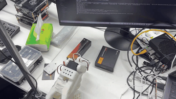
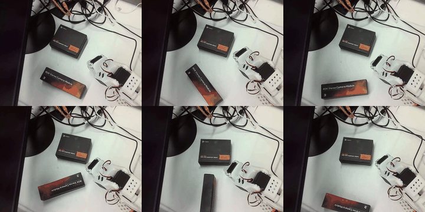

English | [简体中文](./README_CN.md)

# ACT Policy on RDK S600

This document covers ACT model export, BPU compilation, calibration, and SO100 on-board inference for the RDK S600.

**Pick and Place Demo:**

<div align="center">
  
</div>

> Note that this demo is just a simple Pick and Place demonstration with only 33 episodes of training data collected. Below is a side-by-side visualization of 6 training episodes (Episode 0/6/13/20/26/32):

<div align="center">
  
</div>

The canonical ACT tools in this directory export policies trained with [Hugging Face LeRobot](https://github.com/huggingface/lerobot) and deploy them to D-Robotics RDK S600 BPU. Unless stated otherwise, run the commands below from the repository root.

For the full workflow documentation, see: 👉 *[Full Workflow Guide](../../doc/WORKFLOW_GUIDE_EN.md)*

## ACT Directory Structure

- `models/act/export_bpu_actpolicy.py`: **Canonical model export script**. The root `export_bpu_actpolicy.py` remains as a backward-compatible launcher.
- `bpu_export_config_s600_calfix.yaml`: **Recommended S600 config** for LeRobot v0.5.2 / SO100 ACT / `nash-p`.
- `bpu_export_config.yaml`: Generic template for other platforms (defaults to `nash-e`; do not use on S600).
- `models/act/bpu_control_robot.py`: **Canonical on-board runtime**. The root `bpu_control_robot.py` remains as a backward-compatible launcher.

## 1. Environment Preparation

### 1.1 Development Machine (For Model Conversion)

Use the official Hugging Face LeRobot repository:
👉 **[https://github.com/huggingface/lerobot](https://github.com/huggingface/lerobot)**

Do **not** use the outdated `D-Robotics/lerobot` fork.

This branch was verified with **LeRobot v0.5.2**. The verified environment used:

```text
datasets 4.8.5
torch 2.7.1+cu126
onnxruntime 1.26.0
onnx 1.21.0
numpy 2.2.6
```

A dedicated conda environment is recommended:

```bash
conda activate lerobot
git clone https://github.com/huggingface/lerobot.git
cd lerobot
git clone https://github.com/D-Robotics/rdk_LeRobot_tools.git
cd rdk_LeRobot_tools && git checkout s600 && cd ..
pip install -e ".[feetech]"
pip install onnx onnxsim termcolor tqdm safetensors
```

*Note: Model compilation (ONNX -> HBM) needs to be performed in the Docker toolchain environment (OpenExplorer) provided by D-Robotics.*

### 1.2 RDK Board (For Model Deployment)

Use the same Hugging Face `huggingface/lerobot` repository on the board:

1. **Install LeRobot and this tools repo**:
  ```bash
    git clone https://github.com/huggingface/lerobot.git
    cd lerobot
    git clone https://github.com/D-Robotics/rdk_LeRobot_tools.git
    cd rdk_LeRobot_tools && git checkout s600 && cd ..
    pip install -e ".[feetech]"
    # This branch was verified with datasets 4.8.5.
    # Do not use the D-Robotics/lerobot fork.
  ```
2. **Install BPU Inference Library**:
  ```bash
    pip install hbm-runtime
  ```

## 2. Model Export and Compilation (Executed on Development Machine)

This process has two stages: `export_bpu_actpolicy.py` exports ONNX and compile configs from a PyTorch checkpoint, then the OE toolchain compiles those ONNX files into `.hbm`.

### Export Pipeline Overview

There are **two different config files** in this workflow:


| Config File                          | Used By                   | Purpose                                                     |
| ------------------------------------ | ------------------------- | ----------------------------------------------------------- |
| `bpu_export_config_s600_calfix.yaml` | `export_bpu_actpolicy.py` | checkpoint, dataset, export path, `nash-p`, `cal_num`, etc. |
| `config_BPU_ACTPolicy_*.yaml`        | OE `hb_compile`           | ONNX path, calibration data, quantization/compile settings  |


In short: **you edit the export-stage YAML; the toolchain consumes the auto-generated `config_*.yaml` files.**

The OE toolchain only accepts ONNX. It does not read PyTorch checkpoints directly. The standard flow is:

```text
bpu_export_config_s600_calfix.yaml
        ↓
export_bpu_actpolicy.py
        ↓
export_path/
├── BPU_ACTPolicy_VisionEncoder/
│   ├── BPU_ACTPolicy_VisionEncoder.onnx
│   ├── config_BPU_ACTPolicy_VisionEncoder.yaml
│   └── calibration_data_BPU_ACTPolicy_VisionEncoder/
├── BPU_ACTPolicy_TransformerLayers/
│   ├── BPU_ACTPolicy_TransformerLayers.onnx
│   ├── config_BPU_ACTPolicy_TransformerLayers.yaml
│   └── calibration_data_BPU_ACTPolicy_TransformerLayers/
├── bpu_output/                  # runtime normalize params + final .hbm
└── build_all.sh
        ↓
OE Docker: hb_compile
        ↓
bpu_output/*.hbm
```

#### Why Split ACT into Two ONNX Models?

The full ACT path is:

```text
image -> VisionEncoder -> front_features
state + front_features -> Transformer -> Actions [1, 100, 6]
```

For BPU deployment, the export script splits ACT into two submodels:

1. **VisionEncoder**: `images` -> `Vision_Features`
2. **TransformerLayers**: `states` + `front_features` -> `Actions`

`bpu_control_robot.py` chains them together on the board.

#### What Does `export_bpu_actpolicy.py` Do?

When you run `python export_bpu_actpolicy.py --config bpu_export_config_s600_calfix.yaml`, the script executes the following 6 steps:

**① Load model and dataset, auto-detect cameras**

Loads the PyTorch ACT checkpoint from `act_path` and reads the dataset from `dataset.root`. Fetches one batch, scans all `observation.images.`* fields, and auto-detects camera names (e.g., `front`).

**② Export pre/post-processing normalization parameters**

Reads statistics saved during training from processor safetensors files in the checkpoint, saves to `bpu_output/*.npy`:

- `{camera_name}_mean.npy` / `{camera_name}_std.npy`: Image normalization mean and std.
- `action_mean.npy` / `action_std.npy`: State input normalization parameters.
- `action_mean_unnormalize.npy` / `action_std_unnormalize.npy`: Action output denormalization parameters.

These `.npy` files are loaded by `bpu_control_robot.py` at board-side inference time for manual normalization/denormalization outside the BPU.

**③ Export VisionEncoder ONNX**

Wraps the ACT `backbone` (ResNet) and `encoder_img_feat_input_proj` as `BPU_ACTPolicy_VisionEncoder`. Input: normalized image. Output: visual feature map `[1, 512, 15, 20]`. If `onnx_sim: true`, onnxsim simplifies the graph.

**④ Export TransformerLayers ONNX**

Wraps encoder + decoder + action_head as `BPU_ACTPolicy_TransformerLayers`. Inputs: `states` and VisionEncoder output `{camera_name}_features`. Output: `Actions [1, 100, 6]`. Also saves `new_actions.npy` for precision verification.

**⑤ Generate OE compile configuration and build scripts**

Generates `config_BPU_ACTPolicy_*.yaml`, `build_*.sh`, and the one-click `build_all.sh` for both submodels. Configs include `march: nash-p`, `norm_type: no_preprocess`, etc.

**⑥ Generate quantization calibration data**

Iterates over the training dataset (up to `cal_num` samples):

- Image `0..255 → /255.0 → (image - mean) / std` → VisionEncoder calibration data.
- Image through VisionEncoder forward pass → visual features → Transformer `{camera_name}/` calibration data.
- Normalized state → Transformer `state/` calibration data.

Image calibration tensors are converted from `0..255` to `0..1` when needed, then normalized with `(image - mean) / std`, matching board runtime `uint8 -> /255.0 -> normalize`.

#### `config_BPU_ACTPolicy_VisionEncoder.yaml`

```yaml
model_parameters:
  onnx_model: BPU_ACTPolicy_VisionEncoder.onnx
  march: nash-p
calibration_parameters:
  cal_data_dir: calibration_data_BPU_ACTPolicy_VisionEncoder
  cal_data_type: float32
input_parameters:
  norm_type: no_preprocess
compiler_parameters:
  jobs: 6
```

`cal_data_dir` stores **already normalized image tensors** (for example `front_0000000000.npy`) used to estimate quantization ranges.

#### `config_BPU_ACTPolicy_TransformerLayers.yaml`

```yaml
input_parameters:
  input_name: states;front_features;
  norm_type: no_preprocess;no_preprocess;
calibration_parameters:
  cal_data_dir: calibration_data_.../state;calibration_data_.../front;
```

Transformer has two inputs:


| Input            | Calibration Content                     |
| ---------------- | --------------------------------------- |
| `states`         | normalized joint state `[1, 6]`         |
| `front_features` | VisionEncoder output `[1, 512, 15, 20]` |


Transformer calibration is **not** based on raw images. It uses Vision features.

#### Board Runtime Data Flow

```text
camera uint8
  -> /255.0
  -> (image - front_mean) / front_std
  -> VisionEncoder.hbm
  -> front_features
  -> (state - action_mean) / action_std
  -> TransformerLayers.hbm
  -> Actions [100, 6]
  -> unnormalize
  -> send to robot
```

Because normalization happens outside the BPU, both `config_*.yaml` files use `norm_type: no_preprocess`.

### Step 1: Export ONNX and Configuration

1. **Modify Configuration File**:
  For S600 / SO100 ACT, edit `bpu_export_config_s600_calfix.yaml` directly:
  - `dataset.root`: Dataset root used during training.
  - `act_path`: Trained ACT checkpoint path.
  - `export_path`: Export output directory.
  - `type`: Must be `nash-p` for S600.
  - `cal_num`: Recommended `100`.
2. **Run Export Script**:
  ```bash
    cd rdk_LeRobot_tools
    python export_bpu_actpolicy.py --config bpu_export_config_s600_calfix.yaml
  ```
    After successful execution, ONNX files, calibration data, and `build_all.sh` are generated under `export_path`.
    **Important Note:** The export script reads image, state, and action normalization statistics from the LeRobot v0.5.2 checkpoint processor safetensors. Image calibration tensors are first ensured to be `0..1` float inputs, then normalized with `(image - mean) / std`, matching the board runtime path `uint8 -> /255.0 -> normalize`.

### Step 2: Compile BPU Model

Enter the toolchain Docker environment and run the compilation script generated in the previous step:

```bash
cd /path/to/bpu_export_act_so100_s600_calfix
bash build_all.sh
```

For S600, use the OE 3.7.0 S100/S600 Docker toolchain. Toolchain release summary (continuously updated): [https://forum.d-robotics.cc/t/topic/35229](https://forum.d-robotics.cc/t/topic/35229)

```bash
# Download offline image package
wget https://d-robotics-aitoolchain.oss-cn-beijing.aliyuncs.com/oe/3.7.0/ai_toolchain_ubuntu_22_s100_s600_cpu_v3.7.0.tar
# Load image
sudo docker load -i ai_toolchain_ubuntu_22_s100_s600_cpu_v3.7.0.tar
```

Run compilation:

```bash
docker run --rm \
  -v /path/to/bpu_export_act_so100_s600_calfix:/workspace \
  -w /workspace \
  registry.d-robotics.cc/deliver/ai_toolchain_ubuntu_22_s100_s600_cpu:v3.7.0 \
  bash build_all.sh
```

After compilation is complete, a `**bpu_output**` folder is generated under the export directory. This folder contains:

- `.hbm` / `.bin`: The compiled BPU model files (executable on the BPU).
- `.npy`: Normalization parameters required for runtime.
- `new_actions.npy`: Model inference results before conversion (used for precision verification).

**Please copy the `bpu_output` folder to the RDK board.**

```
bpu_output/
    |-- BPU_ACTPolicy_TransformerLayers.hbm
    |-- BPU_ACTPolicy_VisionEncoder.hbm
    |-- action_mean.npy
    |-- action_mean_unnormalize.npy
    |-- action_std.npy
    |-- action_std_unnormalize.npy
    |-- front_mean.npy
    |-- front_std.npy
    |-- new_actions.npy
    `-- ...
```

## 3. On-Board Inference (Executed on RDK)

The core of on-board inference is using the `**bpu_control_robot.py**` script.

### Prerequisites

1. Installed [huggingface/lerobot](https://github.com/huggingface/lerobot) and `hbm-runtime`.
2. Transferred the `**bpu_output**` folder (containing the quantized `.hbm` model and calibration parameters) to the board.
3. **Hardware Configuration**: Pass robot port, camera index, and camera name via CLI. Calibration files are saved by `lerobot-calibrate`.

### Run Steps

1. Connect the robot. The current script uses **SO100Follower** by default.
2. Run the control script:
  ```bash
    cd rdk_LeRobot_tools
    python bpu_control_robot.py \
      --bpu-act-path ../bpu_output \
      --robot-port /dev/ttyACM0 \
      --camera-index 0 \
      --camera-name front \
      --fps 30 \
      --inference-time 60
  ```

### Common Parameters

- `--bpu-act-path`: BPU model folder path (must contain `.hbm` and `.npy` files).
- `--robot-port`: Follower serial port, default `/dev/ttyACM0`.
- `--camera-index` / `--camera-name`: Camera index and name, must match `bpu_output/*_mean.npy`.
- `--fps`: Control loop frequency (default 30Hz).
- `--inference-time`: Duration of automatic operation (seconds).

### BPU Inference Performance Benchmark

Pure BPU performance benchmark on RDK S600 for each ACT module (20 warmup + 200 official samples):


| Module            | Avg. Inference Time | Frame Rate      |
| ----------------- | ------------------- | --------------- |
| VisionEncoder     | 3.92 ms             | 255.0 inf/s     |
| TransformerLayers | 2.29 ms             | 436.4 inf/s     |
| **Complete ACT**  | **6.20 ms**         | **161.2 inf/s** |


ACT outputs a 100-step action chunk in one inference. At 30 fps control frequency, only one BPU inference (6.20 ms) is needed every 3.33 seconds, leaving the BPU idle for the rest of the time.

## 4. Dataset Format Note (v3.0 vs v2.1)

This branch uses LeRobot v0.5.2 with `**codebase_version: v3.0`** dataset format. The `stable` branch is compatible with **v2.1** format. Key differences:


| Aspect                | v2.1 (stable branch)                              | v3.0 (this s600 branch)                                   |
| --------------------- | ------------------------------------------------- | --------------------------------------------------------- |
| **Organization**      | One file per episode                              | Multiple episodes packed into larger files                |
| **Data files**        | `data/chunk-000/episode_000000.parquet`           | `data/chunk-000/file-000.parquet`                         |
| **Video files**       | `videos/chunk-000/camera/episode_000000.mp4`      | `videos/camera/chunk-000/file-000.mp4`                    |
| **Metadata**          | JSON Lines (`meta/episodes.jsonl`, `tasks.jsonl`) | Parquet (`meta/episodes/*.parquet`, `meta/tasks.parquet`) |
| **Episode stats**     | Separate `episodes_stats.jsonl`                   | Merged into `meta/episodes/*.parquet`                     |
| `**next.done` field** | Present                                           | Removed; episode boundaries inferred from metadata        |


Core data fields (`observation.state`, `action`, `timestamp`, `episode_index`, etc.) are semantically unchanged — only the storage layout differs. v3.0 consolidates many episodes into fewer, larger files and uses offset-based indexing in `meta/episodes/`, which is designed for datasets with millions of episodes and provides faster initialization and less file-system pressure.

If your training data is in v2.1 format, convert it first using the official script:

```bash
python -m lerobot.scripts.convert_dataset_v21_to_v30 --repo-id=<your-repo-id> --root=<dataset-path>
```

## Notes

- **Model Compatibility**: On-board execution must use `.hbm` / `.bin` models quantized and compiled by the OE toolchain, and cannot directly run ONNX or PyTorch models.
- **Robot Configuration**: `bpu_control_robot.py` is currently hardcoded to `SO100Follower`. For SO-101 deployment, update the robot type in code first.
- **S600 calibration consistency**: For LeRobot v0.5.2 ACT models, image calibration must match runtime preprocessing: `uint8 -> /255.0 -> (image - mean) / std`. If `0..255` images are normalized directly with ImageNet mean/std, the Vision/Transformer quantization ranges will be wrong and BPU actions may diverge significantly from PyTorch/ONNX.
- **ACT chunking**: ACT outputs a 100-step action chunk in one inference. Do not pass `--n-action-steps 1` to work around deployment issues.
